# 2.11.3 对流/扩散

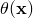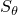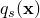### 2.11.3 对流/扩散

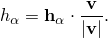**产品：** Abaqus/Standard

本节描述在Abaqus/Standard中建模伴随对流的热传递的能力。 resulting 的单元可用于任何一般热传递网格。这些单元具有非对称Jacobian矩阵：如果模型中包含此类单元，则自动调用非对称能力。提供了稳态和瞬态能力。瞬态能力引入了时间增量的限制（限制在下面定义）：时间增量被调整以在必要时满足此限制。单元的稳态版本可用于瞬态分析，这意味着流体中的瞬态效应不包含在模型中。该公式基于Yu和Heinrich的工作（[1986](07s01a01-References.md)、[1987](07s01a01-References.md)）。
### 热平衡方程

流体以速度流动的连续体的热平衡方程为

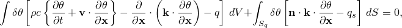其中是一点的温度，是任意变分场，是流体密度，是流体的比热，是流体的电导率，*q*是外部源每单位体积添加的热量，是穿过温度未规定表面（）进入体积的热量，是表面的外法线，是空间位置，*t*是时间。虽然大多数流体具有各向同性电导率，使得（其中是标量，上规定温度，在其余表面上进入域的每单位面积热通量被规定或由对流和/或辐射条件定义。例如，流体对流单元和固体单元之间的边界层可以通过DINTER*x*型单元建模。热平衡方程中的边界项定义

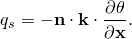这意味着仅与穿过表面的传导相关——任何穿过表面的能量对流不包含在中。如果表面是固体的一部分（其中将由传入相邻身体的热传递定义），这没有区别，因为那样进入该身体的法向速度为零。但是当有流体穿过表面时，这确实有区别——例如，在网格的上游和下游边界上。在这种情况下，对于自然边界条件选择（而不是使用穿过表面的总通量）是理想的，因为它避免了在流体流过表面时能量虚假反射回网格。

这些方程通过使用一次等参单元相对于位置离散化。流体速度假设为已知的。（Abaqus实际上要求定义流体每单位面积的质量流率，因为这通常对用户更方便。速度由质量流率和流体密度计算。）
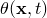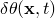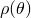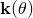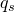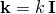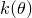
时间离散化从时间*t*的已知解生成时间的解。

温度的插值在单元和时间里增量上定义为

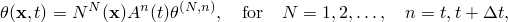其中是标准等参函数，时间插值是线性的：
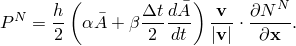
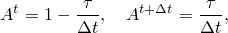其中是时间增量，。

Yu和Heinrich提出的Petrov-Galerkin离散化将这种线性插值与加权函数耦合

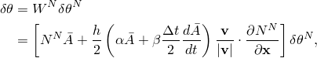其中

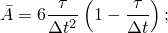是单元上的平均流体速度；是其大小；*h*是下面定义的特征单元长度度量。和是控制参数。加权中的项用于消除解的人工扩散，而项用于避免数值色散。Yu和Heinrich表明最佳选择为

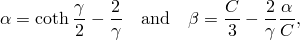其中是单元中的局部Peclet数，*C*是局部Courant数，定义为

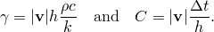上述的表达式在非常低的流体速度下产生负值，这可能使解不稳定；因此，对于低速，色散控制被关闭。

特征单元长度度量*h*由Yu和Heinrich定义如下。

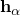设是穿过单元中心点的等参线。单元中心点处流体速度向量方向上的投影为

然后我们定义*h*为

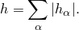当非零时，这些单元要求以保证数值稳定性。

由于加权函数是有偏的（"上风"），它们从一个单元到下一个单元是不连续的。因此，在处理热平衡方程的弱形式时需要一些小心（见[Hughes和Brooks，1982](07s01a01-References.md)）。特别是，传导项的通常分部积分

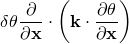仅能对用于离散化的加权函数的连续部分执行：否则，不能保证单元之间热通量的连续性。为方便起见，我们将加权的连续部分写为

热平衡的弱形式为

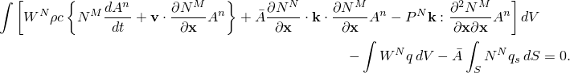这可以重写为

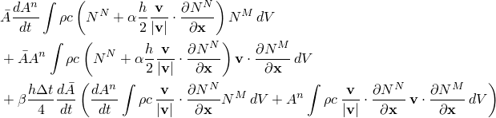

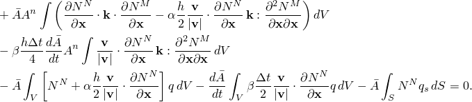

我们现在从时间*t*到对这个方程进行积分，以提供增量的平均平衡陈述。我们使用结果

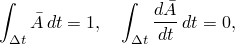

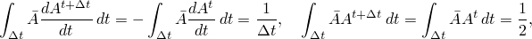和

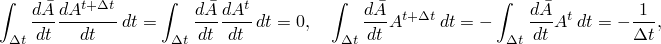给出

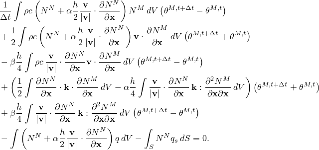

对于稳态情况，忽略此方程中的第三项。在瞬态和稳态形式中，这种对流单元对热传递模型方程组的贡献不是对称的，需要使用非对称矩阵存储和求解方案。
### 参考

### 参考

"Abaqus Analysis User's Guide"第6.5.2节"非耦合热传递分析"
