# 2.11.4 腔体辐射

### 2.11.4 腔体辐射

**产品：** Abaqus/Standard

本节描述的公式提供了使用腔体热辐射建模热传递的能力（除了"非耦合热传递分析"第2.11.1节中描述的辐射边界条件外）。腔体在Abaqus/Standard中定义为由小平面组成的表面集合。在轴对称和二维情况下，小平面是单元的一侧；在三维情况下，小平面可以是实体单元的面或壳单元的表面。为了腔体辐射计算的目的，假设每个小平面是等温的并且具有均匀的发射率。

基于腔体定义，腔体辐射单元由Abaqus内部创建。这些单元可以生成大型矩阵，因为它们耦合了腔体表面每个节点上的温度自由度。其Jacobian矩阵是非对称的：如果在分析中请求腔体辐射计算，自动调用非对称求解能力。提供了稳态和瞬态能力。

这个腔体辐射公式所基于的理论是众所周知的，可以在[Holman（1990）](07s01a01-References.md)和[Siegel和Howell（1980）](07s01a01-References.md)中找到。本节描述了用于求解非线性辐射问题的Newton方法中腔体辐射通量贡献和相应Jacobian的公式。公式中辐射视角因子计算相关的几何问题在"视角因子计算"第2.11.5节中讨论。
### 热辐射

我们的公式基于*灰体*辐射理论，这意味着身体单色发射率与辐射传播波长无关。只考虑*漫反射*（无方向性反射）。不考虑腔体介质中辐射的衰减。使用这些假设以及等温和等发射率腔体小平面假设，我们可以将进入腔体小平面每单位面积的辐射通量方程写为

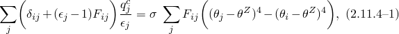其中是进入小平面的通量；是小平面的发射率；是斯特藩-玻尔兹曼常数；是几何视角因子矩阵；是小平面的温度；是所用温度标度的绝对零值；是Kronecker delta。

在*黑体*辐射的特殊情况下（不发生反射，发射率等于1），[方程2.11.4-1](02s11a46.md)简化为

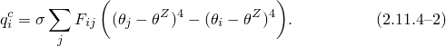
### 空间插值

用于求解具有腔体辐射的热传递问题离散近似的变量是腔体表面节点上的温度。由于我们假设出于腔体辐射目的每个小平面是等温的，有必要计算平均小平面*温度辐射功率*。我们首先将温度辐射功率定义为

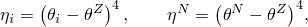其中下标*i*指小平面量，上标*N*指节点量。

然后，我们从小平面节点温度插值平均小平面温度辐射功率为

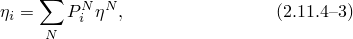其中*N*是形成小平面的节点数，是从面积积分计算的节点贡献因子，

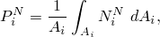其中是面积，是小平面的插值函数。

进入小平面*i*的辐射通量现在可以写为

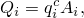并且每个小平面辐射通量对节点的贡献可以写为

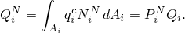则节点*N*处的总辐射通量为

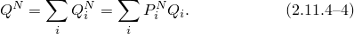
### 腔体辐射通量和Jacobian贡献

Abaqus/Standard提供了两种不同的方案来获得[方程2.11.4-1](02s11a46.md)中定义的腔体辐射通量：一种稳健的串行方法，适用于小腔体；以及一种推荐用于大腔体的完全并行方法。腔体辐射方程的串行求解

涉及小腔体的热辐射问题允许我们求解[方程2.11.4-1](02s11a46.md)得到进入腔体小平面每单位面积的辐射通量为

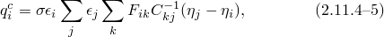其中

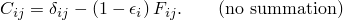[方程2.11.4-5](02s11a46.md)需要计算逆矩阵，这就是为什么此方法仅适用于小腔体。进入小平面*i*的辐射通量然后可以写为

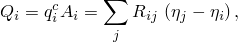其中

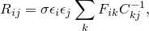或更紧凑地写为

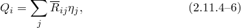其中

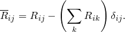

将上述[方程2.11.4-3](02s11a46.md)和[方程2.11.4-6](02s11a46.md)代入[方程2.11.4-4](02s11a46.md)，我们可以将辐射通量对节点的贡献写为

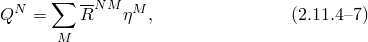其中

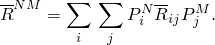

辐射通量基于增量结束时的温度、增量结束时的坐标和增量开始时的发射率来评估。在热传递分析期间坐标的任何时间变化被预定义为平移和/或旋转运动，因此不对Jacobian贡献。发射率作为温度和预定义场变量函数的任何变化随时间被显式处理（使用增量开始时的值），因此也不对Jacobian贡献。您可以指定热传递分析增量期间允许的最大发射率变化。因此，唯一的Jacobian贡献来自温度变化。

由腔体辐射通量引起的Jacobian贡献然后被 trivial 写为

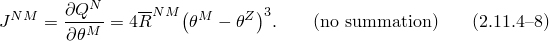

在所有实际情况下，这个Jacobian是非对称的。在执行腔体辐射分析的串行方法时，始终使用这个精确的非对称Jacobian。
### 并行分解腔体的求解

Abaqus/Standard为大腔体的视角因子计算和腔体辐射方程求解提供了一种并行方案。一旦为特定腔体启用了并行分解，Abaqus/Standard将使用迭代技术从[方程2.11.4-1](02s11a46.md)获取辐射热通量。这种迭代技术基于具有预条件子的Krylov方法。

由于我们没有像上述串行方法那样获得逆矩阵，我们无法访问[方程2.11.4-8](02s11a46.md)中的精确Jacobian。相反，我们使用基于照射（任何不由表面发射引起的部分）微小变化的Jacobian近似。由于 resulting 的近似是稀疏的，在热传递有限元方程求解期间迭代比使用精确表达式快得多。然而，由于Jacobian是近似的，在解附近收敛不会是二次的。实际上，与串行方法相比，当启用腔体并行分解时，Abaqus/Standard可能需要更多迭代，特别是在稳态分析和包含低发射率表面的模型中。在这些情况下，我们建议将分析切换到瞬态步骤，并在求解热传递有限元方程时允许每增量更多迭代。
### 参考

### 参考

"Abaqus Analysis User's Guide"第41.1.1节"腔体辐射"
