# 2.11.5 视角因子计算

### 2.11.5 视角因子计算

**产品：** Abaqus/Standard
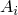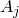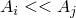
当模型表面可以相互看见时，发生腔体辐射，从而通过辐射相互交换热量（图2.11.5-1）。这种交换取决于测量组成腔体表面之间相对作用的视角因子。除了最简单几何之外，视角因子计算相当复杂。Abaqus为二维和三维情况以及轴对称情况提供了自动视角因子计算能力。这种能力可以考虑一般的表面遮挡（或阴影）以及最常见的辐射对称形式。如果腔体表面在空间中移动导致视角因子变化，视角因子计算也可以在分析历史中自动重复多次（这是用户控制的）。

图2.11.5-1 表面通过辐射的热交换。
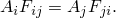
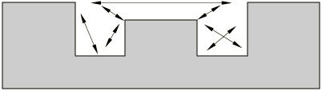

SIMULIA很高兴承认Abaqus中实现的视角因子计算技术源自英国原子能局最初开发的技术；例如，见[Johnson（1987）](07s01a01-References.md)。本节的其余部分包含对此技术的一般描述。
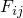### 基本面积之间的视角因子

两个基本面积之间的无量纲视角因子两个面积之间满足关系

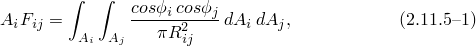其中这两个面积之间的距离，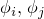面积表面法线之间的角度（图2.11.5-2）。视角因子还满足互惠关系

图2.11.5-2 视角因子计算示意图。

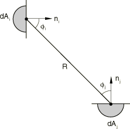 当面积距离比较小时，我们可以以面积集中方式计算视角因子；所以积分[方程2.11.5-1](02s11a47-View-factor-calculation.md)变为

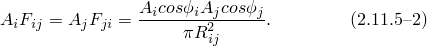然而，这个表达式在奇异，因此对于一般表面表现不佳。因此，我们使用

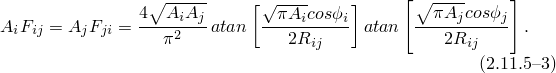[方程2.11.5-3](02s11a47-View-factor-calculation.md)在大时的极限为[方程2.11.5-2](02s11a47-View-factor-calculation.md)。

如果面积距离比较不小，但其中一个面积比另一个大得多（例如），我们可以使用公式

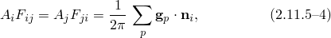其中较小面积。

对于所有其他配置，Abaqus使用[Mitalas和Stephenson（1966）](07s01a01-References.md)开发的方法，其中在[方程2.11.5-1](02s11a47-View-factor-calculation.md)中使用Stokes定理，其中一个轮廓积分解析求解。剩余的轮廓积分数值计算，

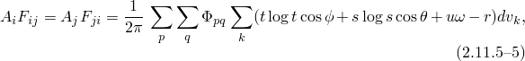其中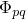面积义的三角形的角度。标量腔体由表面组成；表面又由有限元面组成。出于视角因子计算的目的，人们可以将腔体视为围绕腔体的有限元离散化对应的单元面（或小平面）的集合。在二维和三维情况下，组成腔体的单元面可以被视为基本面积，因此[方程2.11.5-1](02s11a47-View-factor-calculation.md)适用。在轴对称情况下，单元面代表环，因此视角因子涉及两个相互对视的环表面。这需要关于）。

就视角因子计算而言，一次和二次单元面在某种意义上处理相似，因为二次单元面中边的中节点被忽略。这意味着相互对视的一对四节点面将产生与具有与四节点面节点重合的角节点的八节点面相同的视角因子。
### 辐射遮挡

腔体内的辐射意味着每个表面与其他每个表面交换热量。当固体位于辐射表面之间，遮挡（或阴影）了从一表面小平面到另一表面小平面热辐射可能路径的一些但不是全部时，问题变得更加复杂（图2.11.5-3）。

图2.11.5-3 遮挡或阴影示例。

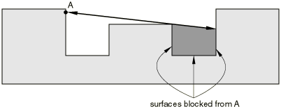

除了最简单的情况外，用户无法处理所有这种情况的复杂性。因此，默认情况下，Abaqus自动检查腔体中每条可能辐射路径是否发生遮挡。这要求程序检查连接每对小平面中心的射线是否与任何其他小平面相交。对于具有大量小平面的腔体，这可能非常耗时。出于这个原因，Abaqus允许用户通过接受哪些表面造成遮挡的输入来指导其遮挡算法，从而显著减少所需的计算工作量。如果两条小平面之间的射线与任何其他小平面相交，则在二维和三维情况下该射线被消除，并且小平面之间不发生辐射热传递。在轴对称情况下，遮挡要复杂得多，因为有限元模型中的每个单元面代表一个环。这自动处理，需要程序计算环的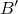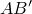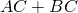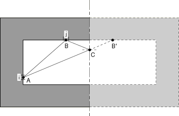 小平面*i*（其质心在点*A*）和小平面*j*（其质心在点*B*）之间的辐射有两个贡献：一个来自点*A*和*B*之间的射线，另一个来自点*A*和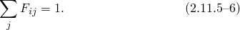这个和等于1是因为来自表面*i*的所有射线必须击中封闭腔体中的某个其他表面*j*。对于开放腔体，这个和始终小于1，表示对环境的辐射。

[方程2.11.5-6](02s11a47-View-factor-calculation.md)中的量是为每个腔体的每个小平面计算的，其值用于提供检查以控制视角因子计算的准确性。
### 对环境辐射

[方程2.11.5-6](02s11a47-View-factor-calculation.md)中计算的量可以偏离1，只要腔体不是完全封闭的。用户可以通过在腔体定义中给出环境温度值来定义这样的开放腔体。在这种情况下，对于开放腔体的每个小平面，[方程2.11.5-6](02s11a47-View-factor-calculation.md)中计算的量与1之间的差异被认为是该小平面向周围介质辐射的部分。
### 参考文献

### 参考文献

"Abaqus Analysis User's Guide"第37.2.1节"热接触特性"

"Abaqus Analysis User's Guide"第41.1.1节"腔体辐射"
