# 2.12.1 耦合热-电分析

### 2.12.1 耦合热-电分析

**产品：** Abaqus/Standard

当电流流过导体时消耗的能量转换为热能时，就会产生焦耳热。Abaqus/Standard提供了完全耦合的热-电过程来分析这类问题。耦合来自两个来源：电问题中的电导率依赖于温度，热问题中的内部热生成是电流的函数。问题的热部分包括"非耦合热传递分析"第2.11.1节中描述的所有热传导和热存储（比热和潜热）特性。（不考虑流体流过网格时引起的强制热对流。）

热-电单元同时具有温度和电位作为节点变量。

本节描述了主导平衡方程、本构模型、边界条件、表面相互作用模型、有限元离散化以及所使用的Jacobian分量。
### 主导方程

导电材料中的电场由Maxwell电荷守恒方程控制。假设稳态直流电，方程简化为

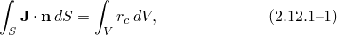其中*V*是任何控制体积，其表面为*S*，是*S*的外法线，是电流密度（单位面积的电流），是单位体积的内部体积电流源。

使用散度定理将面积分转换为体积分：

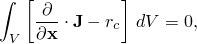由于体积是任意的，这提供了逐点微分方程

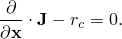

等效的弱形式通过引入任意的、变分的电势场并在整个体积上积分获得：

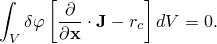首先使用链式法则，然后使用散度定理，这个陈述可以重写为

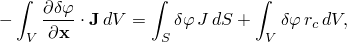其中是穿过*S*进入控制体积的电流密度。
### 本构行为

电流流动由欧姆定律描述：

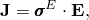其中是电导率矩阵；是温度；是任何预定义的场变量。电导率可以是各向同性、正交各向异性或完全各向异性的。是电场强度，定义为

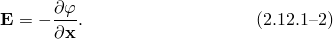由于当带电粒子逆电场移动时发生电位升高，梯度的方向与电场的方向相反。使用电场的这个定义，欧姆定律被重写为

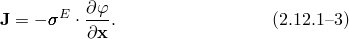本构关系是线性的；即，它假设电导率与电场无关。

引入欧姆定律，电荷守恒主导方程变为

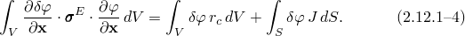
### 热能平衡

热传导行为由基本能量平衡关系描述

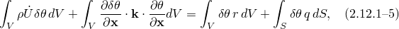其中*V*是固体材料的体积，表面积为*S*；是材料密度；*U*是内能；是热传导率矩阵；*q*是单位面积的热通量，流入物体；*r*是物体内产生的热量。热问题在"非耦合热传递分析"第2.11.1节中详细讨论。

[方程2.12.1-4](02s12a48-Coupled-thermal-electrical-analysis.md)和[方程2.12.1-5](02s12a48-Coupled-thermal-electrical-analysis.md)分别描述了电气和热问题。耦合来自两个来源：电问题中的电导率依赖于温度，，热问题中的内部热生成是电流的函数，，如下所述。
### 电流导致的热能

焦耳定律描述了电流流过导体时消耗的电能率，，为

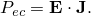使用[方程2.12.1-2](02s12a48-Coupled-thermal-electrical-analysis.md)和[方程2.12.1-3](02s12a48-Coupled-thermal-electrical-analysis.md)，焦耳定律被重写为

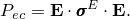在稳态分析中，在时间评估。在瞬态分析中，在增量上获得的平均值

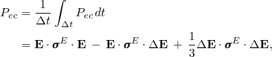其中和是时间的值。以内部热量形式释放的能量为

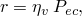其中是能量转换因子。
### 表面条件

身体的外表面——*S*——由可以规定边界条件的部分————和可以与其他身体附近表面相互作用的部分——组成。规定的边界条件包括电势、温度、电流密度、热通量以及表面對流和辐射条件。表面相互作用模型包括界表面之间的热传导和辐射效应以及穿过界面的电流流动。热传导和辐射建模为

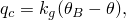和

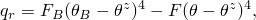分别，其中是所考虑身体表面的温度，是另一个身体表面的温度，是所用温度标度的绝对零值，是间隙热导率，是平均界面温度，是常数。

界表面之间流动的电流建模为

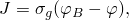其中是所考虑身体表面的电势，是另一个身体表面的电势，是间隙电导率。电流穿过界面消耗的电能为

以热量形式在身体表面释放：

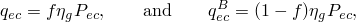其中是能量转换因子，*f*指定总热量如何在界面表面之间分配。在稳态分析中，在时间增量结束时评估，在瞬态分析中使用时间增量上的平均值。这在"电流导致的热生成"第5.2.6节中详细描述。

引入表面相互作用效应和释放为热能的电能，主导电气和热方程变为

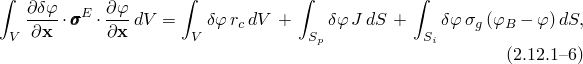和

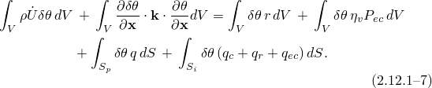
### 空间离散化

在有限元模型中，平衡通过引入插值函数近似为有限组方程。离散量用大写上标表示（例如，。对上标采用求和约定。离散量表示节点变量，节点在相邻单元之间共享，并选择适当的插值以提供假设变化的充分连续性。

虚电势场通过以下方式插值

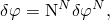其中是插值函数。然后离散电气方程写为

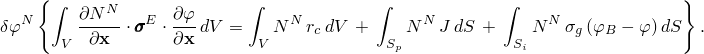由于是任意的，

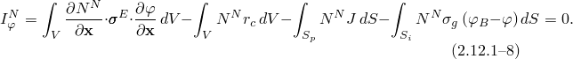

热问题中的温度场由同一组插值函数近似：

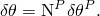使用这些插值函数和向后差分算子对内能率进行积分，，获得热能平衡关系：

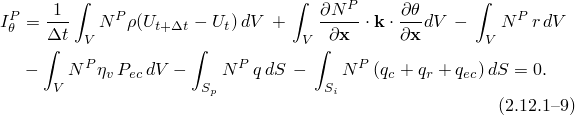
### Jacobian贡献

Jacobian贡献通过对电势和温度在时间和[方程2.12.1-9](02s12a48-Coupled-thermal-electrical-analysis.md)的变分获得。这产生

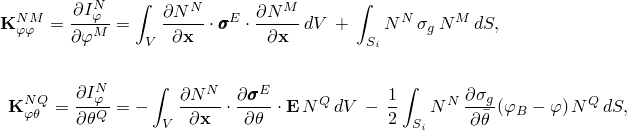

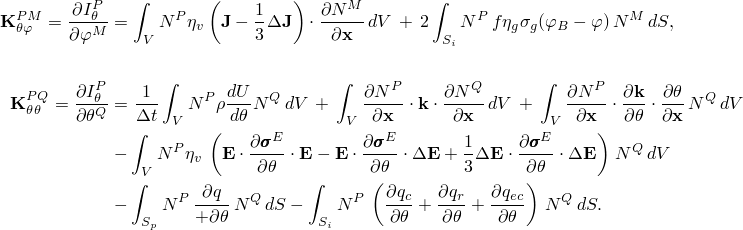项在分量中包括规定的表面對流和辐射条件。表面相互作用项、和在"电流导致的热生成"第5.2.6节中评估。

Jacobian贡献产生非对称方程组，需要使用非对称矩阵存储和求解方案。
### 参考

### 参考

"Abaqus Analysis User's Guide"第6.7.3节"耦合热-电分析"
