# 2.13.1 质量扩散分析

### 2.13.1 质量扩散分析

**产品：** Abaqus/Standard

Abaqus/Standard提供了对一种材料通过另一种材料的瞬态或稳态扩散进行建模的能力，例如氢通过金属的扩散（[Crank（1956）](07s01a01-References.md)、[deGroot和Mazur（1962）](07s01a01-References.md)）。主导方程是Fick方程的扩展，以允许扩散物质在基体材料中具有不均匀的溶解度。

基本求解变量（用作网格节点上的自由度）是"归一化浓度"（通常称为扩散物质的"活度"），其中*c*是扩散物质的质量浓度，*s*是其在基体材料中的溶解度。这意味着当网格包含共享节点的不同材料时，归一化浓度在不同材料之间的界面上是连续的。由于扩散相分压的平方根，界面两侧的分压相同；假设界面处满足Sievert定律。
### 主导方程

扩散问题从扩散相的质量守恒要求定义：

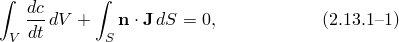其中*V*是任何体积，其表面为*S*，*S*的外法线，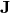扩散相浓度的通量，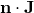离开*S*的浓度通量。

使用散度定理，

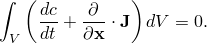由于体积是任意的，这提供了逐点方程

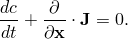

等效的弱形式为

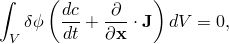其中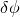任意、适当连续的标量场。

这个陈述可以重写为

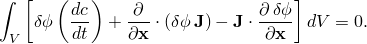再次使用散度定理产生

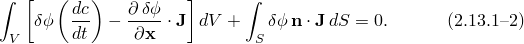
### 本构行为

扩散被假定为由化学势梯度驱动，这给出了一般行为

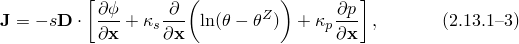其中扩散率；溶解度；"Soret效应"因子，提供由温度梯度引起的扩散；温度；所用温度标度的绝对零；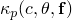压力应力因子，提供由等效压力应力梯度动的扩散；任何预定义的场变量。

这个本构模型特定形式的一个例子是对金属中氢扩散的假设：

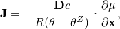其中化学势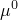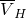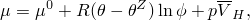其中氢在固溶体中的偏摩尔体积。这个形式类似于[Sofronis和McMeeking（1989）](07s01a01-References.md)使用的，并导致形式为本构表达式

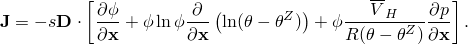为了实现这个特定形式，必须从方程

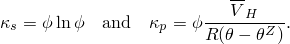计算数据和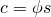改变变量（)并将[方程2.13.1-3](02s13a49-Mass-diffusion-analysis.md)的本构假设引入[方程2.13.1-2](02s13a49-Mass-diffusion-analysis.md)产生

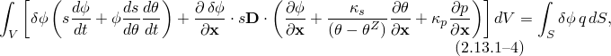其中

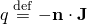是穿过*S*进入身体的浓度通量。
### 离散化和时间积分

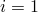在有限元模型中，平衡通过引入适当的插值函数近似为有限组方程。离散量用大写上标表示（例如，。对上标采用求和约定。这些表示节点变量，节点在相邻单元之间共享，并选择适当的插值以提供假设变化的充分连续性。插值基于材料坐标2、3。

虚拟归一化浓度场通过以下方式插值

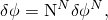其中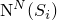插值函数。然后，离散方程写为

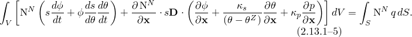

瞬态问题中的时间积分使用向后Euler方法（改进的Crank-Nicholson算子）。采用任何未明确与时间点关联的量取在约定，我们可以 drop 下标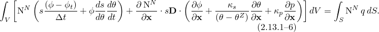
### Jacobian贡献

守恒方程的Jacobian贡献是从[方程2.13.1-6](02s13a49-Mass-diffusion-analysis.md)相对于时间变分获得的。这产生

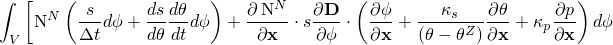

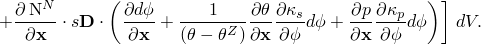重新排列并使用插值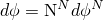我们获得

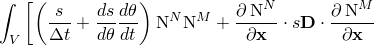

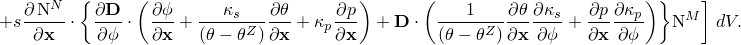

检查上述方程，我们观察到，每当扩散率温度驱动扩散系数压力驱动扩散系数"Abaqus Analysis User's Guide"第6.9.1节"质量扩散分析"
