# 2.16.1 J积分评估

### 2.16.1 J积分评估

**产品：** Abaqus/Standard

J积分被广泛接受为用于线性和非线性材料响应的断裂力学参数。它与裂纹扩展相关的能量释放有关，是缺口或裂纹尖端变形强度的度量，特别适用于非线性材料。如果材料响应是线性的，它可以与应力强度因子相关。由于J积分在缺陷评估中的重要性，其精确数值评估对于 fracture mechanics 在设计计算中的实际应用至关重要。Abaqus/Standard提供了基于虚拟裂纹扩展/域积分方法的J积分评估程序（[Parks, 1977](07s01a01-References.md), 和 [Shih, Moran, and Nakamura, 1986](07s01a01-References.md)）。该方法特别有吸引力，因为它使用简单，几乎不增加分析成本，并且即使对于相当粗糙的网格也能提供优异的准确性。
### 二维中的J积分

在准静态分析的背景下，J积分在二维中定义为

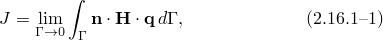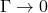其中是开始于裂纹底面并结束于顶面的轮廓，如图2.16.1-1所示；极限表示收缩到裂纹尖端；是虚拟裂纹扩展方向上的单位向量；是由下式给出

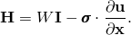对于弹性材料行为，*W*是弹性应变能；对于弹塑性或弹粘塑性材料行为，*W*定义为弹性应变能密度加上塑性耗散，从而表示"等效弹性材料"中的应变能。这意味着J积分计算仅适用于弹塑性材料的单调加载。

图2.16.1-1 J积分评估的轮廓。

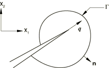

following [Shih et al. (1986)](07s01a01-References.md)，我们将[方程2.16.1-1](02s16a52-J-integral-evaluation.md)重写为

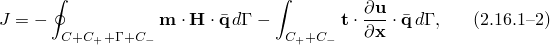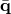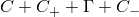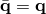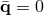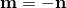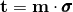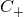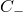其中是封闭轮廓所包围区域内的足够平滑的加权函数，在上值为，在*C*上为；是封闭轮廓所包围域的外法线，如图2.16.1-2所示。在上；是裂纹表面和包围了一个域*A*，当时包括裂纹尖端区域

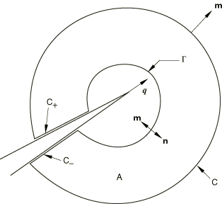

使用散度定理，我们将封闭轮廓积分转换为域积分

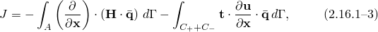其中*A*是封闭轮廓所包围的域。值得注意的是，域*A*当时包括裂纹尖端区域。

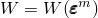如果平衡被满足且*W*是机械应变的函数——即——我们有

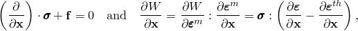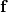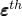其中是单位体积的体力，是热应变。将上述两个方程代入[方程2.16.1-3](02s16a52-J-integral-evaluation.md)给出

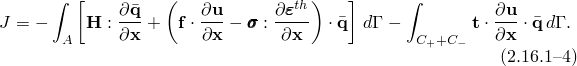

为了评估这些积分，Abaqus定义了一个由围绕裂纹尖端的单元环组成的域。创建不同的"轮廓"（域）。第一个轮廓由直接连接到裂纹尖端节点的单元组成。下一个轮廓由与第一个轮廓中的单元共享节点的单元环以及第一个轮廓中的单元组成。每个后续轮廓通过添加与上一个轮廓中的单元共享节点的下一个单元环来定义。被选择为在轮廓外部节点处具有零幅度，在裂纹方向上在轮廓内部的所有节点上为一，但外环单元的中节点（如果存在）除外。这些中节点根据节点在单元侧面的位置被分配介于零和一之间的值。
### 三维中的J积分

J积分可以通过考虑具有切向连续前缘的裂纹扩展到三维，如图2.16.1-3所示。虚拟裂纹扩展的局部方向再次由给出，

图2.16.1-3 在裂纹前缘点*s*处局部正交笛卡尔坐标的定义；裂纹位于平面。

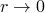它垂直于局部裂纹前缘，位于裂纹平面内。渐近地，当，路径无关的条件适用于在平面中任何轮廓，该平面在*s*处垂直于裂纹前缘。因此，在该平面中定义的J积分可以扩展为代表裂纹前缘上的逐点能量释放率

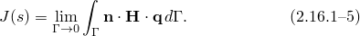

对于三维裂纹平面中的虚拟裂纹前进，能量释放率为

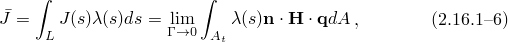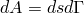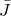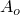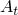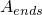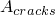其中*L*表示所考虑的裂纹前缘；是包围裂纹尖端的无穷小管状表面上的面积元素（即，）；是可以通过与二维中使用的类似的域积分方法计算。为此，我们首先通过引入轮廓表面、外表面、裂纹前缘末端的外表面（对于其前缘形成闭合回路的裂纹，表面消失）和裂纹面将[方程2.16.1-6](02s16a52-J-integral-evaluation.md)中的面积积分转换为体积积分，如图2.16.1-4所示。

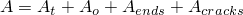图2.16.1-4 表面包围了一个体积*V*，当时包括裂纹前缘区域

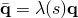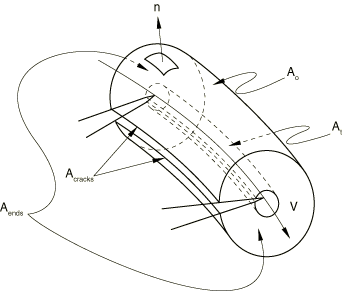可以看到，包围了一个体积*V*。定义了一个加权函数，使得它在上具有零幅度，在假设在这些值之间在*A*内平滑变化。在外部表面上，其中不与表面相切，必须使其相切。这可以通过在Abaqus中明确指定表面法线来完成。然后，我们可以将[方程2.16.1-6](02s16a52-J-integral-evaluation.md)重写为

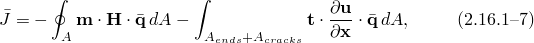其中是*A*的外法线（且在是表面和裂纹表面

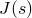为了获得裂纹前缘线上每个节点集*P*处的，使用与裂纹前缘沿线有限元中使用的相同的插值函数进行离散化：

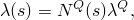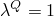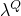其中在节点集*P*处，所有其他为零。[方程2.16.1-8](02s16a52-J-integral-evaluation.md)中代入的这个表达式。最后，裂纹前缘线上每个节点集*P*处的J积分值可以计算为

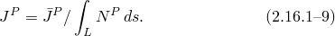
### 参考

### 参考

"Abaqus Analysis User's Guide"第11.4.2节"轮廓积分评估"
