# 2.16.2 应力强度因子提取

### 2.16.2 应力强度因子提取

**产品：** Abaqus/Standard

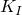应力强度因子线性弹性材料的能量释放率（*J*积分）相关，其中; [Barnett and Asaro, 1972](07s01a01-References.md); [Gao, Abbudi, and Barnett, 1991](07s01a01-References.md); [Suo, 1990](07s01a01-References.md)）。对于均匀、各向同性材料，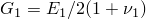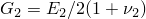中平面应力为中

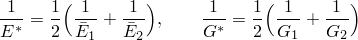

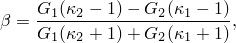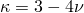于平面应变、轴对称和三维；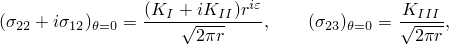中*r*和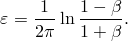

在本节中，我们描述了一种交互积分方法（[Shih and Asaro, 1988](07s01a01-References.md)）来提取混合模式加载下裂纹的各个应力强度因子。该方法适用于各向同性和各向异性线性材料中的裂纹。
### 交互积分方法

通常，给定问题的*J*积分可以写为

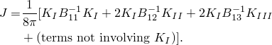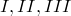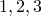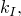中当指示*B*的分量时，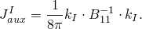辅助场叠加到实际场上得到

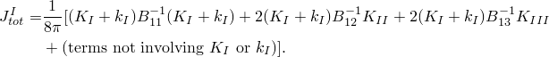

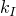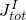由于在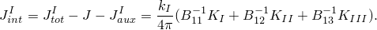

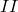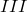如果对模式模式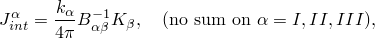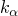果为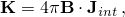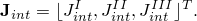中积分的计算接下来讨论。

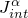基于*J*积分的定义，交互积分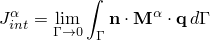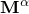中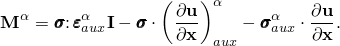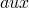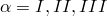标图2.16.2-1 在裂纹前缘点*s*处局部正交笛卡尔坐标的定义；裂纹位于面。

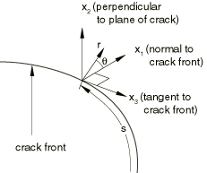

following Abaqus/Standard中用于计算*J*积分的域积分程序，我们为虚拟裂纹前进定义一个交互积分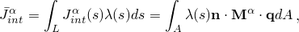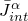中*L*表示所考虑的裂纹前缘；包围裂纹尖端的无穷小管状表面上的面积元素（即，；为了获得裂纹前缘线上每个节点集*P*处的用与裂纹前缘沿线有限元中使用的相同插值函数进行离散化：

中在节点集*P*处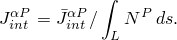
### 参考

### 参考

"Abaqus Analysis User's Guide"第11.4.2节"轮廓积分评估"
