# 2.17.1 应力线性化

### 2.17.1 应力线性化

**产品：** Abaqus/CAE

应力线性化是将截面上的应力分离为恒定的膜应力、线性弯曲和非线性变化的峰值应力。计算线性化应力的能力在Abaqus/CAE的`Visualization`模块中可用；它最常用于二维轴对称模型。有关如何获得线性化应力的详细信息，请参阅Abaqus/CAE User's Guide第52章"计算线性化应力"；这里讨论了Abaqus使用的计算方法。
### 计算应力分量

线性化应力分量使用穿过有限元模型结构用户定义的截面计算。沿定义截面以规则间隔提取应力值，并使用提取的应力值进行数值积分。计算膜应力、弯曲和峰值应力值。这些应力定义如下：

**膜应力**

从总应力中减去膜应力后，作用于平面的纯弯矩所对应的法向应力的恒定部分。

**弯曲应力**

等于等效线性应力的法向应力的可变部分，或者在没有峰值应力存在时，等于总应力减去膜应力。

**峰值应力**

从总应力中减去膜应力和弯曲应力后存在的法向应力部分。为了获得最佳结果，截面的端点应选择使截面垂直于模型的内表面和外表面。这个方向最小化了剪切应力问题，因为它们在线段端点处近似为零（[Kroenke, 1973](07s01a01-References.md)）。
### 三维结构

应力分量的膜值使用以下方程计算：
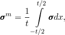
中
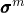
应力值，

*t*是截面厚度，

沿路径的应力，

*x*是沿路径的坐标。应力分量的线性弯曲值使用以下方程计算：
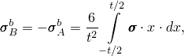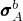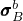
中点A和点B（截面的端点；见图2.17.1-1）处的弯曲应力值。

图2.17.1-1 推荐的应力路径。

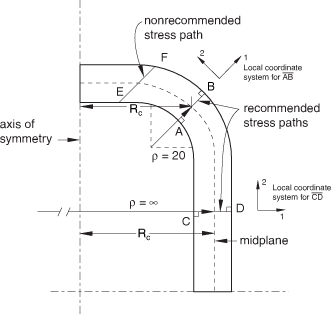

积分是数值执行的。假设点A和点B之间的路径均匀分为*n*个区间，积分计算如下：
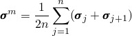

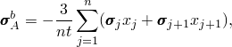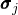
中沿路径点*j*处的应力。
### 轴对称结构

上述方程的推导在轴对称情况下类似，只是中轴径向向外偏移。分别获得厚度、子午线和环向方向应力的表达式。在Abaqus/CAE中，这些分别表示为局部方向1、2和3（见图2.17.1-2）。

图2.17.1-2 应力方向。

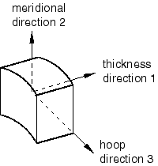
### 子午线应力
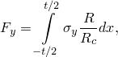
子午线应力使用以下关系计算。每单位周向长度的子午线力为

中

子午线方向的应力，
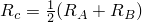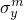
*R*是正在积分的点的半径，
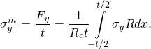
平均周向半径。子午线膜应力过厚度除以获得：

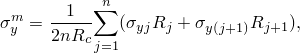
用于计算子午线膜应力的数值方案为
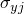
中
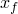
沿路径点*j*处的子午线应力分量，
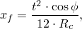
沿路径点*j*处的半径。为了计算子午线弯曲应力，我们首先需要计算从中面到子午线弯曲中性面的距离。该距离中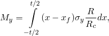
每单位周向长度的子午线弯矩定义为
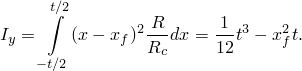
午线弯曲的惯性矩为

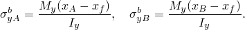
因此，端点A和B处的子午线弯曲应力通过以下获得
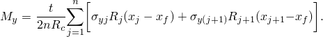
于计算子午线弯矩的数值方案为
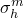

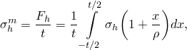### 环向应力

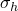环向膜应力过以下获得

中

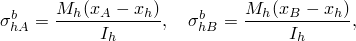环向应力，

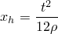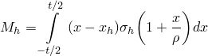中

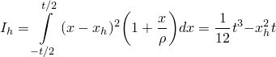中面到环向弯曲中性面的距离，

每单位子午线长度的环向弯矩，

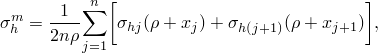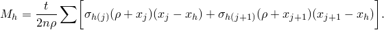计算周向膜应力的数值方案为

矩通过求和计算

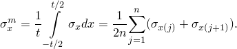
### 厚度应力
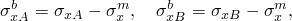
厚度应力不传递任何力或弯矩。通常，应力是由施加的外压和热膨胀效应引起的，没有明显的首选方法来确定"膜"和"弯曲"应力。因此，我们选择厚度"膜"应力作为平均厚度应力：

们选择厚度"弯曲"应力，使得端点A和B处厚度膜应力和弯曲应力的和等于这些点的总应力：
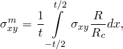
在线性插值这些值之间的弯曲应力。这是合理的假设，因为厚度表面应力由施加的压力决定，不应有强烈的"峰值"应力贡献。
### 剪切应力

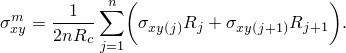子午线平面中的膜剪切应力以与子午线膜应力相同的方式计算：

中沿路径的剪切应力。

剪切应力分布假设为抛物线，在端点处为零。因此，弯曲剪切应力设置为0.0。用于计算膜剪切应力的数值方案为：

### 曲率修正

在轴对称结构中执行应力线性化时使用的方程包括应力线截面的面内和面外曲率半径。默认情况下，"曲率修正"对轴对称结构开启，对非轴对称结构关闭。当计算S22、S33和S12分量时，Abaqus/CAE允许在非轴对称结构的方程中包含这些曲率修正项。数值方案与在轴对称结构中执行应力线性化时使用的方案相同。用户必须选择一个坐标系来指定曲率修正项。当坐标系的*x*轴垂直于应力线时，会生成错误消息。

用户可以关闭轴对称结构的曲率修正，在这种情况下，线性应力分量使用三维结构的方程计算。
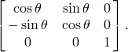### 计算局部坐标系

应力线性化要求将结果从全局坐标系转换到由应力线定义的局部坐标系。
### 轴对称情况
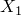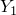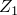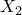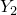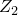
当为轴对称应力线性化执行时，局部坐标系的计算是一个 trivial 的过程。这种情况下的变换矩阵为
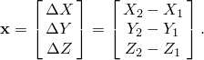

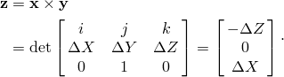### 三维情况

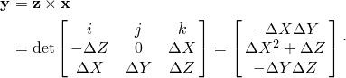当执行三维应力线性化时，局部*x*轴将由应力线定义。局部*y*-和*z*-轴通过一系列叉乘计算。此过程如下所示。

点之间的向量（（

设局部*y*轴位于局部*x*轴和全局*Y*轴的平面内，局部*z*轴定义为

此，局部*y*轴将为

一化后，以上三个向量可以组合创建变换矩阵。
### 参考

### 参考

Abaqus/CAE User's Guide第52章"计算线性化应力"
