# 2.18.1 设计灵敏度分析

### 2.18.1 设计灵敏度分析

**产品：** Abaqus/Design

Abaqus/Design支持静态应力和频率问题的设计灵敏度分析（DSA）。DSA提供某些响应量相对于指定输入量的导数。这些导数被称为*灵敏度*。可用于DSA的响应是Abaqus输出变量列表的一个子集，被称为*设计响应*；指定的输入量被称为*设计参数*。作为设计参数函数的量被称为设计依赖的。DSA理论从分析计算所需导数的角度提出，首先针对静态应力分析，然后针对频率分析。在每节末尾讨论基于该理论的替代数值方法。
### 静态应力分析的DSA

DSA的方程可以基于总位移公式或增量位移公式推导。总位移公式适用于历史无关问题，其中问题的当前状态仅取决于总位移。增量公式适用于历史相关问题，其中问题的当前状态取决于增量开始时的状态和增量位移。
### 非线性平衡问题的总位移DSA公式
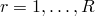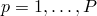
设*R*和*P*分别是设计响应和设计参数的数量。设每个响应设计参数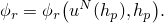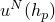
赖为隐式；即，它仅由其解为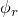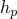
假设我们已在增量结束时求解了由[方程2.1.1-2](02s01a13-Procedures-overview-and-basic-equations.md)定义的平衡问题，并且我们有了收敛解对于设计参数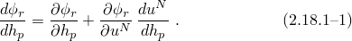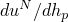
述方程中除了一项外，所有量都可以从平衡解显式确定。唯一的未知是重写为
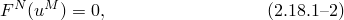
中
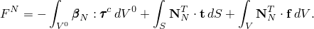
述方程中的所有量都假设依赖于设计参数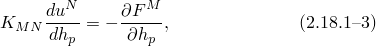
中
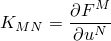
[方程2.1.1-4](02s01a13-Procedures-overview-and-basic-equations.md)中定义的切线刚度（Jacobian）矩阵，代入[方程2.18.1-1](02s18a57-Design-sensitivity-analysis.md)，我们获得
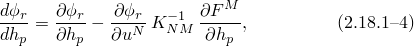
是总位移DSA问题的解。
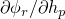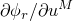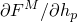
Abaqus中使用的DSA算法被称为*直接微分法*（DDM），包括以下操作。获得收敛平衡解后，必须以逐单元方式计算三个数组解[方程2.18.1-3](02s18a57-Design-sensitivity-analysis.md)的方程组获得，涉及节点位移灵敏度向量计算
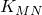
DSA计算中使用的系数矩阵仅是平衡迭代算法中使用的最新切线刚度矩阵。在DSA计算阶段，这个矩阵仍然以分解形式可用，可以轻松检索以对DSA右边向量执行回代。这使得DSA模块成为平衡分析的高效附加组件，能够以相对较低的成本进行灵敏度计算。
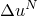### 历史相关平衡问题的增量位移DSA公式

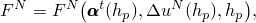上面提出的DSA公式简要介绍了DSA在Abaqus中的实现方式；然而，由于一些简化，讨论与大量非线性力学问题无关，特别是那些涉及所建模结构的历史相关行为的问题。在这类问题中的主要困难是，计算[方程2.18.1-2](02s18a57-Design-sensitivity-analysis.md)中残差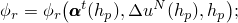

如，见[Kleiber et al. (1997)](07s01a01-References.md)。符号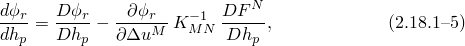在这种情况下，[方程2.18.1-4](02s18a57-Design-sensitivity-analysis.md)取以下形式：

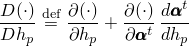中

示量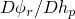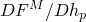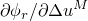从DSA求解算法的角度来看，总方法和增量方法之间的根本区别在于，在后一种情况下，所有状态变量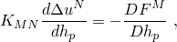DSA求解过程类似于总位移方法。平衡计算完成后，在单元循环中组装显式设计导数数组伪荷载）以及相对于位移的导数后将解向量代入[方程2.18.1-5](02s18a57-Design-sensitivity-analysis.md)。
### 计算方法
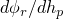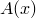
DSA所需的导数可以分析或数值计算。在分析方法中，有限元方程根据前几节描述的理论精确微分。这种方法实现困难，但高效并产生精确灵敏度。在数值方法中，一些或所有所需导数使用有限差分技术计算。数值方法可以进一步分为*整体*或*全局*有限差分方法和*半解析*方法。在全局有限差分方法中，响应灵敏度相对于特定设计参数通过扰动该设计参数多次（取决于有限差分技术）获得，并对每个扰动执行整个平衡分析。为每个分析保留响应，然后差分以获得响应灵敏度。这种方法计算成本高，因为必须为每个扰动求解整个平衡问题，但它易于实现。半解析方法在Abaqus中使用，可以视为分析和全局有限差分方法之间的折衷。在半解析方法中，DSA单元向量通过差分获得；但与分析方法一样，DSA解通过回代相对于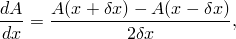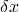
半解析方法的目的是通过有限差分数值计算DSA向量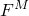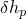
中*x*的扰动。
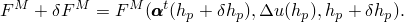
为了一般性，考虑历史相关情况。为了近似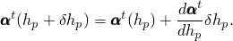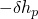
应于设计参数扰动的状态变化近似为

负扰动（复上述过程，然后将结果差分以获得显式设计导数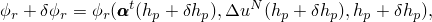
一旦找到（增量）位移灵敏度，可以使用
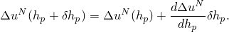
中

得响应灵敏度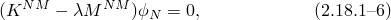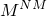下面提出的理论假设所有特征值都是 distinct 的（即，没有重复特征值）。如果并非如此，需要进行额外操作以获得与重复特征值对应的特征值和特征向量灵敏度，以下灵敏度的方程将不正确。重复特征值情况将在下一节中考虑。

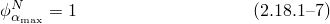执行频率分析意味着求解以下特征值问题（见"特征值提取"第2.5.1节）：

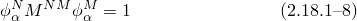中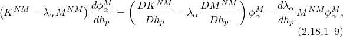

默认是第一种缩放方案。为了获得特征值和特征向量灵敏度，首先对设计参数获得以下方程：

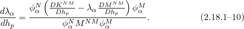中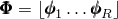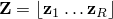左乘，并操作结果给出特征值灵敏度：

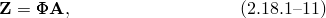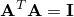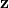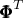了质量和刚度导数外，该方程中的所有量在特征值问题求解后都是已知的。
### 重复特征值情况
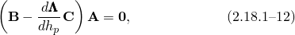
本节概述用于获得重复特征值特征值灵敏度的公式。更多信息可以在[Mills-Curran](07s01a01-References.md)（1988）和[Shaw](07s01a01-References.md)（1991）的论文中找到。当特征值
中的特征向量
[方程2.18.1-12](02s18a57-Design-sensitivity-analysis.md)被识别为一个### 选择有限差分区间

Abaqus使用启发式算法自动确定差分方案中使用的扰动大小。该算法的目标是选择能导致准确计算导数的扰动大小。这是在逐单元基础上完成的，因此对于给定设计参数，一个单元的扰动大小可能与另一个单元的扰动大小不同。扰动大小的选择基于每个设计参数静态步骤。对于静态步骤，标量度量选择为单元伪荷载的范数：

频率步骤。对于频率步骤，标量度量选择为矩阵选择取决于给定模态具有 distinct 特征值还是与重复特征值关联。

如果模态有 distinct 特征值，分子的简化。因此，和[方程2.18.1-13](02s18a57-Design-sensitivity-analysis.md)）。因此，必须使用单个扰动大小（对于每个设计参数）来获得重复特征值的所有灵敏度。为了计算单个扰动大小，通过将![](../graphics/stm_eqn02845计算标量度量![](../graphics/stm_eqn02839，它们相差数量级。对于每个![](../graphics/stm_eqn02844，计算相应的![](../graphics/stm_eqn02846。在连续扰动大小之间![](../graphics/stm_eqn02839的相对变化，计算为![](../graphics/stm_eqn02847，用于测量扰动大小接近最优的程度。在这些扰动大小中，产生最小相对变化的一个，记为![](../graphics/stm_eqn02848，被确定为最佳扰动大小，![](../graphics/stm_eqn02849。如果![](../graphics/stm_eqn02848不小于指定的容差，则扩大扰动大小范围（直到某个限制），并继续测试。重要的是要认识到，![](../graphics/stm_eqn02850不直接用于评估数值微分的准确性，而是作为确定最佳扰动大小的一种手段。因此，对![](../graphics/stm_eqn02848设置更严格的容差会导致算法投入更多努力寻找最佳扰动大小，但不保证更准确的灵敏度。
### 参考

### 参考

"Abaqus Analysis User's Guide"第19.1.1节"设计灵敏度分析"
