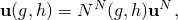
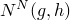
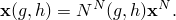
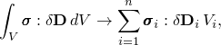
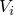
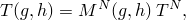
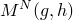

# 3.1.1 单元库：概述

### 3.1.1 单元库：概述

Abaqus单元库提供了完整的几何建模能力。因此，任何单元组合都可用于组成模型。有时需要多点约束来应用必要的运动学关系以形成模型（例如，用实体单元建模部分壳表面，部分用壳单元建模，或用梁和壳单元的混合建模管道弯头）。

所有单元使用数值积分以允许材料行为的完全通用性。壳和梁单元特性可以定义为一般截面行为，或者可以数值积分单元的每个横截面，从而在需要时准确跟踪非线性响应。可以指定具有不同高度处不同材料的复合分层截面。一些特殊单元（如线弹簧）使用近似的分析解来建模非线性行为。

Abaqus中的所有单元都在全局笛卡尔坐标系中公式化，除了用*r*–*z*坐标表示的轴对称单元。在几乎所有单元中，主向量量（如位移中插值函数种*等参*单元保证能够精确表示所有刚体模态和均匀变形模态，这是网格加密时收敛到精确解的必要条件。

Abaqus中的所有单元都进行数值积分。因此，"Abaqus/Standard中的非线性求解方法"第2.2.1节中描述的虚功积分将被求和替代：

中*n*是单元中积分点的数量，与会积分点*i*相关的体积。Abaqus将使用"完全"或"缩减"积分。对于完全积分，积分点的数量足以精确积分虚功表达式，至少对于线性材料行为如此。Abaqus中的所有三角和四面体单元使用完全积分。缩减积分可用于四边形和六面体单元；在该过程中，积分点的数量足以精确积分比插值阶数低一阶的应变场的贡献。这些单元中存在的应变场的高阶（不完整）贡献将不被积分。

缩减积分单元的优点是应变和应力在提供最佳精度的位置计算，即所谓的Barlow点（[Barlow, 1976](07s01a01-References.md)）。第二个优点是减少的积分点数量降低了CPU时间和存储需求。缺点是缩减积分过程可能允许在积分点不引起应变的变形模式。这些零能模式使单元秩亏，并导致称为"沙漏"的现象，其中零能模式开始在网格中传播，导致不准确的求解。这个问题在一阶四边形和六面体中特别严重。为了防止这些过度变形，向单元添加了额外的 artificial 刚度。在这种所谓的沙漏控制过程中，小的人工刚度与零能变形模式相关联。该过程用于Abaqus中的许多实体和壳单元。

大多数完全积分实体单元不适合（近似）不可压缩材料行为的分析。原因在于材料行为迫使材料（近似）无体积变化地变形。完全积分实体单元网格，特别是低阶单元网格，不允许这种变形（除了纯均匀变形）。因此，Abaqus在这些单元中使用"选择性缩减"积分：体积应变使用缩减积分，偏应变使用完全积分。因此，低阶单元在近似不可压缩行为中表现可接受。对于完全不可压缩材料行为，发生了另一个复杂情况：体积模量因此变得无限大。对于这种情况，需要混合（混合）公式，其中位移场增加了静水压力场。在这个公式中，只有体积模量的逆出现，因此对算子矩阵的贡献消失。静水压力场起着强制执行不可压缩约束的Lagrange乘子场的作用。

Abaqus/Standard还为多场问题提供单元。例子是用于流体扩散多孔固体分析的孔隙压力单元，耦合热传递与应力分析的热-位移耦合单元，以及耦合电传导与应力分析的压电单元。在这些多场单元中，标量变量（如温度）通常用与位移场不同的标量函数插值；即，

中![](../graphics/stm_eqn02857可能与![](../graphics/stm_eqn02852不同。场的耦合通常发生在积分点；例如，在热-位移耦合单元中，耦合是由于温度依赖的机械特性和由非弹性功产生的热生成。最后，Abaqus提供了一套完整的扩散单元来分析传导和对流热传递。在这些单元中，只有温度作为节点自由度出现。温度使用与热-位移耦合单元中使用的本质上相同的插值函数![](../graphics/stm_eqn02857进行插值。
### 参考

### 参考

"Abaqus Analysis User's Guide"第27.1.1节"单元库：概述"
