# 3.2.2 实体单元公式

### 3.2.2 实体单元公式

**产品：** Abaqus/Standard  Abaqus/Explicit

Abaqus中的所有实体单元都允许在大位移分析中进行有限应变和旋转。对于运动学线性分析应变定义为

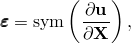其中是总位移，是考虑点在原始配置中的空间位置。如第1章"引论和基本方程"中所讨论的，这种应变度量仅在应变和旋转很小（应变和旋转矩阵的所有分量与 unity 相比可以忽略不计）时才有用的。

对于应变和/或旋转不再很小的情况，在Abaqus的实体单元中使用两种应变测量方法。当单元使用超弹性或超泡沫材料定义时，Abaqus内部使用直接从变形梯度矩阵计算的拉伸值来计算材料行为。对于任何其他材料行为，假定任何弹性应变与 unity 相比很小，因此弹性的适当参考配置与当前配置仅存在微小差异，适当应力度量是柯西（"真实"）应力。（更准确地说，适当应力度量应该是相对于弹性参考配置定义的Kirchhoff应力，但是这个参考配置和当前配置仅存在微小差异的假定使得Kirchhoff应力和柯西应力度量几乎相同：差异在弹性应变与 unity 的量级）。与柯西应力共轭的应变率是变形率，

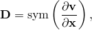其中是点的速度，是点的当前空间坐标。因此，应变定义为变形率的积分。这个积分是非平凡的，特别是在一般情况——主应变轴在变形过程中旋转。在Abaqus中，总应变通过中心差分算法对增量进行变形率近似积分来构造；当应变分量参照固定坐标基时，增量开始时的应变也必须旋转以考虑增量中发生的刚体旋转。这也是近似完成的，使用[Hughes-Winget (1980)](07s01a01-References.md)方法。这个积分算法将与材料行为相关的张量积分定义为

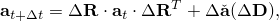其中是张量；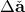是与材料本构行为相关的张量增量，因此依赖于应变增量，，由中心差分公式定义为

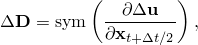其中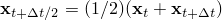；而是旋转增量，由Hughes和Winget定义为

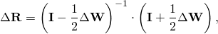其中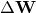是旋转率的中心差分积分：

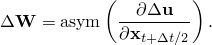在Abaqus/Explicit中，使用了一种略有不同的算法来计算用于Green-Naghdi率。

例如，应力通过这种方法积分为

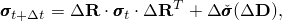其中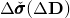是由该时间增量内材料应变引起的应力增量，是柯西应力。下标*t*和分别指增量的开始和结束。

如"过程：概述和基本方程，" 第2.1.1节所示，内部功项对牛顿法Jacobian矩阵的贡献是

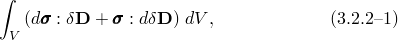其中和在增量结束时计算。

使用上述积分定义，可以证明

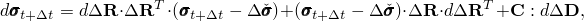其中是本构模型的Jacobian矩阵：

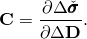

然而，不是基于此计算牛顿法的切线矩阵，而是通过使用以下近似：

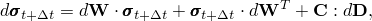得到Jacobian矩阵

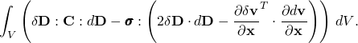

这个Jacobian矩阵是问题率形式的切线刚度。实际案例的经验表明，这种近似在大多数具有实际材料的应用程序的牛顿迭代中提供了可接受的收敛速率。

上述应变和旋转度量是近似值。这些近似值最限制性的方面可能是旋转增量的定义。虽然这个度量确实在某种意义上给出了一点处材料旋转的代表（无论是在Abaqus/Standard还是Abaqus/Explicit中），但很明显，点处的每个单独材料纤维都有不同的旋转（除非材料点仅经历刚体运动，或者作为近似扩展，如果该点的应变很小）。这表明上述公式不适用于应变和旋转较大且材料表现某种各向异性行为的情况。这种情况的一个常见例子是通过应变引起的各向异性，如"运动硬化"塑性模型。上述积分方法不适用于此类材料模型在大应变时的情况（对于典型材料参数的实际目的，这意味着当应变大于20%-30%时解将相当错误）。因此，不建议在如此高的应变水平下在Abaqus中使用运动硬化模型。关于这个主题有大量文献；例如，参见[Agah-Tehrani et al. (1986)](07s01a01-References.md)。
### 参考

### 参考

"Abaqus Analysis User's Guide"第28.1.1节"实体（连续体）单元"
