# 3.2.5 带不兼容模式的连续体单元

### 3.2.5 带不兼容模式的连续体单元

**产品：** Abaqus/Standard  Abaqus/Explicit

Abaqus 中类型为 CPS4I、CPE4I、CAX4I、CPEG4I 和 C3D8I 的低阶四边形连续体单元，以及相关的混合单元，通过不兼容模式得到增强以改善弯曲行为。除了位移自由度外，还在单元内部添加了不兼容变形模式。这些自由度的主要作用是消除规则位移单元在弯曲加载时观察到的所谓寄生剪切应力。

此外，这些自由度消除了弯曲时由泊松效应引起的 artificial stiffening。在规则位移单元中，由弯曲引起的轴向应力的线性变化伴随着垂直于弯曲方向的应力的线性变化，这导致不正确的应力和过高的刚度估计。不兼容模式防止了这种应力的产生。

在非混合单元中（除 CPS4I 外），添加了额外的不兼容模式以防止近似不可压缩材料行为的单元锁定。对于完全不可压缩材料行为，必须使用混合单元。在这些单元中，添加了压力自由度以在单元内强制执行线性压力变化。在混合单元中，不包括用于防止锁定的额外不兼容模式。

如果单元具有近似矩形的形状，不兼容模式单元在许多情况下的性能几乎与二阶单元一样好。如果单元具有平行四边形形状，性能会显著降低。对于梯形单元形状，性能比规则位移单元好不了多少。

由于内部自由度（CPS4I 为4个；CPE4I、CAX4I 和 CPEG4I 为5个；C3D8I 为13个），这些单元比规则位移单元稍贵。然而，额外的自由度不会实质性地增加波前大小，因为它们可以被立即消除。此外，不需要使用选择性减缩积分，这在一定程度上抵消了额外自由度的成本。

Abaqus 中使用的几何线性不兼容模式公式与[Simo 和 Rifai（1990）](07s01a01-References.md)提出的工作有关。Simo 的公式与更早由[Wilson 等人（1973）](07s01a01-References.md)和[Taylor 等人（1976）](07s01a01-References.md)所做的非常相似。非线性公式基于[Simo 和 Armero（1992）](07s01a01-References.md)的工作。

### 几何线性公式

正如 Simo 的论文中所讨论的，不兼容模式公式可以从一般的胡-鹫津（Hu-Washizu）变分原理严格推导出来。在本讨论中，我们不会给出这种推导，而只使用 Simo 工作的关键结果。

在不兼容模式公式中，位移梯度 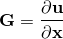 用额外的、不兼容的位移梯度场 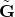 进行增强：

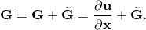不兼容位移梯度  在单元内部选择。该场不能任意选择。它必须独立于规则位移梯度。

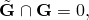也可以表示为形式

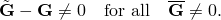此外，它必须与任何恒定梯度场正交，这给出条件

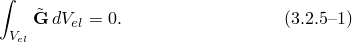如果违反这些条件，单元将无法通过分片试验。

最后一个条件用于获得不兼容模式的一般形式。我们将不兼容场描述为参数梯度场 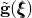 的变换：

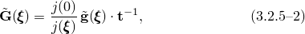其中  是单元中心处的参数变换

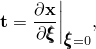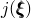 是位置 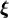 处参数变换的Jacobian，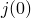 是单元中心的Jacobian。对于平面单元，Jacobian可以写成

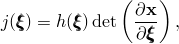其中 *h* 是厚度；对于轴对称单元，它是

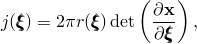其中 *r* 是半径；对于三维单元，它是

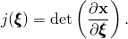将[公式 3.2.5-2](03s02a63-Continuum-elements-with-incompatible-modes.md)代入[公式 3.2.5-1](03s02a63-Continuum-elements-with-incompatible-modes.md)使我们能够为  创建一个简单条件：

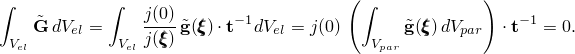

对于二维单元，这给出

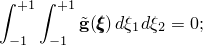对于三维单元，

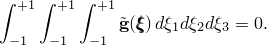这使得可以将 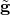 写成  的简单多项式。 的主要贡献可以写成形式

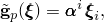其中 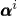 是向量自由度，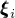 是向量，求和 *i* 延伸到参数坐标。在二维单元中 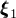 和 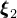 是如下形式的向量

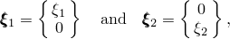在三维单元中

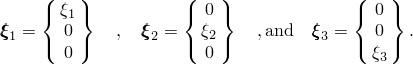因此，不兼容位移梯度的主要贡献变为

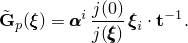

添加这些项后，寄生剪切和弯曲时的泊松效应被消除。注意 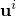 中的向量  在  中以与节点位移向量  在 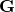 中类似的形式出现，

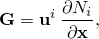并且可以类似于位移自由度来处理。

对于近似不可压缩材料行为，除 CPS4I 外的所有单元中仍可观察到静水压力中的双线性模式。这些模式可以通过引入形式为

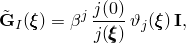的额外不兼容模式来消除，其中 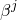 是额外的标量自由度。对于二维单元，添加一个项 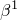，其中

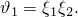在三维单元中，添加四个额外的项 ，其中

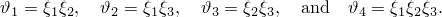因此，不兼容位移梯度  采用最终形式

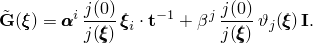

不兼容位移梯度的对称部分对不兼容应变有贡献：

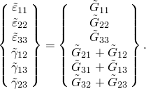斜对称部分在几何线性公式中不起作用。

### 几何非线性公式

由于我们希望使用可用于任何材料模型的公式，我们希望将不兼容模式表示为变形梯度  的修改。最明显的方法是将不兼容模式添加到变形梯度：

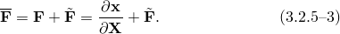这种方法已被 Simo 和 Armero 成功使用。基于此公式的单元满足大应变分片试验；即，任何单元片将能够精确表示均匀变形。然而，一旦单元因变形而畸变，分片试验将不再满足增量意义；即，随后的均匀变形将不能被精确表示。事实证明，这对于涉及大压缩变形的问题来说是致命的缺陷。

满足瞬时分片试验需要在标准变形率上添加不兼容变形率张量：

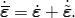为了获得这种类型的近似关系，我们将总变形梯度写成一系列增量变形梯度的乘积：

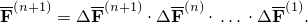然后将主要不兼容模式添加到增量变形梯度：

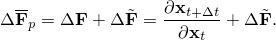

与[公式 3.2.5-2](03s02a63-Continuum-elements-with-incompatible-modes.md)类似，主要不兼容模式被描述为参数梯度场 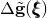 的变换：

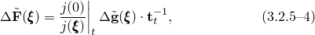其中 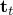 是增量开始时单元中心处的参数变换，

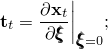 是位置  处参数变换的Jacobian； 是增量开始时单元重心的Jacobian。注意  是基于仅由位移自由度引起的变形来计算的，不包括由不兼容模式引起的体积变化。

增量参数梯度场  与线性公式中的形式完全相同，

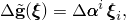它给出主要增量不兼容变形梯度

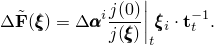双线性体积项以乘法方式添加到主要项：

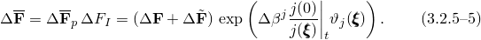

关于当前状态的位置梯度变化从基本关系获得

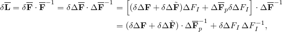其中

这允许我们写出 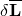

因此，增量开始时单元体积上主要不兼容模式的积分等于

注意，如果增量变形是*均匀的*，即 ，则积分将为零，因为此时积分可以写成

因此，*增量*分片试验将得到满足。类似于变化，获得关于当前状态的位置梯度率

其中

对于有限应变增量，我们使用 Hughes 和 Winget 提出的增量中间方法。这给出

二阶变分以常规方式获得。由于规则变形梯度和主要不兼容模式都是纯基于位移的，初始应力刚度项很容易获得为

其中  是速度梯度， 是包括主要不兼容模式的位移变分梯度。此外， 是变形率， 是变形的变分。

额外的双线性模式仅在一阶变分中作为变分出现（值  本身不出现）；因此，对二阶变分的贡献可以忽略。

### 参考

### 参考

"实体（连续体）单元"，Abaqus Analysis User's Guide 第28.1.1节
