# 3.2.6 三角形、四面体和楔形单元

### 3.2.6 三角形、四面体和楔形单元

**产品：** Abaqus/Standard  Abaqus/Explicit

Abaqus中的实体单元库包括用于平面、轴对称和三维分析的一阶和二阶三角形、四面体和楔形单元。

这些单元的混合版本可用于不可压缩和接近不可压缩的本构模型（参见"混合不可压缩实体单元公式，" 第3.2.3节，了解所用公式的详细讨论）。但是，这些混合形式只能用于填充由砖块单元组成的网格中的区域；否则，可能会引入太多约束变量。

二阶四面体不适用于接触问题的分析：单元面上的恒定压力在角节点处产生零等效载荷。在接触问题中，这使得角落处的接触条件变得不确定，并可能导致由于过度间隙跳动而求解失败。相同的论点适用于楔形单元三角形面上的接触。
### 插值

插值用[图3.2.6-1](03s02a64-Triangular-tetrahedral-and-wedge-elements.md)所示的单元坐标*g*、*h*和*r*来定义。因为Abaus是大多数应用的Lagrangian代码，这些也是材料坐标。它们每个在单元中从0跨域到1，但满足约束：对于三角形和楔形为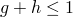，对于四面体为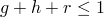。Abaqus用于这些单元的节点编号约定也在[图3.2.6-1](03s02a64-Triangular-tetrahedral-and-wedge-elements.md)中显示。角节点首先编号，然后是二阶单元的边中节点。插值函数如下。

一阶三角形（3节点）：

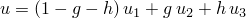

二阶三角形（6节点）：

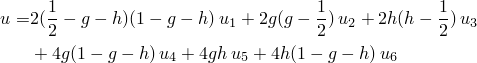

一阶四面体（4节点）：

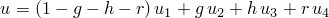

二阶四面体（10节点）：

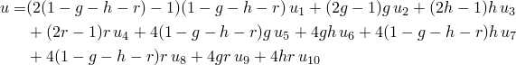

图3.2.6-1 等参主单元。

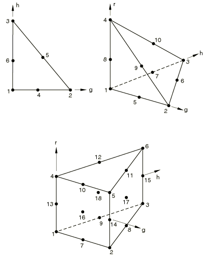

一阶楔形（6节点）：

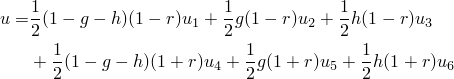

二阶楔形（15节点）：

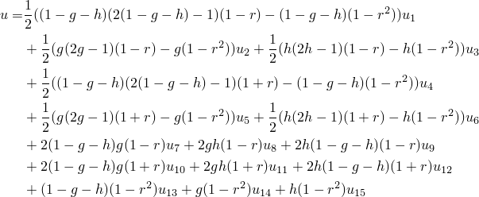

二阶可变15-18节点楔形（假设所有18个节点都定义）：

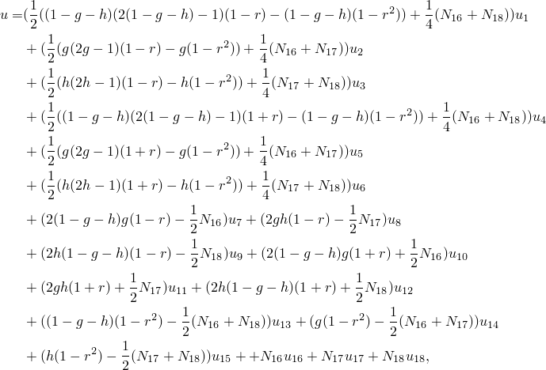其中

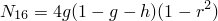

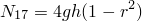

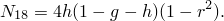
### 积分

一阶三角形和四面体是常应力单元，在用于应力/位移应用时使用单点积分计算刚度。两个单元都使用集中质量矩阵，总质量平均分配到各个节点上。对于热传导应用，一阶三角形的传导率和热容矩阵使用三点积分方案，积分点位于顶点和中点之间；一阶四面体使用四点积分方案。分布载荷分别使用两点和三点对一阶三角形和四面体进行积分。

三点方案也用于二阶三角形在应力/位移应用中的刚度。质量矩阵使用六点方案积分，可精确积分四阶多项式（[Cowper, 1973](07s01a01-References.md)）。分布载荷使用三点积分。单元的热传导版本使用六点方案计算传导率和热容矩阵。

对于应力/位移应用，二阶四面体使用4个积分点计算其刚度矩阵，使用15个积分点计算其一致质量矩阵。对于热传导应用，传导率和热容矩阵使用15个积分点积分。一阶楔形使用2个积分点计算其刚度矩阵，但使用6个积分点计算其集中质量矩阵。二阶楔形使用9个积分点计算其刚度矩阵，但使用18个积分点计算其一致质量矩阵。二阶四面体和楔形单元使用的积分方案可在[Stroud (1971)](07s01a01-References.md)中找到。
### 参考

### 参考

"Abaqus Analysis User's Guide"第28.1.1节"实体（连续体）单元"
