# 3.2.7 广义平面应变单元

### 3.2.7 广义平面应变单元

**产品：** Abaqus/Standard

Abaqus中使用的广义平面应变理论假定模型位于两个边界平面之间，这两个平面可能作为刚体相对移动，从而导致模型"厚度方向"纤维的应变。假定模型的变形与该厚度方向的位置无关，因此两个平面的相对运动仅导致厚度方向纤维的直接应变。这个应变及其一阶和二阶变分定义如下。

设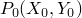是其中一个边界平面中的固定点，如图[图3.2.7-1](03s02a65-Generalized-plane-strain-elements.md)所示。纤维在与其在另一个边界平面中的像之间的长度是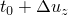，其中是原始配置中该纤维的长度，是该纤维长度的变化。是单元参考节点处自由度3的值。

图3.2.7-1 广义平面应变单元。

参考节点应该是任何给定连接区域中所有单元的相同节点，以便该区域的边界平面相同。不同区域可能有不同的参考节点。由于边界平面是刚性的，单元中任何其他点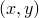处纤维的长度是

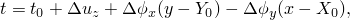其中

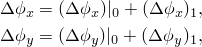其中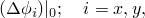是用户指定的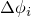的初始值；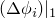是单元参考节点处自由度4和5。

厚度方向对数应变是

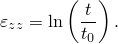

因此，厚度方向应变的一阶变分是

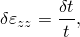其中

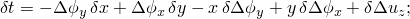二阶变分是

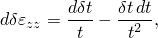其中

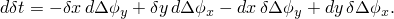
### 参考

### 参考

"Abaqus Analysis User's Guide"第27.1.2节"选择单元的维度"

"Abaqus Analysis User's Guide"第28.1.3节"二维实体单元库"
