# 3.2.8 轴对称单元

### 3.2.8 轴对称单元

**产品：** Abaqus/Standard  Abaqus/Explicit

Abaqus包含两个实体单元库，CAX和CGAX，其几何形状是轴对称的（旋转体），可以承受轴对称加载条件。此外，CGAX单元支持扭转加载。因此，CGAX单元被称为广义轴对称单元，CAX单元被称为无扭转轴对称单元。在两种情况下，旋转体通过将平面横截面绕轴（对称轴）旋转而生成，可以用柱面极坐标*r*、*z*和容易地描述。该横截面上一点的位置用径向坐标*r*和轴向坐标*z*表示。在处，径向和轴向坐标与全局笛卡尔*X*-和*Y*-坐标重合。

如果载荷由独立于的径向和轴向分量组成，且材料是各向同性或正交各向异性的，是主材料方向，则任何点的位移将仅具有径向（）和轴向（）分量，唯一非零的应力分量将是、、和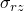。此外，任何*r*—*z*平面的变形完全定义了物体中的应力和应变状态。因此，几何模型通过在处离散参考横截面来描述。

如果允许载荷有周向分量（独立于）且材料为一般各向异性，位移和应力场变为三维的，但问题保持轴对称，因为解不随变化，参考*r*—*z*横截面的变形仍然表征整个物体中的变形。任何点的运动除了上述径向和轴向位移外，还有关于*z*轴的扭转（弧度），它独立于。

本节描述广义轴对称单元的公式。无扭转轴对称单元的公式是此公式的一个子集。
### 运动学描述

与两类单元一起使用的坐标系是柱面坐标系（*r*、*z*、），其中*r*测量点到柱面系统轴的距离，*z*测量其沿该轴的位置，测量包含该点和坐标系统轴的平面与包含坐标系统轴的某个固定参考平面之间的角度。这些单元中坐标和位移的顺序基于*z*是第二个坐标的约定。这个顺序与Abaqus中三维单元使用的顺序不同，其中*z*是第三个坐标，也不是柱面系统中通常使用的顺序（*r*、、*z*）。

设、和是点在未变形状态下沿径向、轴向和周向的单位向量，如图[图3.2.8-1](03s02a66.md)所示。

图3.2.8-1 柱面坐标系和位置向量定义。

点的参考位置可以用原始半径*R*和轴向位置*Z*表示：

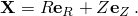同样，设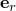、和是点在变形状态下沿径向、轴向和周向的单位向量。如[图3.2.8-1](03s02a66.md)所示，径向和周向基向量依赖于坐标：和。点的当前位置可以用当前半径*r*和当前轴向位置*z*表示：

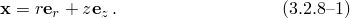

一点的广义轴对称运动可以描述为

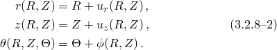如上所述，自由度、和独立于。此外，感兴趣的参考横截面在，但为了后续数学分析的利益，在上述的表达式中必须是非零的很重要。
### 参数插值和积分

运动使用以下参数插值方案：

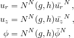其中*g*、是参考—*z*横截面在中的参数坐标，、、是节点自由度。插值函数是"实体等参四边形和六面体，" 第3.2.4节中描述的那些，其中也讨论了等参实体单元的积分方案。
### 变形梯度

对于空间中的材料点，变形梯度定义为当前位置相对于原始位置的梯度：

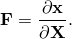当前位置由[公式3.2.8-1](03s02a66.md)给出，梯度算子可以用相对于柱面坐标的偏导数来描述：

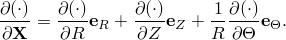由于径向和周向基向量依赖于原始周向坐标，这些基向量相对于的偏导数是非零的：

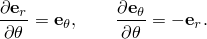因此，链式法则允许我们写成

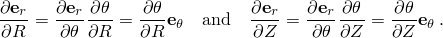利用这些结果，获得变形梯度为

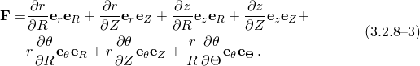

或者，可以写成矩阵形式

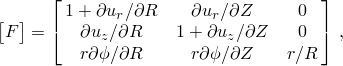其中[公式3.2.8-2](03s02a66.md)给出的运动被明确使用。

类似地，逆变形梯度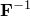容易获得为

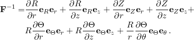
### 虚功

如"平衡和虚功，" 第1.5.1节所讨论的，平衡（虚功）公式需要虚速度梯度，这是相对于当前状态的位置梯度的变分。这个张量为

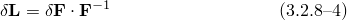其中是线性化变形梯度。

Abaqus用相对于轴对称扭转自由度的固定空间基来公式化有限元方程。因此，[公式3.2.8-4](03s02a66.md)中所需的结果不能简单地遵循[公式3.2.8-3](03s02a66.md)的线性化得到。也就是说，有必要消除来自变分

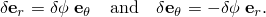的贡献。为此，可以按以下方式修改

其中瞬时是，但其变分为

其中是相对于处基、和的反对称分量

。

通过这种修改，共旋转虚变形梯度给出为

共旋转虚速度梯度为

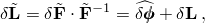或

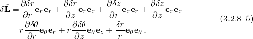

修正虚变形率张量和自旋简单地为

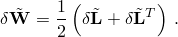
### 当前状态的刚度

如"过程：概述和基本方程，" 第2.1.1节所示，内部功项对Abaqus/Standard中用于实体单元公式的牛顿法Jacobian矩阵的贡献是

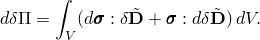的二阶变分获得为

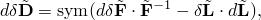其中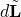与[公式3.2.8-5](03s02a66.md)中具有相同的形式。此外，在这个公式中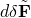是非零的，可以利用"旋转变量，" 第1.3.1节证明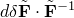具有形式

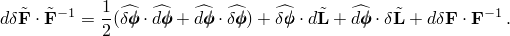分量形式为

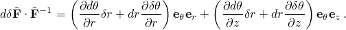引入共旋转应力率

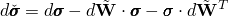得到更熟悉的形式

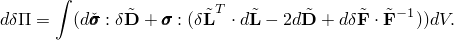
### 参考

### 参考

"Abaqus Analysis User's Guide"第28.1.6节"轴对称实体单元库"
