# 3.4.1 薄膜单元

### 3.4.1 薄膜单元

**产品：** Abaqus/Standard  Abaqus/Explicit

薄膜单元是空间中的薄片，能够承受薄膜力但不具有任何弯曲或横向剪切刚度，因此薄膜中唯一的非零应力分量是平行于薄膜中面的那些分量：薄膜处于平面应力状态。

在任何时候，我们使用局部正交基系统，其中和在薄膜表面内，垂直于薄膜。该基系统由Abaqus用于空间表面上的基的标准约定定义。在本节中，希腊指标取范围1、2，拉丁指标取范围1、2、3。希腊指标用于引用局部正交基前两个方向（薄膜表面内）中的分量。
### 平衡

薄膜单元内部力的虚功贡献为

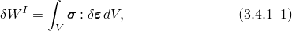其中是柯西应力，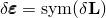是虚变形率（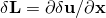，其中是虚速度场），*V*是薄膜的当前体积。

我们假定薄膜表面内的薄膜应力分量唯一非零：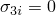。然后[公式3.4.1-1](03s04a70-Membrane-elements.md)简化为

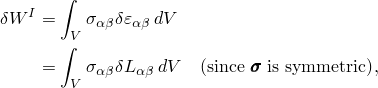其中

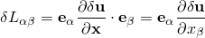和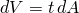，其中*t*是单元的当前厚度，*A*是其当前面积。
### Jacobian矩阵

来自单元的一致Jacobian贡献为

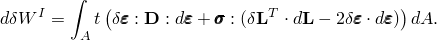由于我们假定，被积函数的第一项为

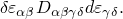我们还假定没有单元的横向剪切应变：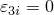，因此，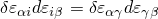。因此，被积函数的第二项为

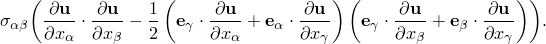我们可以写成

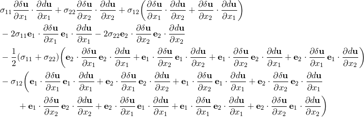
### 厚度变化

在几何非线性分析中，横截面厚度作为薄膜应变的函数变化，具有用户定义的"有效截面泊松比"，。

在平面应力中；线弹性给出

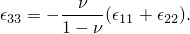将这些视为对数应变，

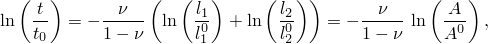其中*A*是薄膜参考表面上的面积。这种与线弹性的非线性类比导致厚度变化关系：

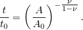对于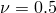，材料是不可压缩的；对于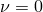，截面厚度不变化。
### 总变形

变形梯度为。由于我们取垂直于当前薄膜表面并假定薄膜没有横向剪切，

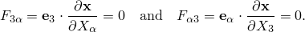通过上述厚度变化假设，变形梯度的直接面外分量为

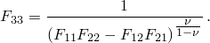

为了计算增量结束时的变形梯度，首先我们计算由位置相对于参考坐标的导数定义的增量结束时的两个切向量：

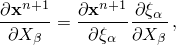其中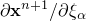通过从节点坐标的形函数导数进行插值获得，坐标变换的变化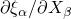基于参考几何。变形梯度分量定义为

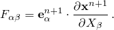

为了选择单元基方向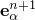，我们执行以下操作。找到任何一对面内正交向量（通过标准Abaqus投影）。然后找到角度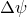，使得单元基向量，定义为

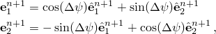满足对称条件

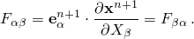利用上述方程中相对于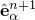的定义，发现旋转角度为

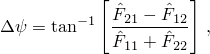其中

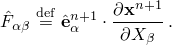然后立即获得变形梯度。

对于弹性体，我们直接使用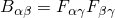和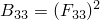。对于非弹性材料模型，我们需要增量应变和平均材料旋转的度量，我们从由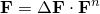定义的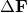计算，其中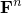是当前增量开始时的变形梯度（在增量"*n*"处）：

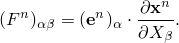我们可以定义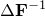的分量

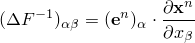因此，通过求逆定义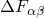。

然后从极分解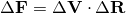定义增量应变和旋转，其中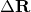是旋转矩阵，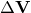是纯拉伸：

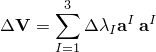（参见"变形，" 第1.4.1节）。我们通过求解以下特征值问题找到和相应的特征向量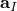

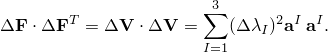由于我们假定薄膜没有横向剪切，法线方向（沿）始终是主方向，因此特征值问题是问题

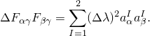然后对数应变增量为

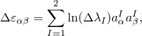平均材料旋转增量从增量的极分解定义：

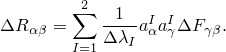由于单元基方向的选择，我们可以假定

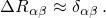
### 参考

### 参考

"Abaqus Analysis User's Guide"第29.1.1节"薄膜单元"
