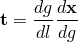
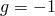
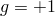
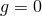
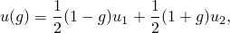
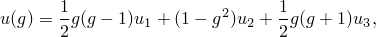
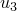
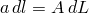
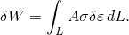
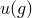

# 3.4.2 桁架单元

### 3.4.2 桁架单元

**产品：** Abaqus/Standard  Abaqus/Explicit

桁架单元是假设仅通过轴向拉伸变形的 一维杆或棒。它们在节点处是销接头，因此离散化中仅使用平移位移和每个节点的初始位置向量。当应变较大时，通过假定桁架由不可压缩材料制成来简化公式。

Abaqus中有两个桁架单元：一个2节点线性插值桁架和一个3节点二次插值桁架。二次插值版本在库中主要用于与其他类型的二次插值单元（如壳单元S8R5）兼容。笛卡尔位移分量和初始位置向量的笛卡尔分量使用相同的插值函数，因此这些单元是最简单形式的等参单元。

这些单元是一维的：沿着单元定义单个材料（等参）坐标*g*，单元中为。在2节点单元中，节点1在，节点2在。在3节点版本中，节点1在，节点2在，节点3在。
### 插值

2节点单元的插值为

3节点单元为

其中、和是变量在节点处的值，是沿桁架的"真实"（柯西）应力，是对数应变，*l*是单元的长度。

由于我们假定桁架是不可压缩的，，其中*A*是原始面积，*L*是桁架的原始长度。因此，

这就是桁架单元内部虚功贡献使用的形式。
### 混合（混合）形式

"混合"桁架单元也可在Abaqus/Standard中使用。在这些单元中，积分点处的轴向力作为额外变量引入，引入兼容性条件来定义这些变量。该公式与混合梁单元使用的公式相同（"混合梁单元，" 第3.5.4节），没有弯曲项。
### 参考

### 参考

"Abaqus Analysis User's Guide"第29.2.1节"桁架单元"
