# 3.4.3 轴对称薄膜

### 3.4.3 轴对称薄膜

**产品：** Abaqus/Standard

Abaqus包含两个轴对称膜单元库MAX和MGAX，其几何形状是轴对称的（旋转体），可以承受轴对称加载条件。此外，MGAX单元支持扭转加载和一般材料各向异性。因此，MGAX单元被称为广义轴对称膜单元，MAX单元被称为常规轴对称膜单元。在两种情况下，旋转体通过将代表膜表面的线（膜的厚度可以忽略不计）绕轴（对称轴）旋转而生成，可以用柱面坐标*r*、*z*和容易地描述。该横截面上一点的径向和轴向坐标分别用*r*和*z*表示。在处，径向和轴向坐标与全局笛卡尔*X*-和*Y*-坐标重合。

如果载荷由独立于的径向和轴向分量组成，且材料是各向同性或正交各向异性的，是主材料方向，则任何点的位移将仅具有径向（）和轴向（）分量。唯一的非零应力分量是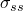和，其中*s*表示在任何*r*—*z*平面上沿代表膜表面的线测量的长度坐标。任何*r*—*z*平面（或更准确地说，任何*r*—*z*线）的变形完全定义了物体中的应力和应变状态。因此，几何模型通过在处离散参考横截面来描述。

如果允许载荷有周向分量（独立于）和一般材料各向异性，位移和应力场变为三维的。然而，问题保持轴对称，因为解不随变化，参考*r*—*z*横截面的变形表征整个物体中的变形。任何点的运动除了上述径向和轴向位移外，还有关于*z*轴的扭转（弧度），它独立于。由于变形，还会有非零的面内剪切应力，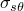。

本节描述广义轴对称膜单元的公式。常规轴对称膜单元的公式是此公式的一个子集。
### 运动学描述

与两类单元一起使用的坐标系是柱面系统（*r*、*z*、），其中*r*测量点到柱面系统轴的距离，*z*测量其沿该轴的位置，测量包含该点和坐标系统轴的平面与包含坐标系统轴的某个固定参考平面之间的角度。这些单元中坐标和位移的顺序基于*z*是第二个坐标的约定。这个顺序与Abaqus中三维单元使用的顺序不同，其中*z*是第三个坐标，也不是柱面系统中通常使用的顺序（*r*、、*z*）。

设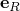、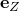和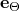是点在未变形状态下沿径向、轴向和周向的单位向量，如图[图3.4.3-1](03s04a72-Axisymmetric-membranes.md)所示。

图3.4.3-1 柱面坐标系和位置向量定义。

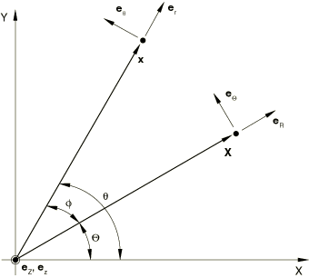点的参考位置可以用原始半径*R*和轴向位置*Z*表示：

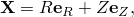类似地，设、和是点在变形状态下沿径向、轴向和周向的单位向量。如[图3.4.3-1](03s04a72-Axisymmetric-membranes.md)所示，径向和周向基向量依赖于坐标：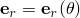和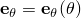。

点的当前位置可以用当前半径*r*和当前轴向位置*z*表示为

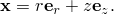膜表面上一点的广义轴对称运动可以描述为

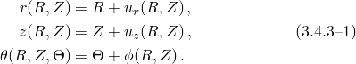如这个描述所暗示的，自由度、和独立于。此外，感兴趣的参考横截面在；然而，为了后续数学分析的利益，在上述表达式中的独立变量很重要。
### 参数插值和积分

运动使用以下参数插值方案：

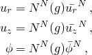其中*g*是参考*r*—*z*横截面在中的参数坐标；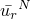、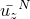、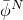是节点自由度。插值函数与桁架单元使用的相同（见"桁架单元，" 第3.4.2节）。所有单元使用缩减积分。
### 变形梯度

对于材料点，变形梯度定义为当前位置相对于原始位置的梯度，由以下给出

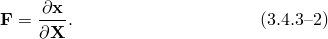

变形梯度的分量需要定义两组正交基向量。在未变形配置中，基向量由以下定义

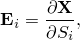其中分别表示参考配置中沿单元长度和周向的长度测量坐标。因此，

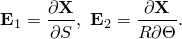在当前配置中，Abaqus用相对于轴对称扭转自由度的固定空间基来公式化方程。基向量随材料流动。然而，由于模型在变形配置中的轴对称性，这些向量可以在定义为

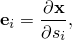其中分别表示当前配置中沿单元长度和周向的长度测量坐标。因此，参考和当前配置中的基向量可以写成

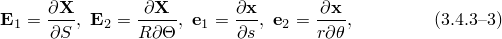其中*S*和*s*分别是参考和当前配置中沿单元长度测量的长度坐标。变形梯度在两组基向量中的分量可以计算为

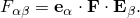使用[公式3.4.3-3](03s04a72-Axisymmetric-membranes.md)中基向量的定义，变形梯度张量的分量为

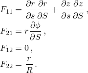
### 虚功

如"平衡和虚功，" 第1.5.1节所讨论的，平衡（虚功）公式需要虚速度梯度，其形式为

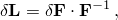其中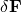表示变形梯度张量的一阶变分。或者，虚速度梯度可以写成

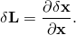回想Abaqus用相对于轴对称扭转自由度的固定空间基来公式化有限元方程。因此，[公式3.4.3-2](03s04a72-Axisymmetric-membranes.md)的线性化不能简单得到所需的结果。也就是说，必须取消来自

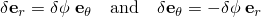的变分的贡献，这源于坐标系统的自旋。为此，可以根据以下方式修改

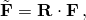其中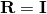瞬时是，但其变分为

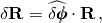其中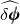是关于处基、和的斜对称分量

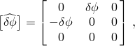。

通过这种修改，共旋转虚变形梯度给出为

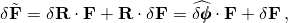共旋转虚速度梯度为

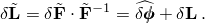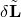的各个分量为

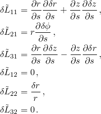分量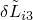不由运动学确定。
### 当前状态的刚度

二阶变分具有通常的贡献：

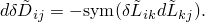此外，还有来自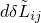的额外贡献，由以下给出

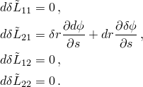其余项不贡献，因为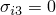。
### 参考

### 参考

"Abaqus Analysis User's Guide"第29.1.4节"轴对称膜单元库"
