# 3.5.2 梁单元公式

### 3.5.2 梁单元公式

**产品：** Abaqus/Standard  Abaqus/Explicit

在梁变形历史的给定阶段，横截面中材料点的位置由表达式

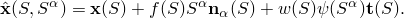给出。在这个表达式中，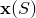是中心线上一点的位置，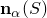是梁截面平面中的单位正交方向向量，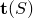是垂直于和的单位向量，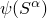是截面的翘曲函数，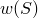是翘曲幅度，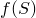是取决于梁拉伸的横截面比例因子。

这些量是梁轴线坐标*S*和横截面坐标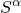的函数，它们被假定为在梁的原始（参考）配置中测量的距离。翘曲函数被选择为使得截面原点处的值为零：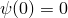。

假定在沿梁的积分点处，梁截面方向近似垂直于梁轴线切线，给定为

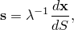其中是轴向拉伸比，给定为

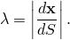通过惩罚横向剪切应变

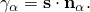来数值强制执行正交性条件。这个条件被假定在原始配置中精确满足。

在下文中，是交替矩阵

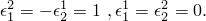梁的曲率定义为

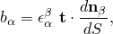梁的扭转由以下得出

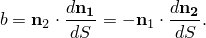梁的"双曲率"定义为

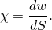

双曲率定义由于梁的扭转导致的截面中轴向应变变化。曲率和扭转的表达可以组合得到

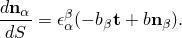在我们从这些表达式推导应变度量之前，我们将详细考虑如何为典型梁有限元获得上述量及其一阶和二阶变分。
### 未变形配置中的梁单元

在未变形配置中，我们对所有量使用大写字母。我们假定未变形状态没有翘曲，因此材料点的位置给定为

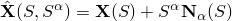曲率和扭转定义为

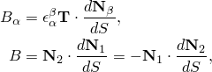其中是垂直于和的单位向量；即，

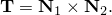我们假定截面法线与梁切线重合。

在单元中，轴线上一点的位置从节点位置用标准插值函数插值为

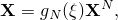其中是参数坐标，通常沿单元在和*1*之间变化。梁轴线切线容易计算为

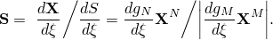截面法线从用户定义的节点法线插值。然而，我们不能使用简单插值，因为这不会创建垂直于梁切线的积分点法线。因此，我们使用两步方法。首先，我们通过插值创建近似法线

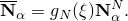然后，我们通过

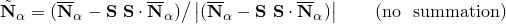相对于对这些向量进行正交化，随后通过

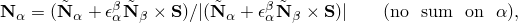相对于彼此进行正交化，其中已假定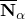和形成右手系统。这提供了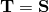。

原始配置中的曲率和扭转直接从计算为

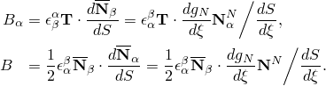"平均"扭转被采用，因为通常，

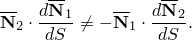然后法线向量的梯度获得为

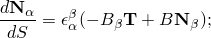因此，曲率和扭转也等于

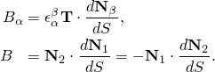上面用于推导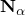和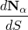的过程不是唯一的，但提供了满足适当正交性条件的值。这个过程仅对未变形配置执行。对于后续配置，和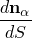通过运动方程的前向积分单独获得。
### 位置、翘曲和法线方向的变化

我们假定梁轴线的位置和法线方向可以发生（独立的）变化。轴线位置的变化由速度向量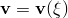描述，可以从节点速度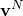用标准插值函数获得为

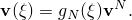法线方向的变化由自旋向量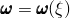描述，从节点自旋向量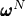用相同的插值函数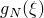获得为

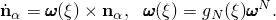刚体运动被包括，因为原始位置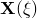通过与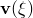相同的插值获得。翘曲的变化率也定义为节点翘曲变化率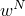用标准插值函数的变化为

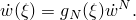速度和自旋描述了位置和方向*变化率*。位置的*有限*变化通过对有限时间增量上的速度积分获得为

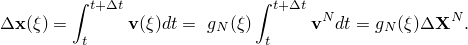类似地，对于翘曲，

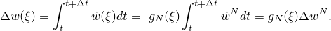自旋与旋转四元数的变化率相关，关系为

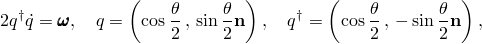其中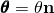是总旋转或Euler旋转。

如果假定自旋在时间增量上是常数，则自旋和四元数之间的关系可以被精确积分。然后我们定义

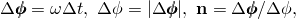增量旋转四元数由以下得出

这允许我们用

更新节点和应力点处的法线方向。在这个方程中，我们使用这样的符号：是当前增量开始时的；即，

对于整个运动，新的法线方向可以形式上表达为

其中由乘积规则定义

这里*i*是一个增量，是该增量的旋转四元数。截面法线以相同方式更新。
### 曲率和扭转的变化

曲率和扭转涉及法线向量相对于*S*的导数。从的更新规则，

第二项可以写成

因此，前两项的标量部分相互抵消，向量部分相同。因此，

因为是一个旋转四元数，其逆等于其共轭（），因此我们可以写成

其中表示四元数的向量部分。对于第一项，我们使用关系

这导致

这是一个向量。从和的定义可以得出

这些结果提供

我们看到，如果，则。

对于第二项，我们用增量开始时的曲率和扭转表示，这给出

组合这些项，

因此，当前曲率和扭转为

和

因此，当前曲率和扭转通过给定所有增量的求和来更新为

### 一阶变分

几何量的一阶变分容易获得。回想

由此得出

其中在的表达式中，我们假定和。对于曲率和扭转的变分，我们注意到。因此，由此得出

这些项将用于后面将讨论的虚功方程。在使用上述表达式时，旋转量通过从被假定对速度场有效的节点变分量的插值获得为

### 用牛顿算法求解

牛顿算法涉及增量方程的线性化。方程必须在当前（最新）状态周围线性化。在积分点处，这些方程简单地取形式

校正和容易从节点校正用插值函数获得为

校正相对于增量结束定义：我们称这种校正为"复合"校正。然而，已假定总增量旋转将用插值为

这个方程的线性化给出

其中是中在加法意义上的校正，使得

为了将加法校正与复合校正相关，我们使用为获得的公式来发现

类似地，在节点处我们发现

现在我们假定沿梁单元的增量旋转很小；即，

这意味着要么

要么

在第一种情况下，我们可以使用近似和，连同用于的插值函数，这给出

在第二种情况下，直接得出

无论哪种情况

这个近似关系仅用于创建Jacobian，因此近似最多会导致收敛速度降低。

一旦获得节点更新向量，就遵循精确的更新过程。这是通过变换到四元数、使用精确的四元数更新公式、以及将结果变换回增量Euler旋转向量来实现的：

积分点处的增量旋转向量通过插值获得。随后，我们可以计算更新的积分点法线和增量曲率和扭转。
### 二阶变分

为了计算Jacobian，我们还需要广义量的二阶变分。这些从一阶变分得出：

其中我们再次使用了。

对于曲率的二阶变分，我们发现

重写第二项和第三项并组合其他项给出

扭转的二阶变分为

然后，按照与相同的过程，

最后，我们注意到

得到的二阶变分总结为

### 应变

截面中一点相对于坐标*S*的当前位置梯度为

我们将仅保留到阶的项。我们假定，因此第二项可以被忽略。我们还假定，并且由于，我们也可以忽略最后一项。然而，翘曲函数可能在端部附近翘曲被约束的地方快速变化。因此，应该被保留。有了这些近似，

相对于的梯度为

相应地，在原始配置中

上述关系容易反转得到

变形梯度然后变为

我们定义初始长度比R为

在上述方括号内的表达式中，阶的项可以再次被忽略。然而，假定截面可能对扭转具有低阻力，因此翘曲和扭转可能很大。这对于薄壁开口截面尤其如此。因此，我们获得：

我们在一个共旋系统中计算的分量，近似为。这提供

我们再次忽略中阶的所有项，除了涉及的项。方程然后简化为

与传统壳和梁理论一致，我们稍微调整涉及初始曲率的项——不是用它乘以，而是用*f*乘它。这样的更改不会显著增加曲率计算中的误差，因为我们无论如何都没有正确地考虑体积积分中的初始曲率。因此，我们为发现：

我们现在对进行乘法分解成"拉伸"部分和"畸变"部分，使得。

对于，我们选择

因此，是

因为是对角张量，对数"拉伸"应变立即可得为

因为"畸变"应变很小，我们从用Green-Lagrange公式获得它们：

对于分量，这给出

注意这些应变很小。因为各项对横截面坐标有不同的依赖关系，这导致条件

最后一个条件通常要求*w*和都很小，因为不会与成正比。然而，对于薄壁开口截面梁，近似满足比例关系，因此我们在这种情况下获得

注意，在所需的精度内，这个方程甚至对其他截面也成立：在这种情况下，右手边和左手边都非常小。代入Green-Lagrange应变表达式得到（小）畸变应变：

总应变通过加法简单相加获得为

我们假定在方向上没有应力。因此，这些方向的应变对虚功没有贡献，不需要进一步考虑。

将总翘曲*w*分成两部分是有用的：由于"自由"翘曲减去由于防止翘曲的部分：。我们假定翘曲函数被选择为使得自由翘曲与扭转有关，关系为

这使得可以将的表达式写成

理想情况下，我们希望选择横截面合矢量，使得它们完全不耦合。此外，我们假定由于扭转中的二阶项导致的整个截面上的轴向应变变化不显著。因此，我们仅考虑由于二阶扭转项引起的*平均*轴向应变。因此，我们引入平均轴向应变

其中是质心坐标，是极惯性矩，是翘曲函数的平均值：

类似地，我们引入平均剪切应变

最后一个表达式可以通过引入剪切中心坐标来简化，它与翘曲函数有关系

这给出

注意，如果没有防止翘曲（），平均值实际上是剪切中心处的值。然而，对于完全防止翘曲（），平均值对应于在质心处获得的值。

我们不是使用原始翘曲函数，而是引入修正翘曲函数，它与有关系

这个函数实际上代表翘曲函数的经典定义，其面积加权平均值为零。平均值可以从经典翘曲函数获得，条件为：

平均轴向应变的表达式然后变为

剪切中心的位置为

因此，应变可以写成形式

[表达式中的第二项与纯弹性扭转的剪切应变场成正比：

我们使用这个定义从剪切应变表达式中消除的梯度，这给出应变的最终表达式

### 虚功

由于假定在方向上没有应力，虚功贡献为

应变变分通过应变表达式的线性化获得为

其中忽略了"畸变"应变阶的所有项。从平均轴向应变和平均剪切应变的表达式，我们获得平均轴向和剪切应变变分为

其中再次忽略了"畸变"应变阶的所有项。

我们现在引入如下定义的广义截面力：

| 轴向力 | |
| --- | --- |
| 剪切力 | |
| 弯矩 | |
| 扭矩 | |
| 翘曲矩 | |
| 双力矩 | |

这将虚功贡献变换为

观察，总扭矩*T*相对于截面质心是扭转矩和翘曲矩之和：

### 虚功的变化率

为了获得虚功的变化率，我们首先将虚功方程中的积分变换到原始体积，使得

相对于原始状态的应变变分为

相对于原始状态的应变变分为

虚功的变化率为

其中我们忽略了*b*阶的项。应力变化从本构律得出

我们用与虚功相同的关系近似和：

对于平均应变率

我们现在忽略涉及应力张量；曲率、扭转或翘曲的变分；以及横截面轴向应变变化的乘积的所有项。使用先前获得的和中二阶变分的表达式，并将结果变换到当前状态，这提供

增量矩、力等定义为

为了确定初始应力刚度，我们假定翘曲函数及其导数的二阶变分为零：。因此，

因此，只有相对于质心的扭矩对虚功变化率的初始应力贡献起作用：

[和的二阶变分包含曲率和扭转二阶变分的贡献。这些可以通过定义相对于横截面坐标系原点的弯矩和扭矩来分离：

虚功变化率的表达式然后取形式

我们建议将"横截面大小"作为拉伸的函数。对于截面的热拉伸，我们使用各向同性膨胀，对于截面的"机械"拉伸，我们假定有效泊松比。总横截面拉伸为

所以

将其用于上述虚功变化率的表达式，我们发现

如果材料张量是对称的，这个表达式是对称的。
### 截面积分

前面几页中提出的公式适用于所有可能的梁类型。然而，不同类型的梁将导致不同的最终公式。我们考虑三类不同的梁：

可能约束翘曲的梁。这些梁通常具有开口薄壁截面，用一些相对实心的部分或一些相对较小的闭合单元加固，扭转常数比极惯性矩小得多。因此，在弹性范围内，翘曲可能很大，端部翘曲约束可能对梁的扭转刚度有重大贡献。在这种情况下，扭转剪切应力和轴向翘曲应力可能与轴向力和弯矩引起的应力具有相同数量级，必须使用完整理论。

翘曲未受约束的梁。这些梁通常具有实心截面或闭合薄壁截面，扭转常数与截面极惯性矩具有相同数量级。因此，在弹性范围内，翘曲相当小，假定端部翘曲约束可以被忽略。假定轴向翘曲应力可以忽略不计，但假定扭转剪切应力与轴向力和弯矩引起的应力具有相同数量级。在这种情况下，翘曲依赖于扭转，可以作为独立变量消除，这导致了相当简化的公式。

翘曲约束主导扭转刚度的梁。这些梁通常具有开口薄壁截面，扭转常数比极惯性矩小得多。在弹性范围内，翘曲可能很大，翘曲约束对于为梁提供扭转刚度至关重要。在这种情况下，轴向应力可能与轴向力和弯矩引起的应力具有相同数量级，但扭转剪切应力相对较小。因此，翘曲可以与相对刚性弹性约束的扭转耦合，但不能被消除，因为必须能够防止节点处的翘曲。在一般讨论有无翘曲约束的截面之后，将推导最后两类的截面示例。

在Abaqus中，我们忽略个别材料点上横向剪切引起的剪切应力的影响。因此，我们将始终假定横向剪切中的截面弹性行为，导致关系

其中是横向剪切力，作用在剪切中心，是用于防止剪切刚度在细长梁中变得过大的"细长补偿因子"。细长补偿因子定义为

其中是单元的长度，*I*是惯性矩和中的较大者。因此，横向剪切项不需要在任何进一步细节中考虑。

横向剪切力被单独考虑这一事实允许我们写成

其中和是由于横向剪切力引起的应变和应力，和是由于围绕剪切中心的扭转引起的应变和应力。代入扭转和翘曲矩的表达式给出

其中我们使用了这样的事实：是基于围绕剪切中心施加扭转矩计算的，因此对横向剪切力引起的剪切应力不做功。

翘曲函数假定基于截面在剪切中的各向同性均匀弹性行为来确定。对于这种情况，扭转的弹性能量为

对于没有翘曲约束的扭转，消失，单位长度梁的能量为

其中我们引入了扭转积分*J*给定为

对于完全防止翘曲，和单位长度梁的能量为

其中我们引入了极惯性矩

对于无约束翘曲，。由于扭矩必须等于

并且由于

由此得出

### 翘曲未受约束的梁

对于这种梁类型，不考虑翘曲约束。因此我们假定。此外，我们假定翘曲引起的轴向应变可以忽略不计：。

对于材料点的应变，这给出

对于应变变分

代入虚功声明给出

其中前面为*F*、、和推导的表达式适用。

虽然截面中没有翘曲约束，但翘曲矩并不消失。从 earlier 获得的表达式得出

这给出关于质心的扭矩

对于关于原点的扭矩

对于虚功的变化率，我们类似地获得

### 具有弹性扭转和约束翘曲的梁

考虑剪切应力由线性弹性响应从剪切应变定义的情况，剪切模量恒定为*G*：

这允许我们为扭转和翘曲矩写成：

将这些表达式代入与扭转相关的虚功方程部分给出

注意，关于质心的扭矩*T*为

因此，我们可以将虚功写成关于主变量*b*和*w*的形式：

完整虚功方程具有形式

其中*F*、、和*W*如前定义。

对于虚功的变化率，我们类似地获得

我们现在讨论Abaqus中包含的一些特定截面类型。
### 圆形截面

对于这种截面，不存在翘曲。因此，

### 实心非圆形截面

矩形或梯形等实心截面属于此类。翘曲函数是调和函数，受条件约束，即没有剪切应力分量可以垂直于横截面边界作用。虽然可以以此种方式确定翘曲函数，但由于其简单性，我们选择使用Saint-Venant应力函数来处理。按照标准程序，我们对这个函数进行归一化，使得（弹性）剪切应变可以直接从中导出。我们引入函数，它在横截面中可微，具有性质

应力函数通过求解形式为

的微分方程确定，其中*S*表示截面的边界。这个边界条件确保没有剪切应力分量可以垂直于边界作用。

对于实心非圆形截面，这个微分方程使用二阶等参有限元数值求解。杆的扭转常数然后等于归一化应力函数曲面下体积的两倍。
### 闭合薄壁截面

在这种情况下，我们假定垂直于截面的剪切应变必须消失，使得

由于，这给出

这可以 identical 满足任何地方。沿截面的归一化剪切应变为

其中*s*是沿截面的距离。围绕圆周积分这给出

其中是截面所包围的面积。假设剪切模量沿截面恒定，总扭转弹性能量为

其中*t*是壁厚。用Lagrange乘子约束最小化能量给出

因此，组合定义

这允许基于截面几何在任何点计算。
### 薄壁开口截面

表现出显着翘曲的最重要截面是薄壁开口截面。对于单个分支截面，我们可以方便地将表示为沿截面的坐标*s*和垂直于截面的坐标*z*的函数。的合适近似为

其中是壁中心线处的值。最小化扭转弹性能量给出

我们现在引入，这是壁中间的位置。具有和，并在完成对*z*的积分后，最小化条件简化为

显然，主项是*h*阶的。这给出方程

所以是

其中是沿截面开始处的值。注意，

表示相对于剪切中心在 midsection 上两点之间的*扇形面积*。因此，容易得出

所以对于线性弹性材料行为，截面中扭转和弯曲之间没有耦合。如前所述，必须被选择为使得

这消除了截面中扭转和轴向延伸之间的耦合。

注意，耦合项仍然存在，但它们被纳入广义应变-位移关系中。扭转和延伸之间的耦合由控制，这是翘曲函数在横截面坐标系原点处的值。如果原点在截面上，可以正确评估这个值。如果原点不在截面上（这意味着节点未连接到截面），我们假定。

扭转积分*J*容易获得为

极惯性矩由表达式给出

上述推导涵盖了单分支开口截面。多分支开口截面可以通过将一个分支的末端与下一个分支的开始用厚度为的截面连接，转换成单分支开口截面。这样的虚拟截面不会对面积、惯性矩或扭转积分产生任何贡献，因此对结果没有影响。
### 参考

### 参考

"Abaqus Analysis User's Guide"第29.3.1节"梁建模：概述"
