# 3.5.4 混合梁单元

### 3.5.4 混合梁单元

**产品：** Abaqus/Standard

Abaqus/Standard中的混合梁单元设计用于处理非常细长的情况，其中梁的轴向刚度相对于弯曲刚度非常大；因此需要混合方法，其中轴向力被视为独立未知量。对于剪切梁，提供了混合单元，其中横向剪切力也被视为独立未知量。本节讨论这些混合方法的基础。
### 轴向和弯曲行为

梁的内部虚功可以写成

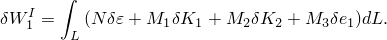或者，我们可以引入独立的轴向力变量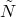，并写成

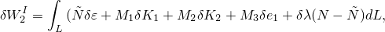其中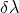是引入的Lagrange乘子，用于强制执行约束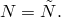。这些表达式的线性组合为

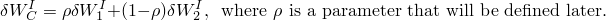然后

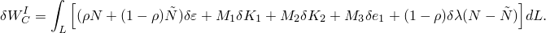该项对牛顿方案的贡献为

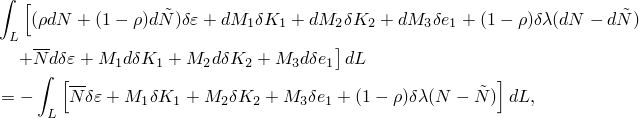其中

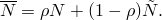截面行为的切线刚度给出

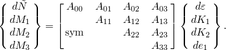如果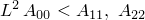（其中*L*是单元长度），则梁在轴向是柔性的，混合公式是不必要的。否则，我们假定上面第一个方程的逆定义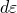从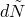：

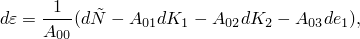所以

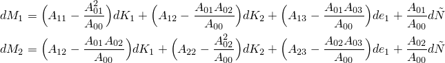

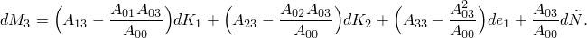现在使用乘以的第一切线截面刚度和乘以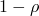的第二切线截面刚度，单元的牛顿贡献变为

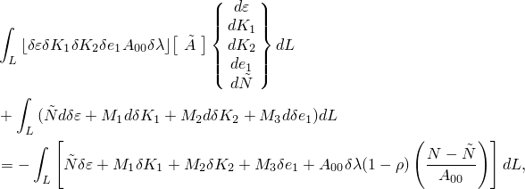其中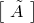是

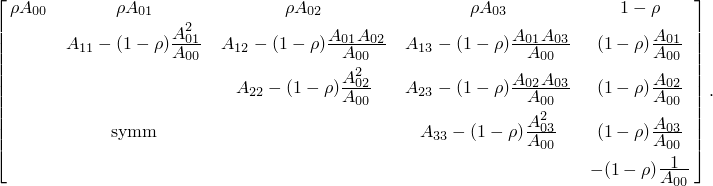变量在单元中每个积分点处被作为独立值选取。我们选择为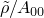，其中是一个小值。通过这样的选择，通过确保在每个单元的位移变量之后消除变量，高斯消元方案在求解方程时没有困难。
### 横向剪切

在允许横向剪切的混合单元（B21H、B22H、B31H、B32H）中，通过将剪切力作为独立变量处理，使用以下公式来强制执行横向剪切约束。与横向剪切相关的内部虚功为

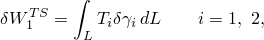其中和是截面上的剪切力，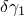和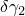是横向剪切应变的变分。虚功也可以通过引入独立剪切力变量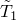和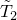写成

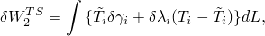其中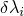是Lagrange乘子。与轴向情况一样，我们取这两种形式的线性组合，

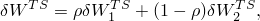其中稍后定义。这给出

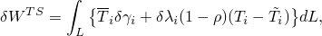其中

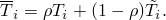该项对牛顿方案的贡献为

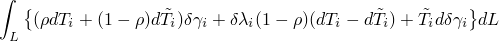

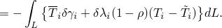

Abaqus以弹性方式处理横向剪切，所以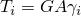，其中是常数。然后牛顿贡献为

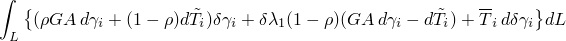

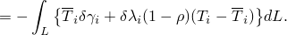

我们现在定义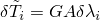并选择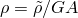，其中是相对于的一个小值，以给出

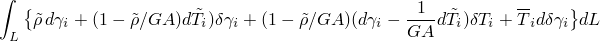

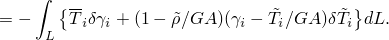
### 参考

### 参考

"Abaqus Analysis User's Guide"第29.3.3节"选择梁单元"
