# 3.5.5 Timoshenko梁的质量和惯性

### 3.5.5 Timoshenko梁的质量和惯性

**产品：** Abaqus/Standard  Abaqus/Explicit

Abaqus中Timoshenko梁（包括PIPE单元）的质量和惯性属性可能来自两个独立的来源。第一个来源是梁本身的密度和横截面几何。第二个来源来自可能施加在梁横截面上指定位置的任何额外质量和每单元长度的惯性属性。当质量和惯性仅从第一个来源给出时，用户可以选择请求各向同性近似或梁质量矩阵的精确旋转惯性公式。当使用各向同性公式时，每长度的梁质量被施加到位于横截面轴原点的梁节点，并且质量矩阵公式中忽略梁节点与横截面质量中心之间的偏移（如果非零）。

设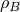是梁密度。梁横截面坐标系中关于质量中心质量和旋转惯性定义为

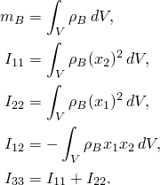这里，和是相对于横截面质量中心测量的。

对于各向同性（近似）公式，单元的质量矩阵取形式

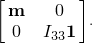在二维中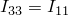。

在本节所有表达式中，适用于平移自由度的质量矩阵对于2节点梁是集中的，对于3节点梁是一致的。

当使用精确公式时，梁节点与横截面质量中心之间的任何偏移将在单元的质量矩阵中产生平移自由度与旋转自由度之间的耦合。

设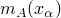定义每梁长度的附加质量。组合梁质量定义为

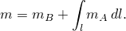

设是质量中心*C*与具有当前坐标的某个点之间的向量，

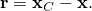

对于刚体，物体中任何点的速度由以下给出

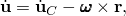其中是物体的角速度。对这个表达式取时间导数，加速度为

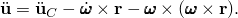

平衡方程的局部或强形式表示线性动量守恒和角动量守恒；这两个平衡方程是

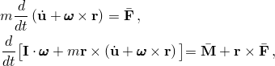其中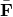和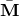是作用在质量中心处的外力和外部力矩，是旋转惯性张量。

平衡的变分或弱形式为

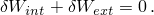取平衡方程中的时间导数，内部或d'Alembert力贡献为

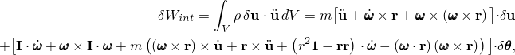其中是物体中一点位置的变分，是刚体参考节点旋转的变分。外部载荷贡献为

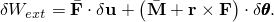对于线性理论，所有非线性项被忽略，因此内部力贡献简化为

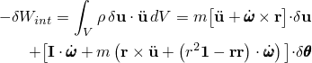并导致以下所有线和线性扰动分析的质量矩阵：

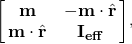其中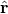表示斜对称矩阵，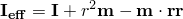。

当刚性体的惯性用于隐式时间积分时，需要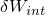的Jacobian贡献。它可以写成形式

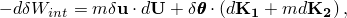其中使用了以下符号

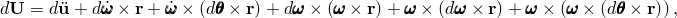

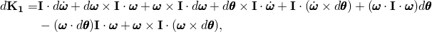

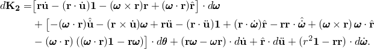在3节点梁的Jacobian公式中，平移自由度使用一致质量矩阵，旋转自由度以及耦合平移和旋转自由度的项使用集中质量矩阵。
