# 3.6.3 剪切柔性小应变壳单元

### 3.6.3 剪切柔性小应变壳单元

**产品：** Abaqus/Standard

本节讨论Abaqus/Standard中小应变剪切柔性单元的公式，它们是四边形（S4R5、S8R5、S9R5和S8R），6节点三角形STRI65除外。这些单元的基本思想是壳参考表面上一点的位置————和一个向量——近似垂直于参考表面——的分量被独立插值。然后壳理论的运动学包括从相对于表面上位置的导数测量参考表面上的膜应变，以及从的导数测量弯曲应变；用于此目的的应变度量是Koiter-Sanders理论应变的近似（[Budiansky和Sanders, 1963](07s01a01-References.md)）。横向剪切应变测量为在壳参考表面切线上的投影变化。对于这些单元类型，应变度量适用于大旋转但小应变，并且忽略由变形引起的壳厚度变化。
### 符号

[图3.6.3-1](03s06a81-Shear-flexible-small-strain-shell-elemen.md)中显示了一个典型的壳表面片段。

图3.6.3-1 壳参考表面。

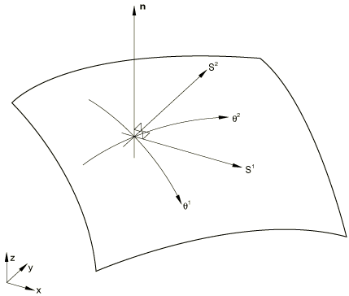设（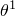，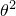是壳参考表面上的高斯曲面坐标集。由于这些坐标仅在积分点处局部需要，我们使用单元的参数坐标作为这些坐标。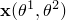是插值参考表面上一点的当前位置，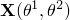是同一点的初始位置。单位向量

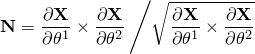是初始配置中插值参考表面的单位法线。这个向量给表面一个"侧面"——壳的一个表面是"顶"表面（在壳参考表面沿正方向），另一个是底表面。对应于当前配置中的向量，将通过离散强制执行Kirchhoff约束，使其近似垂直于当前配置中的参考表面。

在本节的其余部分，希腊索引将用于指示与（二维）参考表面相关联的值，因此在求和约定下将对范围1、2求和。

首先，我们为应力和应变输出建立方便的方向。这些将是局部材料方向，与共旋方向无法区分（达到近似的阶数），因为我们假定应变很小。在整个Abaqus中用于表面上这种局部方向的标准约定如下。

选择正交方向最为方便。定义

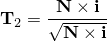只要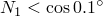，其中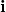是全局*X*方向的单位向量；否则，

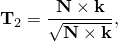其中是全局*Z*方向的单位向量。然后定义

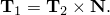

设

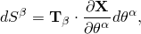使得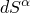是每个材料点处局部定义的距离测量坐标。变换

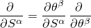相对于表面坐标局部变换。这里

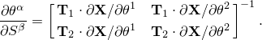

应力和应变分量在（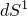，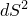）方向中形成。
### 表面度量

定义以下表面度量。变形表面的度量为

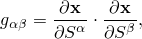曲率张量的近似（二次基本形式）是

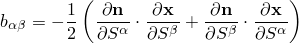（这只是近似，因为在当前配置中不完全垂直于表面）。

原始参考表面对应的度量是度量

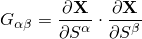和曲率的近似

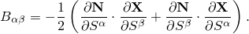向量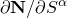从插值函数的导数和节点处的"法线"定义。这些节点法线计算为会切于该节点的所有单元表面法线的平均值。Abaqus确定表面在该节点处是否打算平滑（标准是节点处法线之间的角度应小于20）。如果表面不被计算为平滑，则在节点处的不同表面分支中设置单独的法线。因此，应该是原始参考表面二次基本形式的合理近似。
### 位移

壳单元的节点变量是壳参考表面的位移，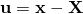，和法线方向，。由于被定义为单位向量，只需要两个独立值来定义，因此这种壳单元每个节点只需要五个自由度。在Abaqus中以两种方式处理这个问题。在自然每个节点有五个自由度的平滑壳表面节点处，Abaqus存储增量开始时投影到壳表面内两个正交方向上的变化的投影值，以定义。否则，Abaqus存储通常的旋转三重奏，，在节点处。后一种方法如果节点在平滑表面上，则留下冗余自由度。在节点处局部引入小的刚度，将这个额外的自由度约束为壳参考表面相同旋转的度量。
### 插值

相同的双多项式插值函数用于、、和的所有分量。库中的剪切柔性壳单元使用双线性插值（四个节点）、完全双二次插值（九个节点）和"serendipity"二次插值（八个节点）。
### 应变

参考表面膜应变为

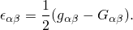

曲率变化为

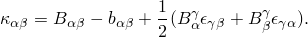

横向剪切为

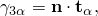其中

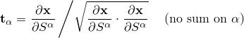是当前表面中线的单位切向量。

除了这些应变外，当在单元的节点上使用六个自由度时，额外的旋转自由度以如下方式用惩罚约束。

当这样的节点是单元的角节点时，在单元中定义、、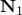、和（如上）。注意，在每个单元的节点处这些将是不同的，因为插值表面通常不是连续的。然后要惩罚的应变定义为

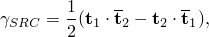其中

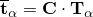是由节点处的旋转值定义的旋转切线方向，和

是由节点处插值参考表面运动定义的旋转切线方向。

在原始配置中的每个边中节点处，定义作为该表面分支节点处单元的平均表面法线（最多有两个这样的单元），作为边的切线。然后定义

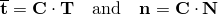作为由节点处的旋转值定义的和的旋转值。向量

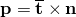然后垂直于和边。

然后在这些边中节点处要惩罚的应变定义为

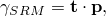其中

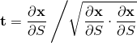是参考表面当前位置中单元边的切线。
### 惩罚

横向剪切应变在一组缩减积分点计算，并与以下刚度相关联：

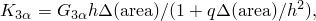其中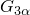是与横向剪切相关的弹性模量。由用户直接定义，或从为壳层给出的弹性模量计算。*h*是壳厚度；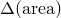是在数值积分方案中与此积分点相关的参考表面面积值；*q*是一个数值因子，目前设置为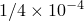。（关于这种因子的讨论，见[Hughes等人，1977](07s01a01-References.md)。）横向剪切总是被弹性处理：壳中的非线性材料计算基于平面应力理论，使用膜应变和弯曲应变来定义在每个贯穿壳厚度的积分点处平行于壳参考表面的应变。

当在使用六个自由度的节点处需要旋转约束时，使用的惩罚为

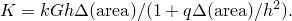

这与横向剪切约束相同，只是这里是被"分配"给节点的面积，因子*k*被引入。这个（小的）因子基于数值实验选择，大到足以避免奇异性，又小到足以避免显著增加模型的刚度。

这些应变度量，连同上面指定的插值，对于任何一般刚体运动给出零应变

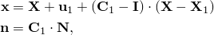其中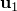、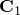和是常数。
### 应变的一阶变分

应变的一阶变分为

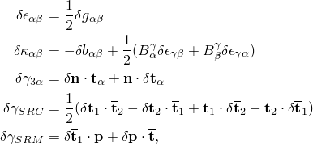其中

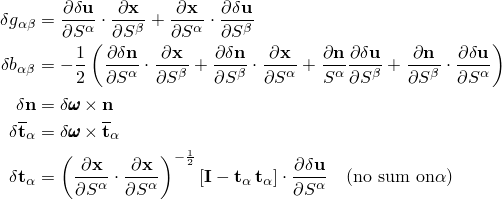而在边中节点处

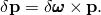
### 应变的二阶变分

在形成初始应力矩阵时，我们通过忽略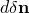、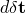等来近似，以简化表达式并降低形成矩阵的成本。数值实验表明，至少对于测试的问题，这不会显著影响收敛速率。有了这个近似，

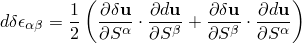

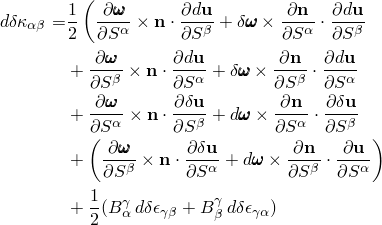

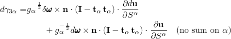

和

### 内部虚功率

对于这些壳单元，内部虚功率假定为

其中、和是上面定义的横向剪切刚度和惩罚，*r*表示计算横向剪切的积分点，表示使用六个自由度的角节点，表示使用六个自由度的边中节点。这里和是在距离参考表面*z*偏移的表面中的（，）材料方向中的应变和应力。采用通常的Kirchhoff假设：

所以上面第一项为

厚度方向积分在Abaqus中数值执行。积分方案是Simpson规则，用户选择阶数。壳也可以被认为是分层的，每层有不同的属性，每层分配有不同的积分方案（由用户指定）。
### 压力载荷刚度

与压力载荷相关的载荷刚度在壳中通常很重要，特别是在弹性壳的特征值屈曲估计中。在Abaqus/Standard中，压力载荷刚度实现为对称形式，因此假定压力大小在表面上恒定，并忽略自由边效应。详见[Hibbitt（1979）](07s01a01-References.md)和[Mang（1980）](07s01a01-References.md)。

载荷刚度以如下形式获得。与压力相关的外部虚功为

其中是每单位面积的压力载荷 given in terms of the (externally prescribed) pressure magnitude, *p*, as

因此，

由壳位移变化引起的这项变化（"载荷刚度"）为

因为我们假定压力大小*p*是外部给定的，不依赖于位置。忽略自由边效应，并假定大小*p*均匀，导致对称形式

这就是Abaqus中提供的压力载荷刚度。
### 参考

### 参考

"Abaqus Analysis User's Guide"第29.6.1节"壳单元：概述"
