# 3.6.4 三角形面壳单元

### 3.6.4 三角形面壳单元

**产品：** Abaqus/Standard

Abaqus/Standard中的STRI3单元类型是一个面壳——一个用于近似壳的板单元。单元有三个节点，每个节点有六个自由度。应变更基于薄板理论，使用小应变近似。通过在随单元旋转的局部坐标系中公式化单元变形来精确考虑任意刚体旋转。单元也满足分片测试，因此它将使用适当的网格产生可靠的结果。

单元的弯曲基于Batoz的插值函数（[Batoz等人，1980](07s01a01-References.md)）对板弯曲的离散Kirchhoff方法。这个公式满足整个三角形边界上的Kirchhoff约束，并提供整个单元内曲率的线性变化。然而，膜应变在单元内被假定为常数。此外，曲线壳被这个单元近似为一组由每个单元的三个节点定义的平面形成的面。因此，在大多数应用中需要使用相当精细的网格。
### 运动学

在参考配置中，在每个单元的平面内定义局部正交基系统，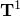和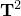，使用标准Abaqus约定。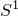和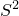在参考配置中沿和测量距离。

图3.6.4-1 参考配置中的三角形面壳。

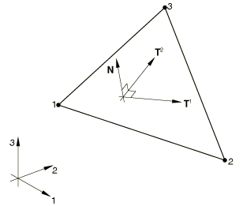膜应变然后定义为

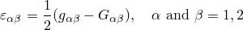其中

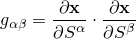是当前配置中的度量，和

是参考配置中的度量。

这里和分别是当前和参考配置中点的空间坐标。曲率变化增量定义。为了考虑大的刚体旋转，我们使用随单元三个节点定义的平面旋转的局部坐标系。为这个局部系统选择的基向量是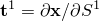和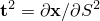。由于膜应变被假定为小，这些向量将近似正交。板法线的增量旋转分量定义为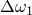关于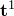和关于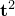。板参考表面沿其节点平面法线的增量位移定义为。（注意在节点处始终为零，因为包含和的平面总是通过节点。）Kirchhoff约束近似为

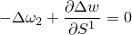和

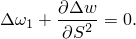

[Batoz（1980）](07s01a01-References.md)假定和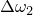在单元上以二次方式变化，沿单元的每条边独立定义为三次函数。然后Kirchhoff约束在角落和沿边方向在每个单元边的中点强制执行，得到

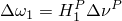和

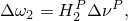其中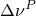是数组

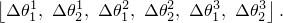

在上述表达式中，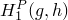和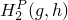是由[Batoz（1980）](07s01a01.md定义的插值函数，节点处的增量旋转分量，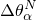，定义为

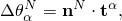其中

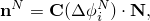和是节点*N*处旋转自由度的增量，是由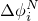定义的旋转矩阵，是增量开始时单元节点平面的法线。最后，增量曲率变化度量定义为

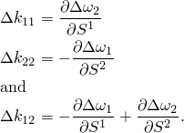

三个膜应变和三个曲率应变完成了单元的基本运动学描述，只是每个节点使用六个自由度在每个节点处引入了伪旋转（在上述方程中仅出现每个节点的两个增量旋转——关于单元节点平面法线的旋转不进入）。为了处理这个问题，我们定义了一个广义应变，在每个节点处用小的刚度惩罚

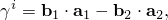其中

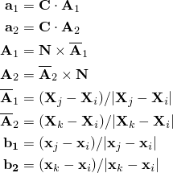*j*、*k*是在节点*i*处形成三角形两边的节点号，按循环顺序排列。
### 应变的一阶变分

应变的一阶变分为

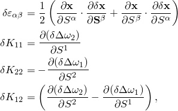其中

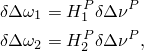而在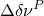中，

此外，对于用于在节点处引入额外刚度以避免由法线方向旋转分量引起的奇异性的"应变"，

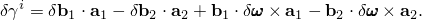
### 应变的二阶变分

应变的二阶变分为

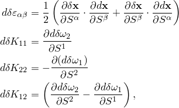其中

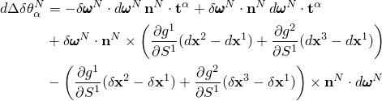和

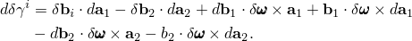这里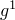和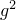是单元平面中的坐标，归一化使得单元的节点在（0,0）、（1,0）和（0,1）。
### 内部虚功率

内部虚功率定义为

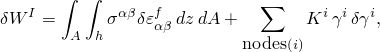其中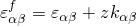是距离参考表面*z*点处的应变；是该点*z*处的应力分量；*h*是壳厚度；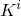是用来约束伪旋转的惩罚刚度。

公式化现在按照"剪切柔性小应变壳单元，" 第3.6.3节中描述的壳单元进行，在单元平面上使用3点积分方案。
### 参考

### 参考

"Abaqus Analysis User's Guide"第29.6.1节"壳单元：概述"
