# 3.6.7 允许非对称加载的轴对称壳单元

### 3.6.7 允许非对称加载的轴对称壳单元

**产品：** Abaqus/Standard

Abaqus/Standard单元库包括一组具有轴对称参考几何形状的非线性薄壳单元，允许非对称加载和变形（SAXA1N和SAXA2N）。本节提供它们的理论公式。这些单元涵盖了从变直径管的弯曲/椭圆化到圆板弯曲的广泛实际应用。这些单元的理论公式类似于"有限应变壳单元公式"第3.6.5节中描述的一般有限应变壳单元。此外，该公式是对"允许非线性弯曲的轴对称单元"第3.2.9节中描述的连续体轴对称弯曲单元的壳对应物。

与连续体轴对称弯曲公式一样，限制条件是*r*-*z*平面中存在对称平面于。因此，允许模型的面内弯曲，而排除了诸如关于对称轴的扭转等变形。未变形构型和变形的对称性通过在壳周向假设特定的位移和旋转插值来利用。具体而言，在或周向方向使用Fourier级数展开来保持对称平面。
### 几何描述

设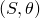是参数化壳参考表面的坐标函数，设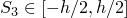是厚度方向的坐标函数，其中*h*是壳的初始厚度。（关于有限应变壳公式的几何描述的详细说明，见"有限应变壳单元公式"第3.6.5节。）然后，参考或未变形构型中的点由法向坐标映射标识为

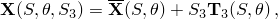其中是材料点的三维位置，是壳参考表面映射，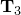是壳参考表面的单位法线。是单位向量这一事实假设参考构型是（局部）恒定厚度的。由于轴对称参考构型，可以相对于全局笛卡尔坐标系给出为

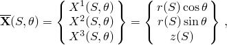其中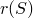是半径，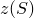是轴向位置，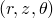是圆柱坐标。（请注意，圆柱坐标的通常约定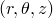已被更改，这与轴对称壳单元和允许非线性弯曲的轴对称单元一致。）根据定义，壳参考表面的法线场为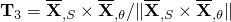，通过直接计算得出

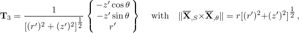其中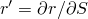和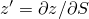。相对于圆柱坐标系，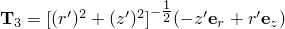。

基本运动学假设是：对于任何变形构型，物体中一点的位置可以确定为

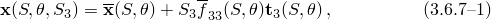其中是材料点的变形位置，是变形的壳参考表面映射，是变形的单位方向场，是厚度变化参数。对于任何壳公式，关键重要的是旋转场的处理；即，方向场的处理。方向场的几何描述和增量更新程序在下面详细给出。

在上述运动学假设下，壳的变形构型完全由参考表面映射、变形方向场和厚度参数决定。

我们定义以下位移量。由于是（线性）向量空间中的一个元素，我们可以通过变形参考表面和未变形参考表面之间的差来定义参考表面位移向量；即，

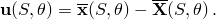然而，方向场是一个不属于线性向量空间的单位向量场。方向场的方向用旋转向量定义为

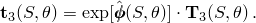这里是由旋转向量定义的反对称矩阵，定义为

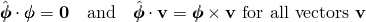是由闭式表达式给出的正交变换

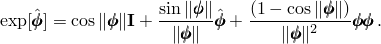或者，可以使用四元数代数来指定变形方向场的方向。在这种情况下，正交矩阵被四元数参数取代，其中

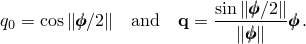然后单位方向场的方向由下式得出

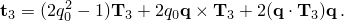类似地，正交变换可以从四元数参数中提取为

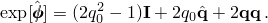
### 插值

位移和旋转分量相对于圆柱坐标系给出，其标准正交基向量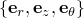在参考或未变形构型中是固定的。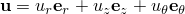和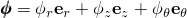的一般插值方案使用关于变量的Fourier展开为

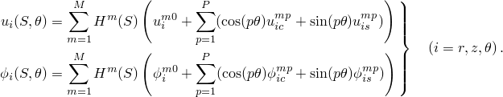这里是沿轴对称参考构型生成线的多项式插值函数；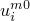、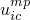、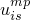、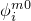、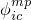、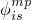是解幅值（Fourier系数）；*M*是沿生成线插值使用的项数；*P*是沿参考壳周向使用的Fourier插值项数。请注意，对于选择，可以获得轴对称变形。

在*r*-*z*平面中于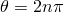处的对称要求，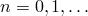，消除了许多上述Fourier系数。对于位移向量，唯一允许的项是

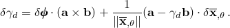对于旋转分量，对称要求将*r*和*z*分量与分量的角色交换：

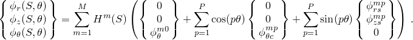出于实际原因，、和的值通常需要在壳周向的特定位置获得。因此，使用位移和旋转分量、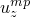和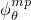代替Fourier系数、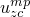和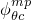。此外，由于以下原因在的插值中引入了负号：Abaqus轴对称壳单元的约定是轴向切向方向在节点编号递增的方向上绘制（壳局部1方向）。然后，通过切向的90度逆时针旋转（壳局部3方向）获得壳的法线。然而，关于法线场（关于壳局部2方向）的正旋转是顺时针的。这个约定意味着左手壳局部坐标系。对于轴对称壳弯曲单元，在积分点处需要右手壳局部坐标系；因此，正旋转的方向在那里反转。

重新排列Fourier级数展开并进行替换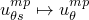，位移分量的插值为

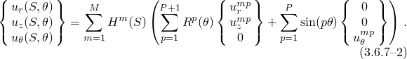类似地，用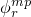和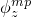分别替换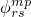和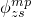，旋转分量的插值变为

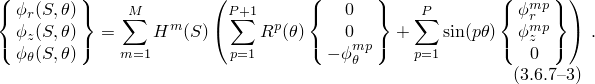在上述插值中，、和是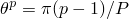处的物理位移和旋转分量，和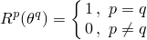是三角插值函数，其性质为，定义为：

：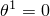，，

：，，，

：，，，，

：，，，，，

与连续体轴对称弯曲单元一样，是关于提供的最高阶插值。使用更高阶插值会使单元显著增加成本，并且假设通用有限应变壳比使用的该单元更便宜。
### 虚功

三维理论的虚功表达式为

其中*V*是变形体的当前体积，是Cauchy应力张量的曲线分量，是Lagrange应变张量的分量，是变分或线性化应变度量分量。根据定义，Lagrange应变张量分量由

给出。请注意，在虚功的声明中，尚未对曲线坐标函数做出选择。此外，当前体积度量由参数关系给出

我们现在将运动学假设[公式3.6.7-1](03s06a85-Axisymmetric-shell-element-allowing-asym.md)引入的定义中发现

其中微分现在相对于参数坐标，因此和。定义以下壳应变度量分量和运动学关系：

在上面，是未变形参考表面的第二基本形式的分量。

将上述定义代入虚功表达式，我们发现（经过一些操作）体积积分简化为关于变形参考表面的以下积分

其中且当前参考表面Jacobi行列式为。在上述虚功表达式中，项在中被忽略。该项是——其中*h*是厚度，*R*是某个特征曲率半径——根据运动学假设[公式3.6.7-1](03s06a85-Axisymmetric-shell-element-allowing-asym.md)可以忽略。壳应力分量由通过壳厚度的以下积分定义：

对于薄壳，引入了Kirchhoff-Love近似，该近似指出变形方向场（近似）是变形参考表面的法线场，以及平面应力假设。与这些近似一致，我们忽略所有项和与厚度参数梯度成比例的项。因此，我们设定

我们现在可以总结薄（Kirchhoff-Love）壳的虚功表达式：

其中壳分量由关于Cauchy应力张量分量的积分定义为

在的表达式中，被解释为约束应力，强制方向场保持垂直于参考表面。虚功表达式的另外两个贡献和，其中是，因此被忽略。
### 标准正交表面坐标系和坐标变换

需要相对于变形构型中的标准正交基来定义应力分量。为了做到这一点，我们定义一个法向坐标系，其中和与变形参考表面相切，是单位法线场。

定义以下符号。设是相对于基的分量；即

此外，设分量矩阵的逆由给出，使得

请注意，基向量和引入了距离测量坐标和，使得

从[公式3.6.7-5](03s06a85-Axisymmetric-shell-element-allowing-asym.md)可以得出，标准正交切向量由下式给出

对于材料计算，将应变和应力量相对于局部标准正交标架表示是很重要的。因此，设和是相对于该局部标准正交基的膜和弯曲应力分量。因此，我们可以写成

其中我们记得。然后，应力分量对虚功表达式的贡献可以如下变换。首先，膜贡献：

然而，回想一下，根据坐标的定义，。因此，

类似地，弯曲贡献为：

设是二维交错张量，使得和。然后和

由于括号中的第二项与弯曲曲率成比例，我们相对于第一项忽略此项，得到

### 应变-位移算子

我们现在用矩阵算子符号写出虚功表达式[公式3.6.7-4](03s06a85-Axisymmetric-shell-element-allowing-asym.md)。定义以下应力分量向量：

定义矩阵应变-位移算子如下：

其中是零列。然后，虚功表达式[公式3.6.7-4](03s06a85-Axisymmetric-shell-element-allowing-asym.md)等价为

### 共旋坐标系

到目前为止，和是参考表面切平面中任何两个标准正交向量。我们可以通过要求增量参考表面变形梯度的矩阵分量

是对称的，即来唯一地选择这两个向量。请注意，根据定义。这个对称条件在变形构型中定义了一个共旋标准正交基。这个标准正交基计算如下。

获得Abaqus约定的一对标准正交表面向量。然后我们在参考表面的切平面中关于法线向量将这些向量旋转角度，其中由对称条件确定。因此，我们定义

根据定义可得

因此，定义量

对称条件要求

由此可以确定

然后由[公式3.6.7-6](03s06a85-Axisymmetric-shell-element-allowing-asym.md)确定和。

在确定更新后的向量后，我们可以计算坐标变换所需的量。首先是增量变形梯度分量和Jacobi矩阵分量：

请注意，由于增量变形梯度分量是对称的，在写入时没有歧义。我们现在可以计算逆分量

### 一致线性化

迭代求解过程需要计算一致切线刚度。这个刚度有两部分，一部分来自材料模型，另一部分来自变化的几何。我们用表示二阶变分量。回到[公式3.6.7-4](03s06a85-Axisymmetric-shell-element-allowing-asym.md)，虚功表达式可以写成

其中，是参考构型参数化的Jacobi行列式，由给出，分量相对于共旋标架。我们假设本构行为为

因此，虚功的变分产生

积分中的第一项形成材料刚度，而后两项形成几何刚度。应变度量分量的二阶变分在"有限应变壳单元公式"第3.6.5节中计算。膜应变的二阶变分为

弯曲应变的二阶变分为零；即，

### 增量自由度：插值和构型更新

在增量开始时，我们有迭代*k*处的构型，记为。在增量求解过程中，我们求解增量位移场和增量旋转场相对于参考圆柱坐标系：

我们用这些增量场更新构型到迭代。

1. **参考表面更新**：使用与[公式3.6.7-2](03s06a85-Axisymmetric-shell-element-allowing-asym.md)中总位移向量相同的插值方案对位移增量进行插值：

参考表面位置映射通过位移增量更新为

2. **旋转场更新**：使用与[公式3.6.7-3](03s06a85-Axisymmetric-shell-element-allowing-asym.md)中总旋转场相同的插值方案对增量旋转场进行更新：

这个增量旋转向量对应于有限旋转，用四元数参数表征为

总旋转四元数参数可以通过更新公式更新为

类似地，变形单位方向场可以从增量旋转场更新为

这里我们使用符号来表示由四元数旋转向量。曲率由方向场的梯度计算，方向场通过

更新，其中

为完整起见，我们记录的值。首先，沿生成线

对于周向导数，我们必须考虑基向量在方向上的导数：和。因此，。引入插值函数，我们有

其中从上述给出的插值函数的定义计算，和由旋转场更新中给出的增量旋转场的插值给出。
### 应变增量和应力分量更新

按照"有限应变壳单元公式"第3.6.5节中有限应变壳单元公式，三维（有限）应变增量计算为

这里膜应变分量的增量由对数膜应变增量的Hughes-Winget二阶近似给出

弯曲应变分量的增量由表达式给出

其中

作为应力更新过程的示例，考虑Saint Venant-Kirchhoff材料模型的简单情况。在这种情况下，

其中是由

给出的平面应力弹性系数。请注意，分量相对于当前标准正交基。
### 压力载荷和载荷刚度

对于几何线性问题，由于几何是轴对称的，施加表面压力产生的等效节点载荷很容易计算。然而，对于几何非线性问题，必须考虑非对称变形。

与表面压力*p*相关的等效节点载荷可以通过考虑外部载荷的虚功贡献获得

其中*S*是*R*-*Z*平面中的参数表面坐标，参考表面位置为

其中和。回想一下，一点当前位置可以表示为轴向插值器和周向插值器的函数

[公式3.6.7-7](03s06a85-Axisymmetric-shell-element-allowing-asym.md)中的项可以如下展开：

因此，

变分写成，其中分量具有与[公式3.6.7-7](03s06a85-Axisymmetric-shell-element-allowing-asym.md)中相似的插值。因此，虚功贡献变为

引入插值函数后，我们获得等效节点力：

对于几何线性分析，等效节点力简化为标准轴对称表达式

压力载荷项的线性化导致以下压力载荷刚度矩阵：

对于静水压力（*p*随*z*变化）的情况，必须在压力载荷刚度中包含附加项。这些项是由于压力大小的变化而产生的，可以从表达式

中获得。使用插值函数并用上划线表示附加贡献，我们获得附加载荷刚度贡献：

### 惩罚约束：横向剪切和钻孔旋转

有必要在单元表面上的选定节点处强制执行旋转约束，以防止变形的奇异模式。在每个节点平面内每对节点之间强制执行一个轴向横向剪切约束。在周向节点线的每对节点之间强制执行一个周向横向剪切约束和一个关于旋转场和的钻孔旋转约束。在每种情况下，旋转场被约束为跟随节点位移。总而言之，对于单元SAXAMN：

轴向横向剪切：

周向横向剪切：

钻孔旋转：约束被强制执行，其中是轴向的积分阶数，是Fourier模式的数目。横向剪切

横向剪切应变是方向场相对于壳表面法线旋转量的度量。我们将横向剪切应变定义为

其中*c*不求和，并用惩罚约束强制此量为零。请注意，是沿参数坐标线定义的壳表面的单位切向量。回想一下，和。因此，是轴向横向剪切应变，是周向横向剪切应变。

为方便起见，记录单位向量的变分：

其中*c*不求和。等价地，的定义可以用来写成

线性化横向剪切应变计算为

由于根据定义，可得

其中*c*不求和。

为完整起见，横向剪切应变的二阶变分为

其中与成比例的项被忽略，和之间的耦合已被对称化。钻孔旋转

从数学上讲，控制壳变形的方程对于钻孔旋转是不变的；即，旋转轴平行于方向的 director场的旋转。因此，有必要为这种旋转分配一个运动学定义。我们将钻孔应变定义为周向切向向量的旋转（由位移场测量）和由旋转场测量的旋转之间的差异。因此，我们将钻孔应变定义为

这里，是旋转后的参考轴向切向向量，是变形的（单位）周向切向向量，定义为

上述是对参考构型中轴向切向向量的线性近似，由给出，其中和是轴向平面中两个相邻节点的位置向量。钻孔旋转约束要求关于表面法线的旋转分量与位移场测量的表面面内旋转相匹配。

线性化钻孔应变计算类似于横向剪切线性化应变计算。不重复计算，

类似地，钻孔应变的二阶变分为

其中与成比例的项被忽略，和之间的耦合已被对称化。
### 零半径：塌陷边缘

对于壳表面任意点的参考半径变为零的情况，所有偏移节点塌陷到同一点，沿该周向边缘的边缘约束变得冗余。因此，有必要单独处理零半径情况。

对于零半径情况，所有冗余自由度被约束为跟随0和180处节点的平均运动。边缘约束被分成两部分：首先，定义一个周向横向剪切应变，要求径向旋转跟随第一个和最后一个节点平面处的周向旋转：

引入插值后，线性化应变为

请注意，。其次，定义一个钻孔旋转应变，要求关于*Z*轴的旋转为零：

这导致线性化应变由

给出。请注意，。
### 质量矩阵

在每个材料点处，三个方向（径向、轴向、周向）的位移分量仅取决于相应的节点位移分量。因此，质量矩阵不涉及径向、轴向和周向自由度之间的任何耦合，我们可以将质量矩阵写成三个独立表达式的形式：

类似地，我们可以将与旋转自由度相关的项写成：

这里上标*m*和*n*指的是*r*-*z*平面中的特定节点，上标*p*和*q*指的是沿周向的特定位置。插值函数、和是*r*-*z*平面中的插值函数与方向中插值函数的乘积：

用于形成质量矩阵的面积积分可以分成沿*r*-*z*平面中单元长度的积分和沿周向的积分。对于质量矩阵的*r*-*r*分量，这产生

对于质量矩阵的分量，这产生：

通过定义原始质量矩阵，可以将矩阵写成方便的形式

或对于旋转分量为

这些原始质量矩阵与 regular轴对称壳单元使用的质量矩阵相同。我们还可以定义周向分布矩阵

质量矩阵的各个分量然后取形式

周向分布矩阵可以针对Fourier级数中项数*P*的各种值进行评估。经过一些计算，得到以下结果：

：

：

：

：

### 参考

### 参考

"Axisymmetric shell elements with nonlinear, asymmetric deformation," Section 29.6.10 of the Abaqus Analysis User's Guide
