# 3.6.8 复合壳中的横向剪切刚度及从中面的偏移

### 3.6.8 复合壳中的横向剪切刚度及从中面的偏移

**产品：** Abaqus/Standard  Abaqus/Explicit
### 横向剪切刚度

Abaqus支持单元类型S3R、S3RS、S4、S4R、S4RS、S4RSW、SC6R、SC8R和S8R用于层合复合壳的分析。这些单元基于一阶横向剪切柔性理论，其中假定横向剪切应变在壳厚度上为常数。这个假设需要使用剪切修正因子。这些因子的开发也为估计复合截面中的层间剪切应力提供了基础。本节描述了单元类型S3R、S4、S4R、SC6R、SC8R和S8R横向剪切刚度的发展。有限应变壳

横向剪切刚度修正因子对于各向同性板容易显示为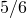。我们希望建立层合板和夹层结构的等效因子。为此，我们计算壳厚度方向横向剪切应力的分布，假设为单向弯曲并假定线性弹性响应。然后，用截面力和应变表示的剪切应变能等于该横向剪切应力分布的应变能。

下面概述的这种方法提供了计算层间剪切应力的近似方法，并提供了横向剪切刚度的合理估计。在该计算中，Abaqus假定壳截面方向是主弯曲方向（关于一个主方向的弯曲不需要关于另一个方向的约束力矩）。对于关于壳中面不对称的正交异性层组成的复合壳，壳截面方向可能不是主弯曲方向。在这种情况下，横向剪切刚度和层间剪切应力是较不精确的近似值，如果使用不同的壳截面方向会发生变化。

考虑*x*-*y*平面中的板。假设仅在*x*方向有弯曲和剪切，*y*方向无梯度。然后壳中的膜力为零：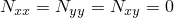，对于所有响应变量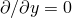。在这种情况下，截面内*x*方向的平衡为

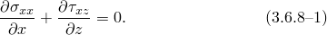

关于*y*轴的力矩平衡给出

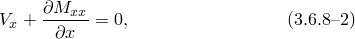其中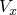是板中每单位宽度的横向剪切力，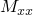是关于*y*轴弯曲的每单位宽度弯矩。

对于弯曲行为，我们假设应变在截面上线性变化：

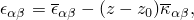其中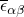是参考表面的膜应变，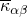给出，其中平面应力弹性刚度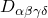由该壳层材料的弹性和方向定义。希腊下标取范围。

通过厚度积分并反转得到的截面刚度得到6×6截面柔度矩阵，：

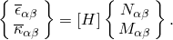

我们已经假设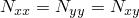。我们现在还假设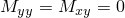；即，可能在没有与*y*方向相关的约束力矩的情况下在*y*方向没有弯曲。这对于不平衡复合截面显然不是这种情况，但我们仍然使用它作为简化假设以获得剪切修正因子。因此，

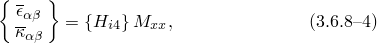其中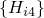是的第四列。将这个结果与壳厚度一点处的弹性刚度结合，得到相对于的面内应力分量

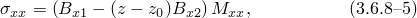其中

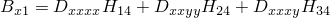和

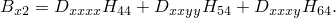

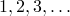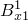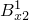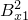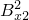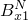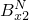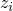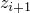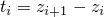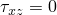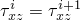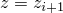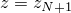将该方程在*x*方向上的梯度与平衡方程[公式3.6.8-1](03s06a86-Transverse-shear-stiffness-in-composite-.md)和[公式3.6.8-2](03s06a86-Transverse-shear-stiffness-in-composite-.md)结合，得到板厚度方向横向剪切应力变化的描述：

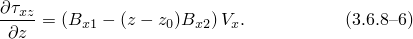在计算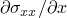时，我们假设复合截面的弹性和厚度不随（或缓慢随）壳上的位置变化。

层合复合壳截面由*N*层组成，，第1层的（,）值不同，第2层的（,）值不同，（,）在第*N*层。第*i*层从延伸到，其厚度为。通过壳厚度积分[公式3.6.8-6](03s06a86-Transverse-shear-stiffness-in-composite-.md)，使用边界条件在处，在处，在处，得到第*i*层中的横向剪切应力为

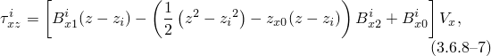其中

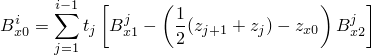和

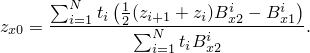

在这种情况下使用下标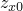而不是，因为结果与*x*方向的纯弯曲相关。

通过类似的过程（基于*y*方向的纯弯曲）获得沿壳厚度的变化。

这些结果提供了层间剪切应力的估计。

我们通过匹配通过积分与上述横向剪切应力分布相关的弹性应变能密度获得的剪切应变能来定义截面的剪切柔性：

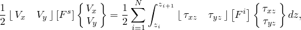其中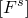是截面的剪切柔性，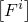是第*i*层内的连续体横向剪切柔性。这里我们引入假设：层内的横向剪切柔性与面内柔性无关。对于壳结构来说通常是这样。

将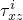和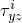的关系代入上述方程并积分，将截面的剪切柔性定义为

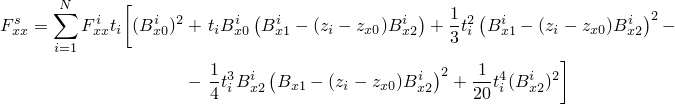

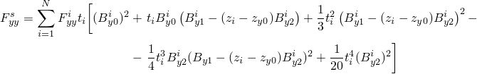

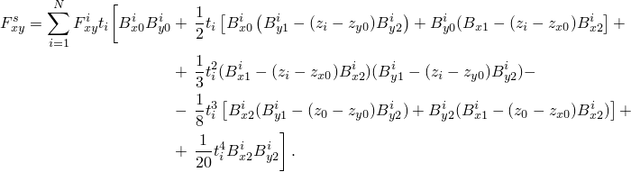

截面的横向剪切刚度随后可用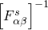获得。请注意，如果任何层在各局部系统中是各向异性或正交异性的（因为那时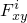将不为零），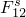将不为零。小应变壳

当为预积分截面计算每个增量处的壳合力时，小应变壳单元S3RS、S4RS和S4RSW的横向剪切力使用为有限应变壳导出的横向剪切刚度计算。对于数值积分截面，横向剪切行为基于为提高计算性能而简化的刚度。对于单层或多层各向同性截面和单层正交异性截面，横向剪切力收敛于适当的薄壳和厚壳横向剪切解，并假定横向剪切应力具有常数分布。对于多层正交异性截面，横向剪切刚度是近似的，其中假定横向剪切应力分布为分段常数。对于这种情况，当壳变厚且主材料方向偏离主截面方向时，可能无法收敛到适当的横向剪切行为。
### 偏移：参考表面与中面

在Abaqus中，壳的几何形状由存在于壳参考表面节点上的运动学变量定义。壳理论的运动学包括在参考表面上测量膜应变，以及从参考表面上单位法线向量的导数测量弯曲应变。默认参考表面是壳中面。然而，在许多情况下，更方便的是将参考表面定义为偏离中面。在这种情况下，我们假设任何材料点的面内应变在截面上线性变化：

其中和表示参考表面上的两个正交轴，是参考表面的膜应变，是从中面到参考表面的距离，的正值在正法线方向。当时，壳的顶面是参考表面，其中*t*是壳厚度。当时，壳的底面成为参考表面。当时，中面表示参考表面。

如果壳的响应是线弹性的，则壳截面上一点处的任何面内应力分量，，由

给出，其中平面应力弹性刚度由该壳层材料的弹性和方向定义。希腊下标取范围。

单位长度的截面力和弯矩分量然后可以定义为

通过厚度积分上述方程得到合成截面刚度，：

### 参考

### 参考

"Shell section behavior," Section 29.6.4 of the Abaqus Analysis User's Guide
