# 3.7.1 二维中的钢筋建模

### 3.7.1 二维中的钢筋建模

**产品：** Abaqus/Standard  Abaqus/Explicit

设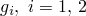为单元的 usual等参坐标。设*r*为沿着单元面与增强平面相交线的等参坐标，在单元中（参见[图3.7.1-1](03s07a88-Rebar-modeling-in-two-dimensions.md)）。

图3.7.1-1 实体二维单元中的钢筋。

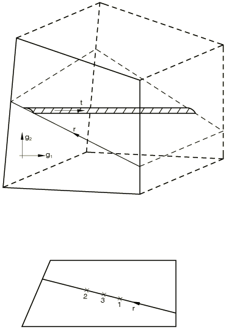增强平面始终垂直于单元面。

钢筋将在一个或两个点进行积分，取决于底层单元的插值阶次。积分体积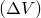、位置、钢筋应变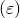以及每个点处钢筋应变的一阶和二阶变分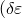和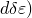计算为

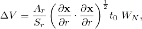其中

是平面单元的原始厚度，轴对称单元为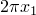；

是钢筋横截面面积；

是钢筋间距（对于轴对称单元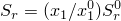，其中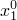是给定间距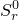的半径）；

是与沿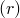线的积分点相关的高斯权重；

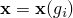

是位置；和

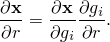

应变是

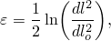其中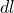和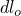分别测量当前和初始构型中沿钢筋的长度。

对于这些单元允许的变形，

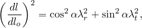其中是钢筋相对于模型平面的方向，

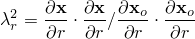是*r*方向的平方拉伸比，是厚度方向的拉伸比：

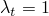

对于平面应力或平面应变；

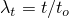

对于广义平面应变，其中*t*在"广义平面应变单元"第3.2.7节中给出；和

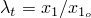

对于轴对称单元。

从这些结果得到应变的一阶变分为

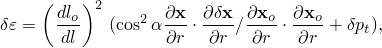其中

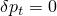

对于平面应力和平面应变，

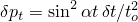

对于广义平面应变，和

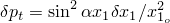

对于轴对称情况。然后是应变的二阶变分

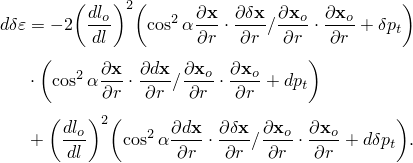
### 参考

### 参考

"Defining rebar as an element property," Section 2.2.4 of the Abaqus Analysis User's Guide
