# 3.7.3 壳、膜和表面单元中的钢筋建模

### 3.7.3 壳、膜和表面单元中的钢筋建模

**产品：** Abaqus/Standard  Abaqus/Explicit

壳、膜或表面单元中钢筋的定义基于三个几何属性：每根钢筋的横截面面积、钢筋之间的间距，以及钢筋相对于单元局部坐标系统的方向。对于壳单元，钢筋定义还需要从中面到钢筋的距离。在Abaqus中，基于这些几何属性和钢筋材料的弹性模量创建一个等效的" smeared"正交异性层。等效钢筋层平行于单元的中面。对于膜和表面单元，该层与单元的平面重合，对于壳单元，该层可以偏移最多半个壳厚度。在几何线性分析中，等效钢筋层的几何属性保持不变。然而，在几何非线性分析中，由于有限应变效应，这些属性中的每一个都可能发生变化。

用户有许多选项来定义钢筋在单元中作用的方向。在每种情况下，确定钢筋与单元的等参坐标方向（由用户选择）之间的角度，沿着旋转轴（垂直于单元）测量为正。设单位向量定义单元中一点处的钢筋方向。等参方向由切向量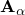给出，定义为

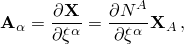其中是参考中面位置，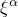是等参坐标函数（ 1或2），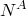是单元的形函数，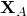是单元的参考节点位置。

参考或初始钢筋角度由钢筋单位向量与等参方向之间的内积计算，其中由用户指定。

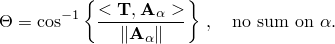

钢筋方向和用户选择的等参方向都位于平行于中面的切平面中。垂直于钢筋方向的平面内单位向量通过将绕中面法线旋转90度来定义。法线方向由

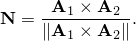找到。

随着钢筋增强单元的变形，钢筋的长度和间距发生变化。Smeared钢筋层假设意味着钢筋层的变形由底层单元的变形梯度确定。根据这个假设，钢筋拉伸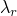是

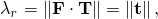其中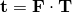是变形的钢筋材料纤维。由于变形梯度将蚀刻在参考体中的材料线映射到变形构型中，这些材料线的长度变化定义了拉伸。钢筋对数应变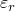是

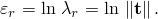

钢筋间距拉伸是钢筋平面内垂直于钢筋方向的拉伸。为确定间距拉伸，利用垂直于变形钢筋方向的单位法线（在钢筋平面内）是

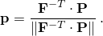可以容易地验证是一个单位向量。为看出它垂直于，取内积：

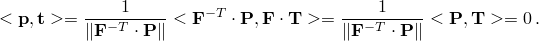间距拉伸可定义为垂直于参考钢筋方向的方向变形的分量。由于的变形是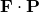，间距拉伸由下式得出

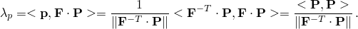由于是一个单位向量，

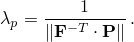

钢筋方向相对于用户选择的等参方向的最终角度是

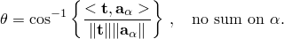钢筋旋转或钢筋角度变化是最终角度与原始角度之间的差值：

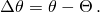Abaqus报告当前角度和每个钢筋定义在单元每个积分位置处的钢筋角度变化。

Smeared层的等效厚度等于钢筋面积除以钢筋间距；Abaqus假设钢筋的体积在整个分析过程中保持不变。这个假设意味着钢筋的面积和间距可能由于有限应变效应而发生变化。变形构型中钢筋的面积和间距定义如下：

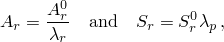其中

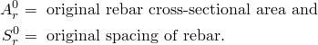

在壳单元中，钢筋层可以初始定义在中面上方或下方一定距离处。在允许有限应变的壳单元中，壳的厚度可以随面内变形而变化。在Abaqus/Standard中，厚度变化由截面泊松比定义，用户可以指定。在Abaqus/Explicit中，这种行为基于壳厚度方向的实际材料属性。为考虑壳厚度的变化，钢筋层距中面的距离按厚度拉伸比例缩放。
### 参考

### 参考

"Defining reinforcement," Section 2.2.3 of the Abaqus Analysis User's Guide
