# 3.8.1 静水压流体计算

### 3.8.1 静水压流体计算

**产品：** Abaqus/Standard  Abaqus/Explicit

Abaqus提供了一种可用于表示静水条件下充液空腔的能力。该能力提供了充液结构变形与内部流体对空腔边界施加的压力之间的耦合。在Abaqus/Explicit中，流体必须是可压缩的，压力从空腔体积计算。在Abaqus/Standard中，空腔内的流体可以是可压缩的或不可压缩的，流体体积给出为流体压力*p*、流体温度和空腔中流体质量*m*的函数：

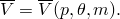我们将不可压缩情况称为"液压"流体，可压缩情况称为"气压"流体。从流体压力和温度推导的体积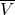应等于空腔的实际体积*V*。在Abaqus/Standard中，这通过用约束方程

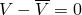增强结构的虚功表达式来实现，以及由空腔压力引起的虚功贡献：

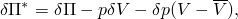其中是增强虚功表达式，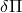是没有空腔时结构的虚功表达式。负号意味着空腔体积的增加释放了流体的能量。这代表了一种混合公式，其中结构位移和流体压力是主变量。增强虚功表达式的速率获得为

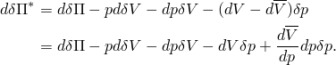这里，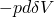表示压力载荷刚度，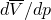是流体的体积-压力柔度。

由于压力对于空腔中的所有表面面元（或单元）是相同的，增强虚功表达式可以写成各个表面面元表达式的和：

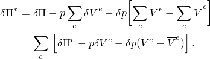此外，由于温度对于所有空腔面元是相同的，流体体积可以逐个面元计算：

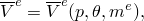其中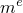是单元质量。在求解中，单元的实际体积可能不同于单元体积：

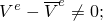然而，总流体体积将与空腔体积匹配。
### 带热膨胀的液压流体

在Abaqus/Standard中，流体默认是不可压缩的，流体体积依赖于温度但与流体压力无关：

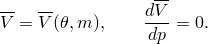如果引入可压缩性，流体体积取决于温度和压力：

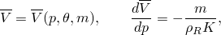其中*K*是流体体积模量，是零压力和初始温度下的参考流体密度。

空腔中的总流体质量是构成空腔的单元流体质量的总和：

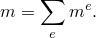空腔中流体单元的质量由初始流体密度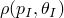和初始单元体积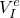计算：

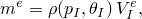其中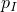是初始流体压力，是初始温度。初始流体密度从用户定义的参考密度得出：

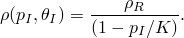

当前压力和温度下的流体密度获得为

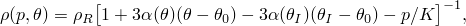其中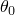是热膨胀系数的参考温度，是平均（割线）热膨胀系数，并假设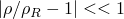。

因此，当前压力和温度下的流体体积为

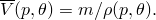该体积可以逐单元计算：

流体可以加入或从空腔中移除。加入的流体量给定为（流体）质量变化量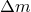。因此，当前空腔温度下流体体积的变化为

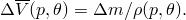
### 理想气体

在这种情况下，流体是可压缩的，体积是空腔中压力和温度的函数：

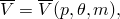如前所述，空腔中总流体质量是空腔中单元质量的总和。流体假定表现为理想气体；因此，空腔中流体的密度可以计算为

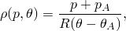其中是气体常数，是绝对零度温度，是环境压力。当前流体体积可以再次逐单元计算：

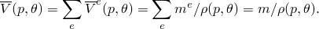相应的体积-压力柔度为

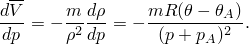流体可以加入或从空腔中移除。加入的流体量再次给定为（流体）质量变化。因此，当前空腔温度下流体体积的变化为

### 体积计算

静水压流体单元表现为覆盖空腔边界的表面单元，但考虑到空腔参考节点时，它们实际上是体积单元。[图3.8.1-1](03s08a91-Hydrostatic-fluid-calculations.md)描绘了4节点静水压流体体积单元F3D4。虚线表示该单元实际上是锥形。

图3.8.1-1 F3D4静水压流体单元。

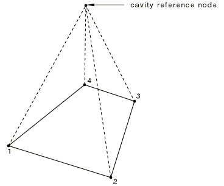

必须计算每个单元的体积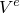。金字塔单元底面上任意点的坐标可以通过

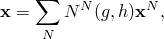找到，其中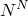是金字塔底面的插值函数（"实体等参四边形和六面体，"第3.2.4节），用参数坐标*g*和*h*表示；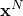是节点坐标；求和扩展到基面上的所有节点。对于三维单元，表面上的Jacobi行列式计算为

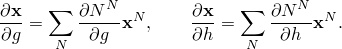单元面的法线乘以单元面的无穷小面积，因此获得为

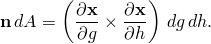与该无穷小面积相关的无穷小体积是

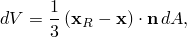其中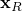是空腔参考节点的位置。然后通过积分获得单元的体积，对于四边形底面得到

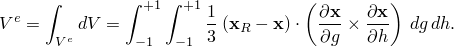对于三角形底面，积分边界将不同。引入相对位置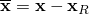，这变为

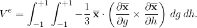单元体积的变分容易获得为

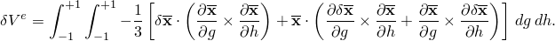该表达式包括由于金字塔单元"侧面"体积变化对体积变化的贡献。因此，等效力也将包括这些侧面上的压力的影响。侧面的压力将被相邻金字塔单元侧面的压力平衡；因此，我们只需要计算来自金字塔"底面"上压力的贡献。这可以通过使用分部积分分离贡献来完成，得到

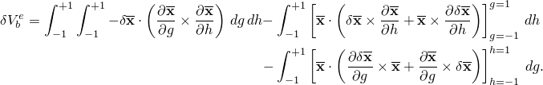最后两个积分代表金字塔侧面上的贡献；因此，得到的表达式为

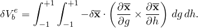该方程可以直接容易地获得（见"压力载荷刚度，"第6.5.1节）。

体积表达式的二阶变分为

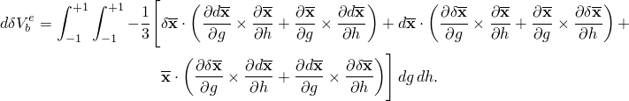平面和轴对称流体单元可以获得类似的表达式。对于平面单元，体积容易获得为

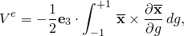其中是垂直于平面的单位向量。类似地，对于轴对称单元

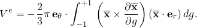一阶和二阶变分以与三维单元相同的方式获得。

积分可以解析进行。例如，对于单元类型F3D4，上述表达式经过一些处理后得到

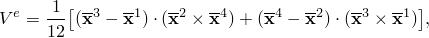其中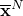、表示相对节点坐标。一阶变分（仅涉及底面）等于

体积的二阶变分为

### 流体交换

Abaqus提供了一种可用于模拟两个空腔之间或空腔与外部之间流体流动的能力。这通常用于流体必须通过狭窄孔口流动的情况。假定质量流率*q*是压力差的齐次函数。此外，假定流率可能依赖于平均温度————并且对于可压缩流体，依赖于平均压力——：

流率需要在有限增量上进行积分。我们假定对平均压力的依赖性较弱。因此，我们使用半隐式方法：在增量结束时使用，在增量开始时使用。对于温度，我们选择为增量开始和结束时的平均值，因为这可能是最准确的。因此，我们获得质量流为：

这个质量变化需要转换为每个空腔中的体积变化。假定两个空腔中的流体是相同的，但压力（以及可能还有温度）可能不同。使用每个空腔*i*的压力和温度相关密度，关系变为

和

请注意，除了等温不可压缩流体，得到的矩阵是非对称的。对于带热膨胀的不可压缩流体，非对称贡献很小，方程可以在不显著降低收敛率的情况下对称化。对于理想气体，如果压力降很大，非对称项可能有显著影响。

空腔之间流体流动的许多应用涉及稳态振动形式的动态载荷；在这类问题中，通常必须对空腔之间连接处的耗散损失进行建模，以获得有用的结果。在这类问题的大多数中，流体连接两侧的流体首先被静态预加压。在Abaqus/Standard的实现中，假定振动幅度足够小，以至于问题动态阶段中流体连接响应可以作为关于预加压状态的小扰动线性处理。

对于关于预加压状态的小振动，我们将[公式3.8.1-1](03s08a91-Hydrostatic-fluid-calculations.md)线性化给出

因此，通过连接的 mass流量可以如下推导：

将上述质量流表达式代入[公式3.8.1-2](03s08a91-Hydrostatic-fluid-calculations.md)并注意到得到

在Abaqus中，此模型仅用于直接解稳态动态分析过程。
### 负特征值

在某些静水压流体单元问题的求解中可能会遇到负特征值。对于标准单元，这可能表示已超过分岔或屈曲载荷。然而，对于静水压流体单元，情况不一定如此；负特征值可能完全由数值实现引起。

考虑[图3.8.1-2](03s08a91-Hydrostatic-fluid-calculations.md)中描绘的简单静水压流体模型。

图3.8.1-2 简单静水压流体模型。

如果流体被认为是不可压缩的，向下力的应用导致流体垂直压缩并水平膨胀，同时保持原始流体体积。因此，该模型可以充分离散为三自由度系统：右压板的水平位移*u*；顶板的垂直位移*v*；以及流体压力*p*。矩阵形式的相应方程组为

方程求解器按顺序处理方程。因此，它将在处理约束之前处理将位移与力相关的子矩阵。如果，这会导致负特征值。然而，由于与负特征值相关的模式随后被连续性方程约束，不会发生不稳定。
### 参考

### 参考

"Surface-based fluid cavities: overview," Section 11.5.1 of the Abaqus Analysis User's Guide
