# 3.9.2 带集中塑性的框架单元

### 3.9.2 带集中塑性的框架单元

**产品：** Abaqus/Standard

框架单元设计用于分析最初笔直的细长梁。单元为大方位移和大旋转但小应变实现。框架单元的弹性响应遵循Euler-Bernoulli梁理论。塑性通过带运动硬化的集中塑性模型包含在单元响应中，这只允许在梁端部发生屈服。硬化数据给出为广义力与广义位移之间的关系。因此，单元的塑性响应是长度相关的。弹塑性框架单元被设计用于表示框架结构中塑性铰的形成，其中单个框架单元可用作结构节点之间的构件。
### 单元上的自由度

框架单元根据用户定义的端节点处的解变量和与内部节点相关的额外内部自由度来公式化。这里讨论单元的三维版本。二维版本通过对三维自由度的适当简化获得。单元有三个节点（两个用户定义和一个内部），12个外部自由度和三个内部自由度。两个端节点中的每一个都有六个外部自由度：三个位移和三个旋转。一个内部节点（在单元中心）只有三个位移自由度，如图3.9.2-1所示。

图3.9.2-1 空间中的框架单元。

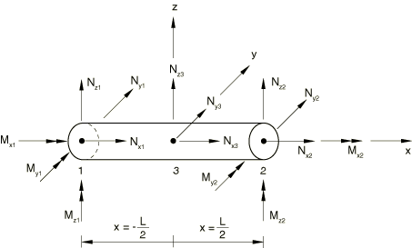

单元在局部系统中公式化，*x*方向表示轴向，*y*和*z*方向表示垂直于框架单元轴的方向。在这个局部坐标系中，单元的自由度可以写成

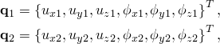

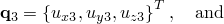

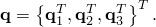
### 弹性公式

单元的弹性响应由Euler-Bernoulli梁理论控制。垂直于框架单元轴（*y*和*z*方向）的挠度位移插值使用四次多项式，允许沿梁轴的曲率二次变化。设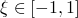是沿梁长度的等参坐标。然后，

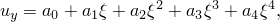

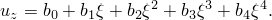

横向位移插值包含端部力和弯矩载荷以及沿梁轴恒定分布载荷（如重力载荷）的精确解。沿框架单元轴（*x*方向）的位移插值函数是二次多项式，允许沿框架单元轴的轴向应变线性变化：

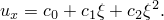

扭转旋转自由度沿梁轴（绕*x*轴的旋转）的插值是线性的，允许恒定扭转应变：

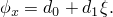

遵循Euler-Bernoulli梁理论的广义应变为

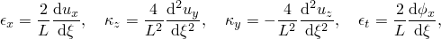其中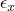是轴向应变，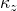和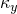是梁曲率，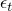是扭转应变。位移插值方程中的15个未定常数通过引入节点自由度来确定；即，

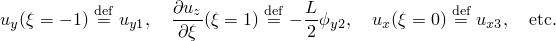下面在讨论大方位移公式的部分描述了关于节点自由度的插值。

应变-位移关系写成矩阵形式为

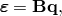其中是一个4×15矩阵，

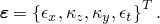

弹性刚度矩阵数值积分，用于计算15个节点力和力矩——12个与两个端节点相关的力/力矩（也称为广义力），

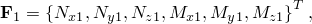

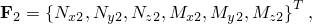和三个与内部节点相关的力，

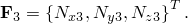框架单元的力和力矩向量可以写成

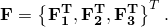

因此，弹性刚度是一个15×15矩阵，将力向量与节点位移向量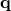关联：

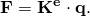

框架单元的材料属性通常可以是温度相关的。让我们定义弹性应变向量为

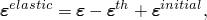其中表示总应变，表示热膨胀应变，其中只有轴向应变非零，由

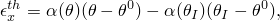给出，其中

是热膨胀系数，

是框架单元截面的当前温度，

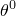

是的参考温度，和

是这一点处用户定义的初始温度（"Abaqus/Standard和Abaqus/Explicit中的初始条件，" Abaqus Analysis User's Guide第34.2.1节）。温度场由用户在单元端部定义，并假定沿单元轴线性变化，但在单元横截面内恒定。如果热膨胀系数是温度相关的，则在节点处评估。在单元端节点处计算热应变，在积分点处的热应变使用适当的插值方案从节点插值：轴向应变线性插值，曲率二次插值，扭转应变沿框架单元轴恒定。

初始广义应变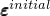由用户给出的初始广义力使用关系式计算

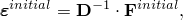其中表示在节点温度处评估的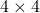材料矩阵：

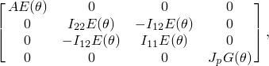*A*是横截面积；*E*是杨氏模量；*G*是剪切模量；、和是横截面惯性矩；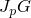是扭转刚度。广义初始力向量包括以下分量：

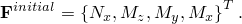当需要时，使用适当的插值器将初始应变从节点值插值到积分点：轴向分量线性，弯曲分量二次，扭转分量恒定。

Abaqus数值积分弹性刚度矩阵：

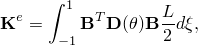其中温度相关材料属性在积分点评估，假定温度沿单元轴线性变化。

对于温度无关材料和管道截面最简单的情况，弹性刚度矩阵可以解析积分给出：

端节点处的扭矩：

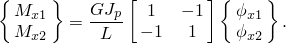

节点处的轴向力：

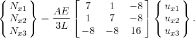

端节点处的弯矩和所有三个节点的横向力：

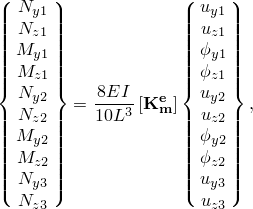其中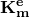是弹性刚度矩阵的弯曲部分，取以下形式：

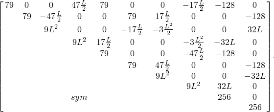
### 集中塑性模型

我们假设位移和旋转增量承认弹性部分和塑性部分的加法分解。因此，

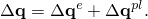总力和力矩由弹性本构关系产生

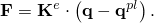

引入集中塑性概念，使得塑性变形只能发生在梁外部（端）节点，并通过一个或两个节点处的塑性旋转（铰）和塑性轴向位移发展。进一步假设外部节点处的塑性变形可以由所有三个弯矩和轴向力的相互作用引起。因此，这些端节点处的塑性变形向量具有以下形式：

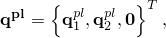

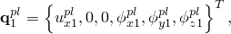

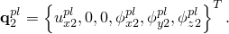屈服函数（这里称为塑性交互面）用节点力和力矩表示。为计算塑性变形的增量，在加载历史期间，在框架单元的两个端部检查塑性交互面。一般来说，塑性交互面是截面力、其塑性截面能力和硬化参数的函数。如果在两个框架端都满足以下条件，框架单元是弹性的：

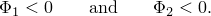如果在一个或两个框架端超过塑性交互面，框架单元是弹塑性的：

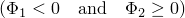

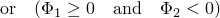

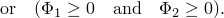假设具有与塑性变形增量沿塑性交互面外法线方向相关联的塑性，以下关系成立：

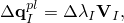其中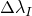表示端*I*处塑性变形的大小，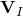表示该端塑性流动的方向。
### 硬化模型

硬化模型遵循从线性Ziegler硬化律和松弛项（回忆项）推广的非线性运动硬化规则，这引入了非线性。关于硬化模型的详细信息，见"经受循环加载的金属模型，"第4.3.5节。现在引入广义背应力向量，它定义了移动塑性交互面的原点，并将其定义为

因此，塑性交互面可以表示为端*I*处广义力、的函数，其中对于每个分量*i*，

背应力增量的非线性运动硬化演化律具有形式

其中

和是第*i*个塑性分量的截面参数，必须从定义截面硬化响应的测试数据中校准。参数是初始运动硬化模量，参数决定了运动硬化模量随塑性变形增加而减小的速率。此实现所需的测试数据是截面力和弯矩分量作为广义塑性位移函数的 值。这些要么是轴向力对塑性轴向位移，要么是弯矩对铰塑性旋转。数据可以给定为值对——广义截面力对共轭广义塑性位移——或者通过指定截面的屈服应力。曲线拟合算法将确定每个分量*i*的参数和，因为硬化律为每个截面力分量单独写出，*i*的范围取决于进入塑性交互面的力和力矩的数量。积分硬化规则[公式3.9.2-1](03s09a93.md)，获得背应力的以下演化律：

其中背应力表示增量开始时背应力的值。
### 塑性交互面

在广义截面变量中公式化的塑性交互面取决于横截面轮廓。带集中塑性的框架单元仅对管状横截面有效，最简单形式的交互面可以表示为四维空间中的椭球：轴向力和三个弯矩。用每个截面分量的极限力和弯矩归一化，塑性交互面可以为框架单元的每个端*I*写成

其中、、和表示初始屈服的截面能力：分别是轴向力和三个弯矩。任何其他其塑性交互可以由上述椭球面足够好地近似的横截面轮廓都可以在框架单元的集中塑性概念内使用。对于用框架单元建模的二维问题，塑性交互条件变为轴向力和弯矩平面中的椭球。通过在任何变形时刻在两个框架单元端检查塑性交互条件，确定如果

和，框架单元保持弹性。

和，框架单元是弹塑性的。如果端*J*处的塑性条件被超过，需要迭代过程来找到增量结束时最终的变形状态。或者端*I*保持弹性，端*J*变为塑性，或者两端都变为塑性。

和，框架单元是弹塑性的。如果在一个或两个节点处超过塑性条件，需要迭代过程来找到增量结束时最终的变形状态。根据两端塑性变形的比率，一个或两个端将变为塑性。

框架单元塑性模型的积分遵循与"塑性模型的积分，"第4.2.2节中描述的一般规则相同。

为了求解任意载荷增量增量结束时变形和截面力的值，需要迭代过程。为建立适当的Newton循环，使用以下关系，其中一些是线性化的：

弹性平衡方程：

*F*代表增量结束时的广义力。

相关流动规则：

硬化演化律：

背应力定义：

两个框架端的塑性交互面：

### 大位移和大旋转公式

框架单元允许大方位移和旋转；但是，假定应变很小。因此，非线性几何公式对应于叠加在旋转参考框架上的Euler-Bernoulli梁理论。Euler-Bernoulli位移场相对于这个旋转参考构型定义，这导致应变。Euler-Bernoulli位移场定义如下。

设和是变形构型中框架单元的平均位置和平均旋转：

旋转参考系统的运动由刚体运动定义，其中运动的平移部分是位移向量，因为最初对应于单元质心。运动的旋转部分是由平均旋转向量创建的旋转矩阵：

平均旋转通过

定义单元局部方向从参考值到当前值的旋转。

为定义应变感生旋转贡献，我们将每个节点的旋转乘性分解，

其中是节点旋转的应变感生部分。由于假定应变很小，在节点*I*处将Euler-Bernoulli旋转定义为轴向量，使得

使用[公式3.9.2-8](03s09a93.md)在[公式3.9.2-7](03s09a93.md)中，我们可以通过四元数提取来求解。相对于参考单元坐标方向的分量

Euler-Bernoulli位移场是节点相对于单元中心的位置与节点相对于参考中心旋转到当前构型的参考位置之差：

或者相对于旋转的局部单元坐标方向的分量

一旦从非线性位移和旋转确定了等效的Euler-Bernoulli位移和旋转，使用Euler-Bernoulli梁理论的标准表达式。单元插值为

遵循Euler-Bernoulli梁理论的应变增量为

其中是轴向应变，和是弯曲应变，是扭转应变。
### 附加数据

用户可以以值对的形式提供截面力的硬化数据，将轴向节点力与塑性伸长以及弯矩和扭矩与塑性旋转相关联。如果框架截面的硬化数据和屈服应力值都被省略，Abaqus假定框架单元将保持弹性。

曲线拟合算法用于演化硬化方程。至少需要三对数据供Abaqus拟合曲线并求解每个广义力分量*i*的常数和根据以下公式缩放：

其中表示塑性变形开始时塑性方向的分量*i*。对于[公式3.9.2-2](03s09a93.md)形式的塑性交互面，缩放因子等于。

图3.9.2-2 框架单元的硬化模型。

### 参考

### 参考

"Frame elements," Section 29.4 of the Abaqus Analysis User's Guide
