# 3.9.5 线弹簧单元

### 3.9.5 线弹簧单元

**产品：** Abaqus/Standard

Abaqus/Standard中的线弹簧单元为板和壳中部分穿透裂纹的分析提供了一种计算成本较低的工具。基本概念首先由[Rice（1972）](07s01a01-References.md)提出，并进一步由[Parks和White（1982）](07s01a01-References.md)讨论。"线弹簧"是一系列一维有限单元，放置在部分穿透缺陷沿线，允许缺陷一侧相对于另一侧（[图3.9.5-1](03s09a96-Line-spring-elements.md)中的点*A*和*B*）具有局部柔性。这种局部柔性从平面应变单边缺口试件的现有解计算（[图3.9.5-2](03s09a96-Line-spring-elements.md)）。与缺陷附近完全三维模型相比，该方法计算成本较低；由于在壳模型中嵌入二维解，它也是近似的。对典型几何的该方法的实践经验表明，对于几种重要的几何，该方法提供了可接受的精度。

图3.9.5-1 表面几何；线弹簧建模。单元的B侧包含节点*1*、*2*和*3*；对于LS6单元，A侧包含节点*4*、*5*和*6*。

图3.9.5-2 线弹簧柔度校准模型。

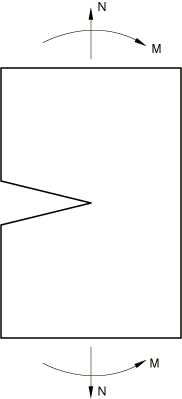

本节讨论单元的几何和运动学基础，以及平衡声明和定义本构关系的局部解的发展。本构关系用裂纹上传递的力和弯矩以及裂纹相对两侧上点的相对位移和旋转（[图3.9.5-1](03s09a96-Line-spring-elements.md)中的*A*和*B*）表示，并从单边裂纹平面应变试件的局部解推导。弹性和完全塑性（极限分析）解用于构建近似的弹塑性模型。

沿缺陷每点定义局部标准正交基系统，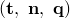，其中是沿缺陷的壳切线，是壳的法线，定义为

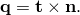

我们用壳法线来确定缺陷发生在壳的哪一侧；在正侧开口的缺陷被给予正的缺陷深度来表示，而在负侧的被给予负的缺陷深度。缺陷相对两侧上两点（[图3.9.5-1](03s09a96-Line-spring-elements.md)中的*A*和*B*）之间除位置相同外其他相同的相对运动，然后定义一组六个广义应变如下。单元的B侧包含节点*1*、*2*、*3*；对于LS6单元，A侧包含节点*4*、*5*、*6*。

I型：| 张开位移 |  |
| --- | --- |
| 张开旋转 |  |

II型：厚度剪切由相对位移定义，

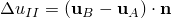

III型：反平面剪切由相对位移定义，

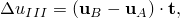和相对旋转

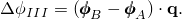相对旋转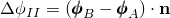在变形中不起作用。

这些相对运动形成了单元的运动学基础。

由于线弹簧单元仅为几何线性分析编写，这些相对运动的一阶变分与上述定义相同，总值被它们的变分替换。
### 虚功贡献

单元的虚功贡献定义为

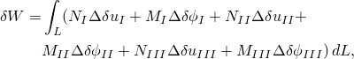其中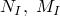等是每单位长度缺陷的力和弯矩，与相应的相对位移和旋转值共轭。在上述表达式中，积分沿整个缺陷进行。
### 插值

单元使用沿裂纹的位移和旋转分量的二次插值，因此与二阶壳单元（S8R、S8R5、S9R5、STRI65）兼容。

提供了两种线弹簧单元——LS6是用于壳中任意缺陷的通用单元，而LS3S用于裂纹位于对称平面且变形关于同一平面对称的情况，此时只需建模几何的一半用于I型使用。
### 弹性

I型线弹簧柔度基于承受远场张力和弯曲的单边缺口试件，如图3.9.5-2所示。这个柔度是

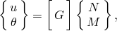其中矩阵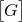可以从[Rice（1972）](07s01a01-References.md)的能量柔度校准获得。的逆提供了每单位长度缺陷的I型刚度，将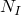和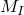与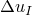和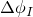关联。II型和III型的类似结果完成了弹性刚度。

应力强度因子计算为

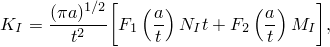其中[Tada等人（1973）](07s01a01-References.md)给出了和的近似表达式，类似的表达式适用于III型（没有适用于II型）。然后通过组合这些应力强度计算*J*积分

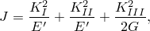其中

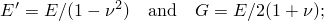*E*是杨氏模量，是泊松比。
### 塑性

Abaqus中的弹塑性线弹簧模型仅基于I型响应，因为没有混合模态加载下弹塑性线弹簧模型的理论。为方便起见，我们定义广义"应变"向量为

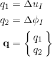和共轭广义"力"为

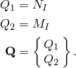

使用简单相关流动、各向同性硬化塑性模型的公式如下。广义应变率分解为弹性和塑性响应为

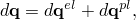上面描述的I型弹性关系用于定义广义应力：

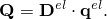

塑性应变率定义为屈服面的法线：

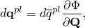其中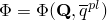是屈服函数，其定义在下面详细讨论，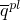是用于提供各向同性硬化的标量硬化参数。硬化从材料的基本应力-应变数据通过功等价论证计算。每单位长度缺陷的塑性功为

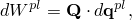也由下式给出

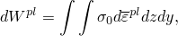其中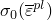是材料的单轴应力-应变行为，*z*和*y*测量穿过单边缺口试件厚度和沿长度的位置。我们用以下近似这个第二表达式

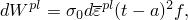其中是屈服应力的代表值（在等效塑性应变为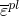时）；*t*是壳厚度；*a*是缺陷深度；*f*是一个常数，被引入以提供与数值结果的匹配。[Parks和White（1982）](07s01a01-References.md)建议选择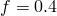，Abaqus使用此值。

屈服面相对于广义应力变量和定义如下。 following [Rice (1972)](07s01a01-References.md)，我们定义

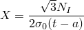和

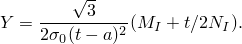

然后对于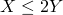，屈服函数被取为Rice提出的极限分析结果的包络线：

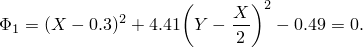否则，我们使用

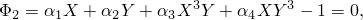和

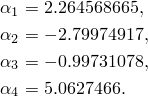

选择这个面在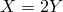处与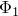连续混合，并在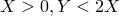处作为行为的合理估计。否则，它是任意的。[Rice（1972）](07s01a01-References.md)指出在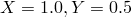处，屈服面将有一个顶点。Abaqus中使用的光滑面是为数值原因采用的。这种光滑性限制了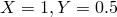处可能的流动行为，但我们假定这不是关键问题。

这些面如图3.9.5-3所示。该图还指示了模型不适用的区域（因为裂纹将闭合）。如果广义应力点在任何积分点进入此区域，则提供警告消息。

图3.9.5-3 线弹簧假定的广义应力屈服面。

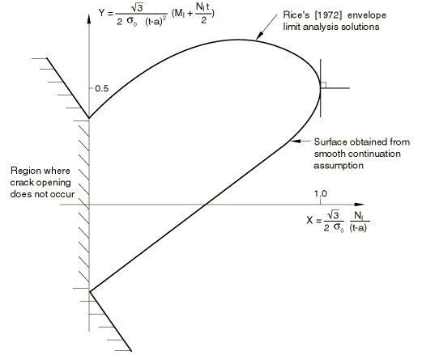

塑性模型通过通常的后向Euler方法积分（详见"塑性模型的积分，"第4.2.2节）。一旦塑性应变增量已知，从[Rice（1972）](07s01a01-References.md)为边缘裂纹带提出的滑移线场运动学，塑性裂纹尖端张开增量给出为

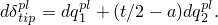*J*积分塑性部分的增量与塑性裂纹尖端张开增量相关

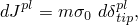其中*m*由（[Parks和White，1982](07s01a01-References.md)）给出，

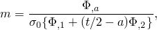其中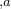表示关于缺陷深度的微分，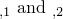分别表示关于和的微分。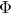根据变形状态是或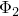。

*J*积分的弹性部分从广义应力通过计算应力强度因子获得，如前一节所述（忽略塑性效应）。总*J*积分是塑性和弹性*J*积分贡献之和。虽然用于计算弹性贡献的方法显然是近似的，但如果主导，它是相当准确的，这就是当显著塑性发展时的情况（[Parks和White，1982](07s01a01-References.md)）。
### 参考

### 参考

"Line spring elements for modeling part-through cracks in shells," Section 32.9.1 of the Abaqus Analysis User's Guide
