# 3.9.6 柔性关节单元

### 3.9.6 柔性关节单元

**产品：** Abaqus/Standard

Abaqus/Standard中的JOINTC单元提供两个节点之间的柔性关节。本节定义这些单元中使用的运动学变量。
### 运动学

JOINTC单元由两个节点组成，这里称为节点1和节点2。每个节点有六个自由度：位移和旋转。用户为单元定义局部方向。在大位移分析中，局部系统随单元的第一个节点旋转。

图3.9.6-1 JOINTC几何。

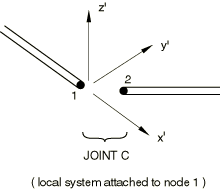我们用单位正交基向量（）定义局部系统。然后在分析中任何时刻

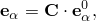其中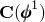是由单元第一个节点处的旋转定义的旋转矩阵。

然后单元中的相对位移为

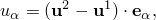一阶变分为

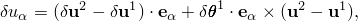其中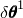是线性化旋转场（见"旋转变量，"第1.3.1节），二阶变分为

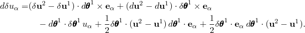

绕局部*3*轴的相对旋转定义为

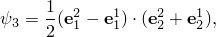其中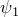和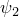通过局部方向索引的循环置换定义。

这些旋转度量仅为小相对旋转定义相对角旋转。由于这些原因，它们简单计算，对于高达180的相对旋转单调增加，被认为适合在单元中使用。

![](../graphics/stm_eqn05464.gif]的一阶变分为

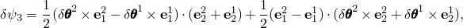其二阶变分为

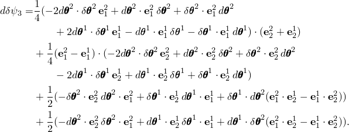

单元中的相对平移速度取为

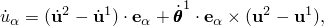绕局部*3*轴的相对角速度取为

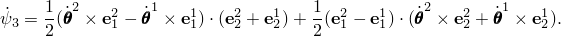
### 虚功

单元的虚功贡献为

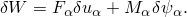我们假设关节的行为由

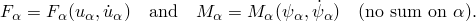定义。

对Newton求解的算子矩阵的贡献为

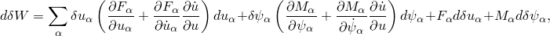其中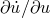由动态时间积分算子定义。
### 参考

### 参考

"Flexible joint elements," Section 32.3 of the Abaqus Analysis User's Guide
