# 3.9.8 分布耦合单元

### 3.9.8 分布耦合单元

**产品：** Abaqus/Standard  Abaqus/Explicit

分布耦合单元提供了一种将参考节点连接到一组耦合节点的方式，该方式根据在每个耦合节点单独规定的权重因子分布载荷。单元将力和力矩作为耦合节点-力分布分布在参考节点上。此处给出的公式也用于基于表面的分布耦合和紧固件约束。本节定义当使用默认连续体耦合方法时的载荷分布关系和得到的单元开发。

参考节点有位移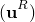和旋转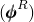自由度。耦合节点在此单元中只有位移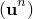自由度处于活动状态。每个耦合节点分配有一个权重因子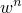，它决定通过耦合节点传递的单元承载载荷的比例。权重因子是无量纲的，其大小仅在相对意义上显著。此后，使用归一化权重：

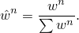
### 载荷分布

设和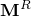是施加在参考节点上的载荷和力矩。耦合节点间静力许可的力分布满足

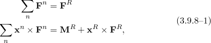其中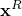和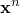分别是参考节点和耦合节点的位置。对于任意数量的耦合节点，[公式3.9.8-1](03s09a99-Distributing-coupling-elements.md)没有唯一解。

Abaqus中采用的力分布具有参考节点的线性化运动在平均意义上与耦合节点组运动兼容的特性。这种兼容性可以通过考虑权重因子被视为质量的情况下移动耦合节点组的动量来描述。在这种情况下，参考节点运动与占据参考节点位置的刚体上一点点的运动相同，其中刚体的质心是耦合节点的质心，刚体以与耦合节点组相同的线性和角动量运动。由于单元质量以这种方式分布，单元的动态行为也具有此特性。

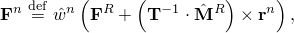其中

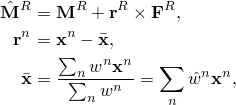耦合节点排列惯性张量为

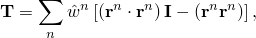其中是二阶单位张量。当权重因子被解释为螺栓横截面积时，这种力分布被识别为等效于经典螺栓图案力分布。
### 约束表达式

载荷分布导致节点运动的以下线性化约束：

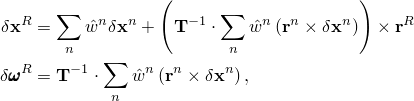其中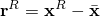。
### 有限运动

有限位移和旋转项采取参考节点运动作为耦合节点有限增量运动函数的约束形式。首先开发耦合节点排列有限旋转的度量，基于耦合节点的增量中位置，定义为

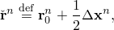增量中惯性张量为

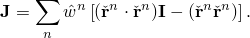增量中的"自旋"为

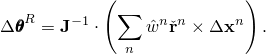

有限增量旋转张量根据[Hughes和Winget（1980）](07s01a01-References.md)公式从上述表达式推导，

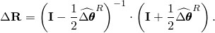

这个正交张量产生增量有限旋转向量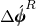。从这个旋转描述得到有限位移和旋转的约束表达式：

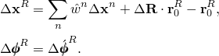
### 虚功贡献

所附结构的虚功表达式用约束的贡献增强

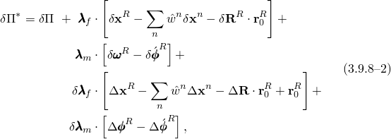其中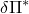是增强虚功表达式，是所附结构的虚功表达式，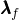和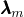分别是力和力矩的相应Lagrange乘子变量。
### 初始应力刚度项

初始应力刚度项从[公式3.9.8-2](03s09a99-Distributing-coupling-elements.md)所示精确虚功表达式的适当近似推导。这个近似基于无穷小增量运动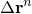和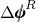的假设，这意味着

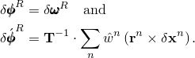获得近似虚功表达式：

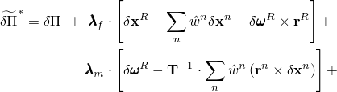

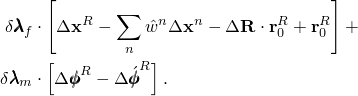这个表达式产生以下初始应力刚度项：

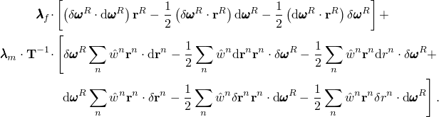
### 质量

分布耦合单元还根据权重分布向每个耦合节点分布质量。规定的单元质量*M*根据

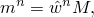分布到云节点，其中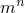是云节点质量。质量仅分布到云节点；参考节点没有关联质量。
### 参考

### 参考

"Distributing coupling elements," Section 32.4 of the Abaqus Analysis User's Guide

"Coupling constraints," Section 35.3.2 of the Abaqus Analysis User's Guide
