# 4.2.2 塑性模型的积分

### 4.2.2 塑性模型的积分

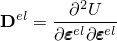**产品：** Abaqus/Standard  Abaqus/Explicit

Abaqus中提供的塑性模型在"塑性模型：一般讨论，"第4.2.1节中以一般术语描述。唯一的率方程是硬化的演化规则、流动规则和应变率分解。为率方程积分提供无条件稳定性的最简单算子是后向Euler方法：将该方法应用于流动规则（[公式4.2.1-5](04s02a101.md)）给出

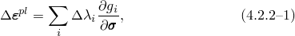并将其应用于硬化演化方程，[公式4.2.1-6](04s02a101.md)，给出

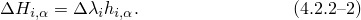

在这些方程中，在本节其余部分，任何未特别与时间点关联的量都取在增量结束时（时间应变率分解，[公式4.2.1-2](04s02a101.md)，在时间增量上积分给出

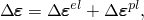其中中心差分算子定义：

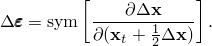

我们将每个应变度量的总值积分为该应变在增量开始时的值（旋转以考虑增量期间的刚性体运动）与应变增量之和。使用[Hughes和Winget（1980）](07s01a01-References.md)的算法近似定义以考虑增量期间刚性体运动的旋转。这种积分允许应变率分解积分为

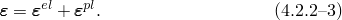

从计算角度来看，问题现在是代数的：我们必须求解本构模型在增量结束时状态的积分方程。定义代数问题的方程组是应变分解[公式4.2.2-3](04s02a102.md)、弹性[公式4.2.1-3](04s02a101.md)、积分流动规则[公式4.2.2-1](04s02a102.md)、积分硬化律[公式4.2.2-2](04s02a102.md)，以及对于率无关模型，屈服约束

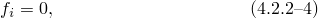对于主动系统（其中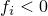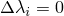系统）。

我们假设流动面足够光滑，以至于其关于应力和硬化参数的（二阶）导数是良好定义的。这对于Abaqus中的模型通常是成立的：例外发生在面的角落或顶点。这些特殊情况在出现时单独处理。

对于一些塑性模型，代数问题可以以闭合形式求解。对于其他模型，可以将问题简化为单变量或双变量问题，然后可以求解给出整个解。例如，Mises屈服面——通常与线性各向同性弹性一起用于各向同性金属——是一个可以精确求解或在单一变量中求解的积分问题的案例（见"各向同性弹塑性，"第4.3.2节）。

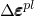对于具有单个屈服系统的其他率无关模型，代数问题被认为是在量中的问题。一旦找到这些——弹性——连同积分应变率分解——定义应力。流动规则然后定义硬化律定义硬化变量的增量。

我们现在推导在具有单个屈服系统的率无关塑性情况下积分问题的Newton求解的方程。具有单个屈服系统的率相关问题的求解方式类似。对于多个独立屈服系统的特殊情况（混凝土和关节材料），为此代数求解使用了特定技术，利用了那些特定模型中可用的简化。混凝土模型及其积分在"混凝土的非弹性本构模型，"第4.5.1节中描述，关节材料模型在"关节材料本构模型，"第4.5.4节中描述。

在求解期间，弹性关系和积分应变率分解被精确满足，因此

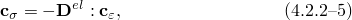其中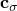应力修正，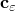塑性应变增量修正，

切线弹性矩阵。

硬化律也被精确满足（因为硬化参数的增量由这些律定义），因此

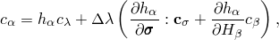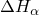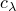中修正，修正。

这组方程可以重写为

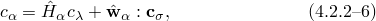中

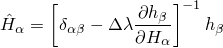

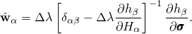

流动规则在找到解之前不会被精确满足，因此给出Newton方程

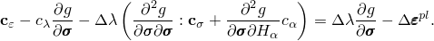

使用[公式4.2.2-5](04s02a102.md)和[公式4.2.2-6](04s02a102.md)允许这些方程重写为

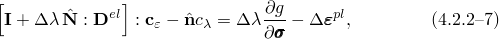中

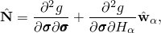

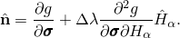

同样，屈服条件在Newton迭代期间不会被精确满足，因此

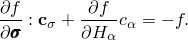

在该方程中使用[公式4.2.2-5](04s02a102.md)和[公式4.2.2-6](04s02a102.md)给出

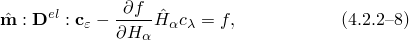中

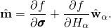

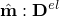我们现在在[公式4.2.2-7](04s02a102.md)和[公式4.2.2-8](04s02a102.md)之间消去取[公式4.2.2-7](04s02a102.md)沿使用[公式4.2.2-8](04s02a102.md)给出

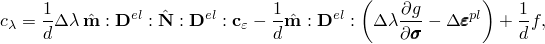中

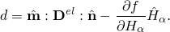

在[公式4.2.2-7](04s02a102.md)中使用此方程然后给出

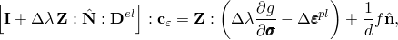中

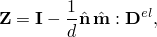是一组线性方程，求解然后更新解并继续Newton循环，直到流动方程和屈服约束满足。

具有单个屈服函数的率相关塑性模型的求解以相同的方式开发，唯一的区别是没有屈服约束以及时间的对应。
### 切线矩阵

当Abaqus/Standard用于隐式时间积分并且使用Newton方法求解平衡方程时，需要材料的切线矩阵，矩阵通过直接取积分方程关于所有求解参数的变分获得，然后求解间的关系。该过程密切遵循上述Newton求解的推导：结果是切线矩阵

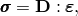中

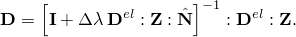
### 参考

### 参考

"Inelastic behavior," Section 23.1.1 of the Abaqus Analysis User's Guide
