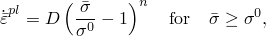
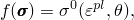
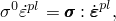

# 4.3.1 金属塑性模型

### 4.3.1 金属塑性模型

**产品：** Abaqus/Standard  Abaqus/Explicit

Abaqus为金属塑性分析提供了几种模型。主要选项是率无关和率相关塑性之间的选择、各向同性材料的Mises屈服面和各向异性材料的Hill屈服面之间的选择，以及对于率无关建模，各向同性和运动硬化之间的选择。特殊塑性理论是铸铁模型（"铸铁塑性，"第4.3.7节）、用于核应用中304和316不锈钢的ORNL模型（"ORNL本构理论，"第4.3.8节）以及用于断裂力学应用的变形塑性（"变形塑性，"第4.3.9节）。

率无关塑性主要用于在低温（通常低于绝对温标下熔点的一半）和低应变率下建模金属和一些其他材料的响应。率无关金属塑性模型使用相关流动。

提供了两种类型的率相关模型。在第一种类型中，在材料模型中引入率相关屈服强度。这适用于相对较高的应变率应用，如动态事件或金属成形过程模拟。这种类型的率相关性可以以不同方式引入。一种方式是使用过应力幂律，

其中是等效塑性应变率；是 nonzero塑性应变率时的屈服应力；是静屈服应力（可能依赖于塑性应变————通过各向同性硬化，依赖于温度————以及其他场变量，）；、是材料参数，可以是温度的函数，也可能是其他预定状态变量的函数。另一种方式是定义屈服应力比，，作为等效塑性应变率的函数。这两个选项都假设不同应变率下的硬化曲线形状相同。如果不同应变率下硬化曲线的形状不同，可以直接指定静态和率相关应力-应变关系。给定应变率下的屈服应力直接从这些关系插值。最后，用户可以通过用户子程序UHARD描述一般的率相关各向同性硬化。见[Symonds（1967）](07s01a01-References.md)、[Lindholm和Besseny（1969）](07s01a01-References.md)以及[Eleiche（1972）](07s01a01-References.md)获取高应变率相关材料响应测量的集合或此类测量的文献目录。

对于高温"蠕变"问题，Abaqus/Standard提供了一些简单的内置蠕变律。但对于许多实际问题，用户必须在用户子程序CREEP中编写单轴蠕变行为，因为实验测量的材料响应很复杂。循环加载下的蠕变响应表现出显著的Bauschinger效应，除非引入复杂的硬化模型，否则无法建模。Abaqus中这种情况的唯一能力是"ORNL"选项。此选项使用简单规则来建模Bauschinger效应，主要旨在作为不锈钢高温响应的设计评估模型。它不详细建模材料的响应。如果该硬化模型不够，用户必须使用用户子程序UMAT。

各向同性硬化意味着屈服函数写为

其中是等效（单轴）应力，是功等效塑性应变，定义为

且是温度。

各向同性硬化通常被认为是适用于塑性应变远超初始屈服状态（Bauschinger效应明显）的问题的合适模型（[Rice，1975](07s01a01-References.md)）。因此，这种硬化理论用于诸如涉及有限应变的动态问题和制造过程——任何涉及大塑性应变且塑性应变不会持续急剧反转方向的过程。

某些情况，如低周疲劳情况，涉及相对低幅值的应变循环。在这些情况下，建模Bauschinger效应变得重要。运动硬化是最简单能做到这一点的理论。Abaqus为这种情况提供了线性运动和非线性各向同性/运动硬化模型。这些模型在"经受循环加载的金属模型，"第4.3.5节中描述。
### 参考

### 参考

"Metal plasticity," Section 23.2 of the Abaqus Analysis User's Guide
