# 4.3.2 各向同性弹塑性

### 4.3.2 各向同性弹塑性

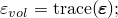**产品：** Abaqus/Standard  Abaqus/Explicit

此材料模型非常常用于金属塑性计算，无论是作为率相关还是率无关模型，并具有特别简单的形式。由于这种简单性，与积分模型相关的代数方程可以容易地用单个变量展开，材料刚度矩阵可以明确写出。这产生了特别高效代码。在本节中这些方程被展开。

为符号简单起见，所有未明确与时间点关联的量假定在增量结束时评估。

带相关流动的Mises屈服函数意味着没有体积塑性应变；由于弹性体积模量相当大，体积变化将很小。因此，我们可以定义体积应变为

因此，偏应变为

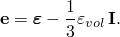弹性是线性各向同性的，因此，可以用两个温度相关材料参数写为。出于此推导的目的，最合适的是选择这些参数为体积模量*K*和剪切模量*G*。这些可以从用户输入的杨氏模量*E*和泊松比计算为

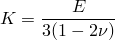和

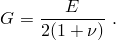

弹性可以写成分体积和偏分量如下。

体积：

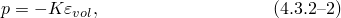其中

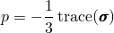是等效压力应力。

偏量：

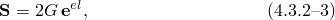其中是偏应力，

流动规则为

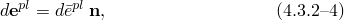其中

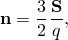

和是（标量）等效塑性应变率。

塑性要求材料满足单轴应力塑性应变率关系。如果材料与率无关，这是屈服条件：

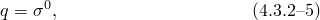其中是屈服应力，由用户定义为等效塑性应变（的函数）和温度（和是用户定义的温度相关材料参数，是静屈服应力。

用后向Euler方法积分此关系给出

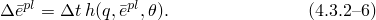

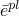此方程可以求逆（必要时数值地）给出*q*作为增量结束时的函数。

因此，率无关模型和积分率相关模型都给出一般单轴形式

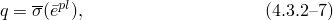其中对于率无关模型，，对于率相关模型，由[公式4.3.2-6](04s03a104.md)的求逆获得。

[公式4.3.2-1](04s03a104.md)到[公式4.3.2-7](04s03a104.md)定义材料行为。在任何发生塑性流动的增量中（由基于纯弹性响应评估*q*并发现其值超过来确定），这些方程必须被积分并求解增量结束时的状态。如"金属塑性模型，"第4.3.1节中的一般讨论，积分通过将后向Euler方法应用于流动规则（[公式4.3.2-4](04s03a104.md)）完成，给出

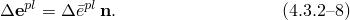

将其与偏弹性（[公式4.3.2-3](04s03a104.md)）和积分应变率分解（[公式4.3.2-1](04s03a104.md)）结合给出

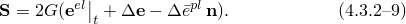

使用积分流动规则（[公式4.3.2-8](04s03a104.md)），连同Mises流动方向定义，（在[公式4.3.2-4](04s03a104.md)中），这变为

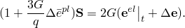

为符号简单起见，我们写成

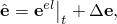以便此方程为

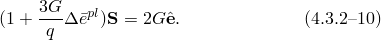

取此方程与自身的内积给出

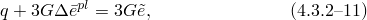其中

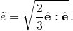

Mises等效应力*q*必须满足[公式4.3.2-7](04s03a104.md)中定义的单轴形式，因此从[公式4.3.2-11](04s03a104.md)，

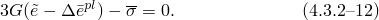

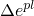这是一个关于的非线性方程，当依赖于等效塑性应变时（即，当材料是率相关的，或当存在非零加工硬化时）。（对于率无关完美塑性，它是关于已知，解被完全定义：使用[公式4.3.2-5](04s03a104.md)，

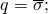因此，从[公式4.3.2-10](04s03a104.md)，

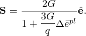从[公式4.3.2-4](04s03a104.md)，

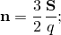因此，从[公式4.3.2-6](04s03a104.md)，

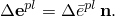

对于由运动学解提供三个直接应变分量的情况（即，除平面应力和单轴应力情况外的所有情况），[公式4.3.2-2](04s03a104.md)定义

因此解被完全定义。平面应力

对于平面应力，不由运动学定义，而是由平面应力约束

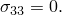

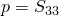这个附加方程（或等效地）必须与屈服条件和[公式4.3.2-9](04s03a104.md)一起求解。预测的第三应变分量

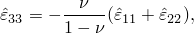其中

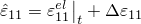和

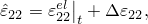作为最终值的初始猜测，使得（具有正确的塑性应变）平面应力条件得以满足。单轴应力

对于仅由运动学解定义一个直接应变分量的情况（单轴变形），我们要求

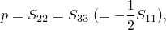所以

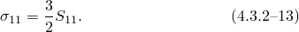
### 材料刚度

对于这个简单的塑性模型，材料刚度矩阵可以推导而不需要矩阵求逆（如"塑性模型的积分，"第4.2.2节中描述的一般情况所需），如下。

取[公式4.3.2-10](04s03a104.md)关于增量结束时所有量的变分给出

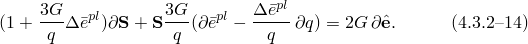

现在，从[公式4.3.2-5](04s03a104.md)，

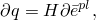从[公式4.3.2-11](04s03a104.md)，

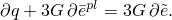

结合这两个结果，

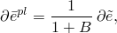其中

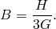

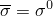从的定义（见[公式4.3.2-11](04s03a104.md)），

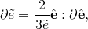因此，

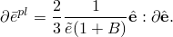

将这些结果与[公式4.3.2-14](04s03a104.md)结合给出

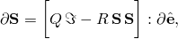其中、是四阶单位张量，和

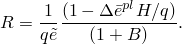

对于由运动学解定义三个直接应变的所有情况，材料刚度由

完成，因此

和

我们有

平面应力

对于平面应力情况，材料刚度矩阵通过在平面应变情况获得的一般材料刚度矩阵上施加

找到。单轴应力

对于单轴应力情况，材料刚度矩阵可以直接从[公式4.3.2-13](04s03a104.md)的变分获得为

### 参考

### 参考

"Classical metal plasticity," Section 23.2.1 of the Abaqus Analysis User's Guide
