# 4.3.3 各向异性金属塑性的应力势

### 4.3.3 各向异性金属塑性的应力势

**产品：** Abaqus/Standard  Abaqus/Explicit

Abaqus中的金属塑性模型对于各向同性行为使用Mises应力势，对于各向异性行为使用Hill应力势。这两个势都仅依赖于偏应力，因此响应的塑性部分是不可压缩的。这意味着在塑性流动主导响应的情况下（如极限载荷计算或金属成形问题），除平面应力问题外，有限单元应选择为能够容纳不可压缩流动。通常使用减缩积分单元来实现此目的：在Abaqus/Standard中也可以使用"杂交"单元，但成本更高。Abaqus/Standard中的完全积分一阶连续体单元使用选择性减缩积分，其中体积应变仅在单元质心计算。那些在"实体等参四边形和六面体，"第3.2.4节中描述的单元也适用于此类问题。

Mises应力势为

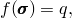其中

这里是偏应力：

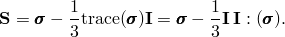

势在主应力空间中静水轴的垂直平面上是一个圆。对于此函数，

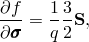和

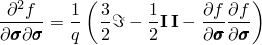其中是四阶单位张量。

Hill应力函数是Mises函数的简单扩展以允许各向异性行为。函数为

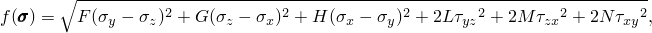以直角笛卡尔应力分量表示，其中是从材料在不同取向上的测试获得的常数。它们定义为

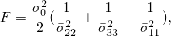

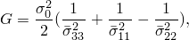

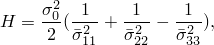

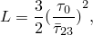

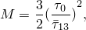

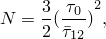其中由用户指定，。和是当只有一个应力分量非零时使势等于的应力值。

对于此函数

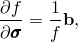其中

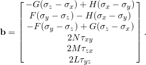

此外，

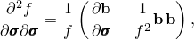其中

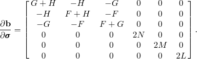
### 参考

### 参考

"Anisotropic yield/creep," Section 23.2.6 of the Abaqus Analysis User's Guide
