# 4.3.4 率相关金属塑性（蠕变）

### 4.3.4 率相关金属塑性（蠕变）

**产品：** Abaqus/Standard

Abaqus/Standard中提供的率相关塑性（蠕变）模型用于建模对应变敏感材料的非弹性应变。结构中的高温"蠕变"是此类材料模型应用的一个重要例子。因为这类问题通常涉及相对较小的非弹性应变（否则结构不是合适的设计），所以显式前向Euler方法作为流动规则的积分器通常令人满意。此方法仅条件稳定，但稳定性限制通常与此类情况下感兴趣的时间历史相比足够大，因此显式方法非常经济。[Cormeau（1975）](07s01a01-References.md)为大多数常见应力诱导蠕变情况开发了稳定性限制公式，这些结果用于监测稳定性。对于这种显式方法，积分很简单。将积分流动规则

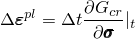与积分应变率分解和（线性）弹性结合给出

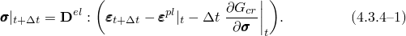

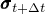当本构积分完成时，此方程组右侧的所有项都是已知的，因此这些方程明确地定义。

还存在许多涉及率相关塑性响应的问题，其中材料在所受应力状态下的特征松弛时间与分析中感兴趣的时间周期相比非常短，因此显式算子的条件稳定性将仅允许非常短的时间增量。对于这种情况，由于其无条件稳定性，使用后向Euler方法可能更经济。Abaqus始终对高应变率应用使用隐式方法，以避免由本构模型积分中稳定性考虑引入的时间增量限制。Abaqus还将在所有几何非线性问题以及率无关塑性同时活跃的问题中使用隐式方法。

后向Euler方法是隐式的；由于塑性应变率通常是应力的强函数，必须小心开发有效算法来求解使用此算子产生的非线性代数方程。问题已在"塑性模型的积分，"第4.2.2节中正式提出。主要困难是获得的合理起始猜测。为此我们如下进行。

为简单起见，我们仅考虑率相关行为和由

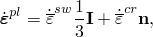定义的流动规则的特定形式，其中是"等效溶胀应变率"，是"等效蠕变应变率"，是偏应力势的梯度，

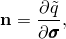其中是Mises或Hill应力势（在"各向异性金属塑性的应力势，"第4.3.3节中定义）。

"等效应变率"是塑性响应应力势的一部分，因此，假定具有形式

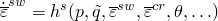和

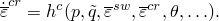的演化律。

流动方程的后向Euler积分给出

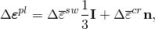其中理解为在时间评估，

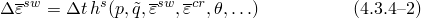和

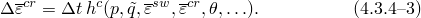和通常在用户子程序CREEP中定义。

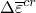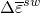代数问题的求解通过首先找到和的合理初始猜测，然后求解完整问题来获得。

Mises和Hill等效应力定义（都具有以下性质：

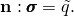

我们也有简单关系

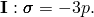

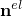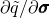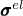和的初始估计通过将问题投影到和获得，其中是，在定义，即如果在增量期间没有非弹性变形将发生在增量结束时出现的应力状态。投影为

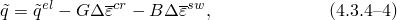和

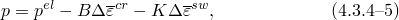其中

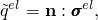

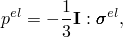

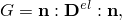

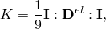和

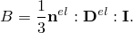

[公式4.3.4-2](04s03a106.md)到[公式4.3.4-5](04s03a106.md)是一组非线性方程，可以求解和。我们用Newton方法求解这些方程，然后使用此解作为求解完整问题的起始估计。当使用Mises应力势且问题不是平面应力时，此起始估计是完整问题的解，因为Mises应力势在偏平面上是一个圆。
### 用户子程序CREEP

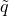Abaqus/Standard为实现粘塑性模型（如蠕变和溶胀）提供了一个非常通用的能力，其中应变率势可以写为等效压力应力*p*、Mises或Hill等效偏应力的函数，以及任意数量的解相关状态变量。本节的目的是提供用户子程序CREEP中需要执行的操作的概述。为说明主要思想，蠕变律假定为应变硬化类型，形式为

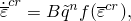其中*B*和*n*是材料常数，*f*是其参数的非线性函数。在用户子程序CREEP中，用户需要基于上述蠕变律定义蠕变应变增量。鉴于蠕变律是率形式，需要一种积分方案将其转换为定义蠕变应变增量的增量形式。这种转换可以通过使用显式（前向Euler）或隐式（后向Euler）积分方案来完成。在显式方案中，任何时间增量期间的蠕变应变率用增量开始时的（已知）量来定义。因此，显式积分将导致蠕变律的以下增量形式：

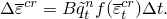在隐式方案中，任何时间增量期间的蠕变应变率用增量结束时的（未知）量来定义。因此，隐式方案将导致蠕变律的以下增量形式：

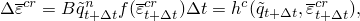其中是，其参数的非线性函数。在上述增量形式中，下标*t*和分别指增量开始和结束时相应量的值。

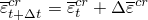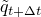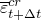认识到并且是的函数，隐式积分方案导致蠕变应变增量是迭代计数器，表示蠕变应变增量的校正。如上述两个方程所示，隐式方案的Jacobian需要函数关于的偏导数。对于这里考虑的示例，Jacobian可以进一步表示为

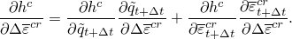如果函数也依赖于静水压力，则还有附加项。在隐式方案中，用户还需要定义进入非线性方程Jacobian的相关导数。在上面的示例中，用户需要定义量和。增量蠕变应变和Jacobian贡献需要增量开始和结束时等效Mises或Hill应力（如果相关，还有压力应力）和等效蠕变应变的值，这些在用户子程序中可用。

另一方面，在显式方案中，蠕变应变增量用增量开始时已知的量定义，因此不需要局部迭代。然而，如"Abaqus Analysis User's Guide"第23.2.4节"率相关塑性：蠕变和溶胀"中所讨论的，显式方案有与稳定性相关的限制。

无论使用何种积分方案来积分蠕变方程的率形式，用户子程序CREEP在每个材料点被调用——增量开始时一次，增量结束时一次。这些调用是为了分别基于增量开始和结束时蠕变应变率获得蠕变应变增量。这两个蠕变应变增量值之间的差异衡量积分方案的准确性，必须小于相关分析步骤选项上指定的最大差异值。
### 参考

### 参考

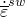"Rate-dependent plasticity: creep and swelling," Section 23.2.4 of the Abaqus Analysis User's Guide
