# 4.3.5 经受循环加载的金属模型

### 4.3.5 经受循环加载的金属模型

**产品：** Abaqus/Standard  Abaqus/Explicit

Abaqus中的运动硬化模型旨在模拟经受循环加载的金属的行为。这些模型通常应用于低周疲劳和棘轮效应研究。这些模型的基本概念是屈服面在应力空间中移动，使得在一个方向上的应变降低相反方向的屈服应力，从而模拟Bauschinger效应和由加工硬化引起的各向异性。

Abaqus中提供了两种运动硬化模型。最简单的模型提供线性运动硬化，因此主要用于低周疲劳评估。如果在塑性范围内将单轴行为线性化（恒定加工硬化斜率），此模型会产生物理上合理的结果。这通常最好通过猜测问题中将达到的应变水平并相应地线性化实际材料行为来完成。认识到该理论提供合理结果的能力方面的这一限制并相应地提供材料数据是很重要的。此模型可用于Mises或Hill屈服面。

组合各向同性/运动硬化模型是线性模型的扩展。它比对线性模型提供对应力-应变关系更准确的近似。它还建模其他现象——如棘轮效应、平均应力松弛和循环硬化——这些是经受循环加载材料的典型现象。此外，可以叠加几个运动硬化模型，当应变变化范围显著时，这通常会产生更准确的结果，并允许更准确地建模棘轮效应。此模型仅适用于Mises屈服面。

本节首先描述两个模型公式共同的方面；然后给出每个模型的具体公式。
### 应变率分解

总应变率弹性和塑性应变率写为

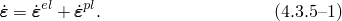
### 弹性行为

弹性行为只能建模为线性弹性

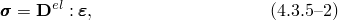中示四阶弹性张量，别是二阶应力张量和应变张量。
### 塑性行为

这些模型是压力无关塑性模型。对于两个模型，屈服面由函数

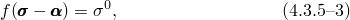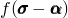义，其中关于背应力或"运动偏移"等效Mises应力或Hill势，屈服面的大小。例如，等效Mises应力定义为

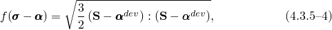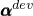中背应力的偏量部分，偏应力张量。

这些模型假设相关的塑性流动：

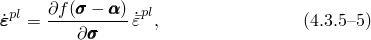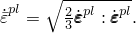中表示塑性流动率，是等效塑性应变率，
### 线性运动硬化模型

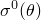此模型是Abaqus中提供的两种运动硬化模型中较简单的一种。屈服面的大小于此模型只能是温度的函数。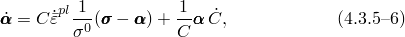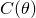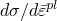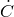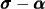中等温单轴应力-应变响应的加工硬化斜率，在不同温度下取得），是*C*随时间的变化率。这种演化律形式定义屈服面中心的当前半径向量方向上塑性应变的变化率，温度变化导致的变化率朝向应力空间原点。项在演化中的包含确保材料响应对温度历史无关，因此，可以用等温数据表征。[Rice（1975）](07s01a01-References.md)相当一般地写道

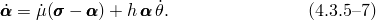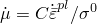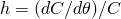设了上述[公式4.3.5-6](04s03a107.md)中此模型基于[Lemaitre和Chaboche（1990）](07s01a01-References.md)的工作。屈服面的大小场变量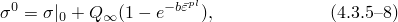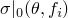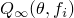中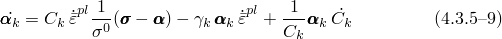总体背应力从关系

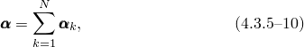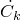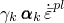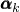算，其中*N*是背应力数量，温度和场变量的变化率。这个方程是基本Ziegler律，推广以考虑温度和场变量的变化率在温度变化，模型预测的材料响应将对温度历史敏感。然而，可以表明这种对温度历史的依赖性很小，随塑性变形的增加而消失。对于完全的温度历史无关行为，条件是使用恒定值）。

背应力和各向同性硬化的演化在[图4.3.5-1](04s03a107.md)中针对单向加载说明，在[图4.3.5-2](04s03a107.md)中针对多轴加载说明。

图4.3.5-1 非线性模型的一维表示。

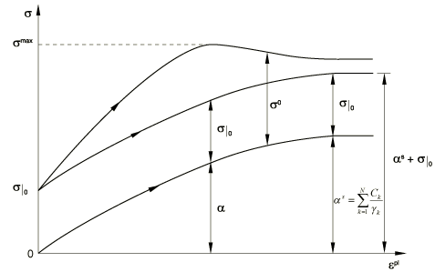

图4.3.5-2 非线性模型的三维表示。

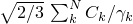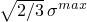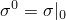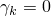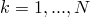屈服面的中心包含在半径为的圆柱内，这直接从[公式4.3.5-10](04s03a107.md)得出。因此，屈服面包含在图中所示的极限面（半径对于，此模型可以退化为上述线性运动模型。

此模型可以捕捉的物理行为及其局限性在Abaqus Analysis User's Guide中详细描述。
### 参考

### 参考

"Models for metals subjected to cyclic loading," Section 23.2.2 of the Abaqus Analysis User's Guide
