# 4.3.6 多孔金属塑性

### 4.3.6 多孔金属塑性

**产品：** Abaqus/Standard  Abaqus/Explicit

多孔金属塑性模型适用于轻度含孔金属。尽管含有孔洞的材料（也称为基体材料）假定为塑性不可压缩，但由于孔洞的存在，体积材料的塑性行为是压力相关的。本模型的详细描述见以下段落，随后是材料点计算的简要说明。
### 屈服条件

对于含有低浓度孔洞的金属，基于单个球形孔洞球对称变形的刚性-塑性上界解，[Gurson（1977）](07s01a01-References.md)提出了如下形式的屈服条件

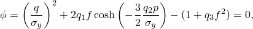其中

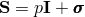是宏观Cauchy应力张量的偏量部分；

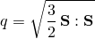是Mises应力；

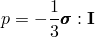是静水压力；*f*是材料中孔洞的体积分数；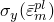是基体材料在完全致密状态下的屈服应力，作为基体中等效塑性应变的函数。[Tvergaard（1981）](07s01a01-References.md)引入了常数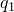、和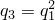（作为孔体积分数和压力项的系数），以使Gurson模型的预测与平面应变拉伸场中有序孔洞材料的数值研究相一致；通过设置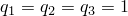可以恢复原始Gurson模型。

应注意，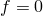意味着材料完全致密，Gurson屈服条件退化为von Mises；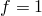意味着材料完全空化，没有应力承载能力。[图4.3.6-1](04s03a108.md)说明了这一点，图中展示了在*p*-*q*平面上不同孔隙率水平的屈服面。

图4.3.6-1 *p*-*q*平面上屈服面的示意图。

[图4.3.6-2](04s03a108.md)比较了多孔金属（在拉伸和压缩中具有初始孔体积分数）与完全塑性基体材料的行为；多孔金属的初始屈服应力为。

图4.3.6-2 多孔金属单轴行为示意图。

在压缩中，多孔材料由于孔洞闭合而"硬化"，在拉伸中由于孔洞的生长和形核而"软化"。
### 流动规则

塑性应变从屈服势导出；屈服条件中应力张量第一不变量的存在导致非偏量塑性应变：

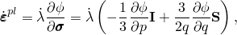其中是非负塑性流动乘子。
### 塑性应变和*f*的演化

（完全致密）基体材料的硬化通过描述。的演化假定由等效塑性功表达式控制，即

孔洞体积分数的变化部分是由于现有孔洞的生长，部分是由于孔洞的形核。现有孔洞的生长基于质量守恒定律，表示为

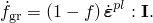

孔洞的形核可能由于微裂纹和/或颗粒-基体界面的解聚而发生。Abaqus假定新孔洞的形核是塑性应变控制的（见[Chu和Needleman，1980](07s01a01-References.md)），因此

其中

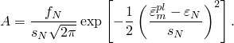形核应变的正态分布具有平均值、标准差，并以体积分数形核。*f*的总变化率给出为

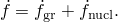孔洞仅在拉伸中形核；如果应力状态是压缩的，Abaqus将不考虑材料点处的形核项。

[图4.3.6-3](04s03a108.md)展示了对于不同值的参数，假定为正态分布的形核函数。[图4.3.6-4](04s03a108.md)展示了对于不同值的，多孔材料单轴拉伸试验中的软化程度。

图4.3.6-3 形核函数。

图4.3.6-4 （单轴拉伸中）作为函数的软化。

### 弹塑性方程的积分

多孔塑性模型弹塑性方程的积分使用[Aravas（1987）](07s01a01-References.md)提出的后向Euler格式进行。以下段落简要讨论该方法；用户可参考该论文了解更多细节。

在增量的材料计算过程中，应力和状态变量在时间*t*（增量开始时）是已知的。给定总增量应变，需要在（增量结束时）更新应力和状态变量，使其满足屈服条件、流动规则和状态变量的演化方程。为此，考虑弹性方程

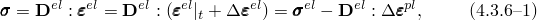其中

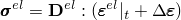是弹性预测，

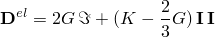是线性各向同性弹性张量，*G*和*K*分别是剪切模量和体积模量，和分别是四阶和二阶单位张量。此外，在上式中，应变被加法分解以将总增量应变写为弹性和塑性部分之和。除非另有说明，所有应力和状态变量均在处评估。

屈服条件、流动规则和状态变量的演化重写为

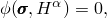

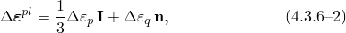和

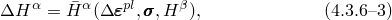其中

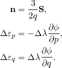在上式中，、是状态变量和*f*。塑性乘子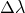从前两个方程中消去，得到

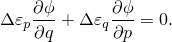[公式4.3.6-2](04s03a108.md)用于弹性方程[公式4.3.6-1](04s03a108.md)得到

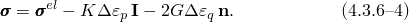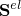和是同轴的；因此，确定为

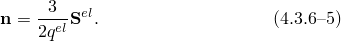一旦已知，可以一致地确定标量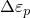和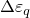来完成解。因此，积分压力相关弹塑性本构方程的问题归结为求解以下两个关于标量和的非线性方程：

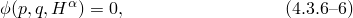

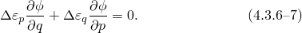在上述方程中，*p*、*q*和定义为

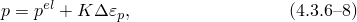

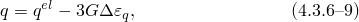

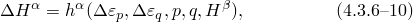其中[公式4.3.6-8](04s03a108.md)和[公式4.3.6-9](04s03a108.md)通过将[公式4.3.6-4](04s03a108.md)分别投影到和上获得，[公式4.3.6-10](04s03a108.md)是[公式4.3.6-3](04s03a108.md)的另一种形式。求解上述未知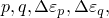和的方程组完成多孔塑性模型的积分算法。

[公式4.3.6-6](04s03a108.md)和[公式4.3.6-7](04s03a108.md)使用Newton法求解和；*p*和*q*使用[公式4.3.6-8](04s03a108.md)和[公式4.3.6-9](04s03a108.md)更新；状态变量使用[公式4.3.6-10](04s03a108.md)更新。
### 计算线性化模量

在求解大变形问题的隐式有限元方法中，离散化平衡方程导致增量结束时节点未知量的一组非线性方程组。Abaqus/Standard使用Newton法求解这些方程，这需要计算*线性化模量*

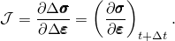为计算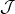（也称为Jacobian），我们从弹性方程（[公式4.3.6-4](04s03a108.md)）开始，可以重写为

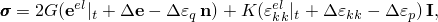其中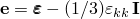是的偏量部分。从上式中可得

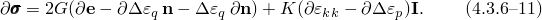再次，[公式4.3.6-6](04s03a108.md)和[公式4.3.6-7](04s03a108.md)用于计算变分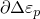和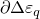。经过一些冗长的代数计算，得到一组线性方程，可以求解和。这些导数被代入[公式4.3.6-11](04s03a108.md)以获得线性化模量。通常这个线性化模量是不对称的。Jacobian推导的更多细节可见[Aravas（1987）](07s01a01-References.md)。
### 参考

### 参考

"Porous metal plasticity,"  Section 23.2.9 of the Abaqus Analysis User's Guide
