# 4.3.8 ORNL本构理论

### 4.3.8 ORNL本构理论

**产品：** Abaqus/Standard

本节描述Abaqus/Standard中304和316不锈钢的本构理论，如核标准[NE F9-5T(1981)](07s01a01-References.md)所规定。本构理论解耦为率无关塑性响应和率相关蠕变响应，每个响应由单独的本构定律控制。

塑性理论使用Mises屈服面，该屈服面可以在应力空间中各向同性膨胀和运动学移动。核标准NE F9-5T通过允许先前蠕变应变在应力空间中膨胀和移动后续屈服面，在塑性和蠕变响应之间提供了一些耦合。然而，对于304和316不锈钢，先前塑性不影响后续蠕变响应。

一组辅助蠕变和加载反向检测规则，使用改进的应变硬化蠕变理论，克服了标准应变硬化理论在应力反向时通常遇到的不一致性。特别地，基于应变硬化假设的蠕变理论预测在应力反向条件下的蠕变率过小，从而通常会低估循环加载条件下发生的蠕变量。
### 不锈钢的ORNL塑性理论

不锈钢的塑性理论，如核标准NE F9-5T所规定，采用带有运动硬化的von-Mises屈服面。在Abaqus中，使用推广到非等温情况的Ziegler硬化规则。

通常，当考虑组合各向同性硬化和运动硬化时，屈服面中心假定随着塑性应变根据Prager或Ziegler运动硬化规则线性移动。将各向同性硬化纳入本构公式会改变应力-应变关系的形式，但保持确定屈服面中心运动的Prager或Ziegler运动偏移规则不变。在ORNL塑性公式中，应力-应变定律的形式保持不变（一维中的双线性表示），并对运动偏移规则进行修改以容纳各向同性硬化。

使用Mises屈服面：

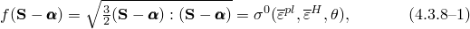其中是偏应力

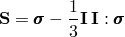且是运动偏移（屈服面中心在应力空间中的位置），假定为纯偏量，因此

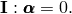量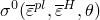是等效单轴应力，表示屈服面中心到其表面上任意点的应力空间距离。在一般情况下，这个屈服面半径假定依赖于等效塑性应变；ORNL定义的等效蠕变应变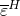；和温度。

该模型使用相关塑性流动，这意味着塑性应变率由

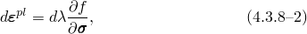定义，其中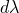是可以被识别为功等效塑性应变率的标量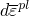，定义为

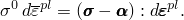之所以如此，是因为

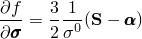对于所选的Mises屈服面，因此

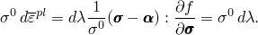

为在活跃塑性变形期间持续满足屈服条件（[公式4.3.8-1](04s03a110.md)），一致性条件为

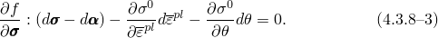

对于的演化，我们使用Ziegler硬化规则的修正形式

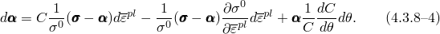

此方程中的第二项解释各向同性硬化，因此当此方程与一致性条件（[公式4.3.8-3](04s03a110.md)）结合时，包含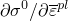的项相互抵消。这产生了双线性形式的单轴应力-应变关系。

活跃塑性加载期间的应变率分解为

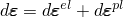（我们假定在活跃塑性加载期间蠕变应变没有变化）。这里是弹性应变增量，是总应变增量。

我们使用线性弹性配合温度依赖性模量，因此

其中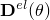是弹性矩阵。这给出率形式

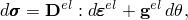其中

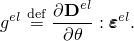

将其与流动规则（[公式4.3.8-2](04s03a110.md)）结合，可以将增量应力-应变关系写为

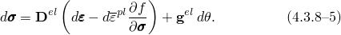

将）的演化方程（[公式4.3.8-4](04s03a110.md)）引入一致性条件（[公式4.3.8-3](04s03a110.md)）提供

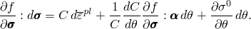

将[公式4.3.8-5](04s03a110.md)投影到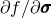上给出

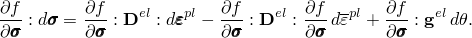

然后结合这两个定义，从总应变率和温度变化率提供

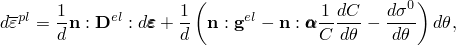其中

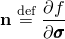和

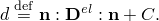

活跃塑性变形期间的增量应力-应变关系现在直接从[公式4.3.8-5](04s03a110.md)获得为

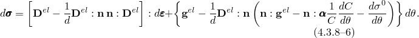

将[公式4.3.8-3](04s03a110.md)和[公式4.3.8-4](04s03a110.md)简化到一维，在大应变值处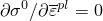且其中，表明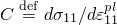是单轴应力与塑性应变关系中塑性部分斜率。

增量应力-应变关系（[公式4.3.8-6](04s03a110.md)）与纯运动硬化获得的形式相同。如前所述，这是由于在的演化表达式和一致性关系中的项相互抵消的结果。双线性应力-应变定律和屈服面中心的移动在[图4.3.8-1](04s03a110.md)中描述。

图4.3.8-1 ORNL塑性理论中双线性应力-应变行为和屈服面中心的移动。

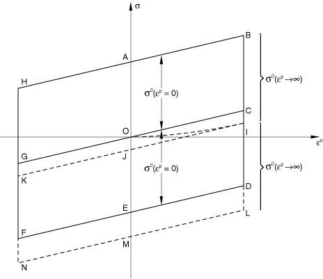在纯运动硬化和等温条件下，在完全反向应变控制条件下两次应力反向，屈服中心遵循路径OCOGOC，而应力-应变曲线遵循路径OABCDEFGHAB。在ORNL理论中，屈服面中心的移动由[公式4.3.8-6](04s03a110.md)控制。项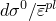在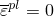时达到最大值，并在持续累积应变下趋于零，当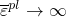。

因此，屈服面中心在单调加载下遵循路径OI。如果点I距离原点O足够远，使得在点I处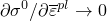，则随着在持续应力反向下继续增长，的持续增长由纯运动硬化控制，其中。屈服面中心随后沿路径IJKJI移动。与纯运动硬化不同，ORNL理论允许由于累积塑性应变导致的的增量变化，产生关于应力-应变原点不对称的应力-应变曲线。

屈服面的膨胀通过值的阶跃变化来近似。[图4.3.8-2](04s03a110.md)显示了适用于原始（初始）应力-应变曲线的值，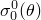，以及适用于第10次循环曲线的值，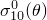。

图4.3.8-2 假定原始和第10次循环ORNL应力-应变曲线在双线性表示的塑性部分具有相同的斜率。

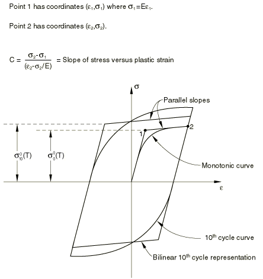的值假定根据关系发生阶跃变化

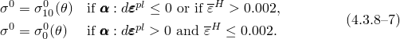

这些条件表明，当ORNL等效蠕变应变值达到0.2%时，或当在应力反向后首次发生屈服时，屈服面大小发生阶跃变化。核标准NE F9-5T建议屈服面中心在阶跃变化期间保持固定。在这种情况下，[公式4.3.8-6](04s03a110.md)中涉及的项保持恒等于零，屈服面中心根据Ziegler运动硬化规则移动。核标准建议[公式4.3.8-6](04s03a110.md)中的常数*C*在将从原始值变为第10次循环值时保持固定。由于*C*是单轴拉伸试验中应力与塑性应变曲线的斜率，这意味着第10次循环应力-应变曲线的塑性切线模量与原始应力-应变曲线的塑性切线模量相同。这一要求也是必要的，以便在完全反向应变控制加载下第10次循环应力-应变曲线关于应力-应变原点对称。
### 不锈钢的ORNL蠕变理论

ORNL蠕变理论的流动规则可以写成

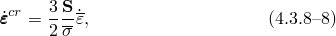其中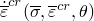是单轴等效蠕变应变率，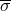是Mises等效应力，

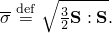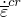对应力、蠕变应变和温度的函数依赖性可以在用户子程序中定义，也可以通过数据行定义。如果选择数据行选项，Abaqus假定有效蠕变应变率可以写为

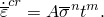在恒定应力下这给出

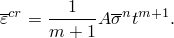在这些方程之间消元*t*给出应变硬化形式的蠕变律

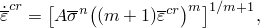现在假定即使在应力随时间变化时这也成立。

ORNL蠕变理论现在用有效蠕变应变替换此方程中的总有效蠕变应变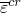，有效蠕变应变根据以下算法确定。

在蠕变响应期间的任何时刻，用于定义等效蠕变应变率的等效总蠕变应变定义为从原点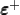或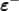的距离。*L*在任何时刻指示哪个原点是活跃的。如果原点是，我们设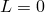，而如果原点是，。量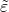定义了总蠕变应变空间中当前原点与先前原点之间的距离。有效蠕变应变然后通过以下步骤确定：

初始设设并设。

设当前原点标志。

设。

计算

如果当前原点是，则当时，有效蠕变应变递减。类似地，如果当前原点是，则当时，有效蠕变应变递减。基于有效蠕变应变递减（加载反向）的概念，选择新原点的规则在步骤4到14中给出。

如果且，设并转到步骤13。否则，设并继续到步骤5。

如果且，设并转到步骤13。否则，设并继续到步骤6。

如果且，设并转到步骤13。否则，设并继续到步骤7。

如果且，设并转到步骤13。否则，设并继续到步骤8。

如果且，设并转到步骤13。否则，设并继续到步骤9。

如果且且，设并转到步骤13。否则，设并继续到步骤10。

如果且且，设并转到步骤13。否则设并继续到步骤11。

如果且且，设并转到步骤13。否则，设并继续到步骤12。

如果且且设并转到步骤13。否则，设并继续到步骤13。

如果，转到步骤18。（在这种情况下，加载在当前蠕变增量期间没有反向，因此不需要更新原点。）如果或2，继续到步骤14。

如果，设。（在这种情况下，新原点是，原点标志设为零。）

如果，设。（在这种情况下，新原点是，原点标志设为一。）

如果，转到步骤18。（在这种情况下，新原点与当前原点相同。因此没有发生加载反向；因此不需要更新原点。）

如果，继续到步骤15。（在这种情况下，发生了加载反向。）

如果，转到步骤16。（当前原点是且发生了加载反向。）

如果，转到步骤17。（当前原点是且发生了加载反向。）

如果，将保持在其当前值，设，设，设，并转到步骤18。（新原点现在是。）

如果，将和保持在其当前值；设；并转到步骤18。（新原点现在是。）

如果，将保持在其当前值，设，设，设，并继续到步骤18。（新原点现在是。）

如果，将、保持在其当前值；设；并继续到步骤18。新原点现在是。）

如果，设

如果，设。

转到步骤1以确定下一个蠕变增量的。

除了前述用于确定应变硬化蠕变公式中有效蠕变应变的算法外，ORNL程序还允许屈服面中心在蠕变期间移动。核标准NE F9-5T建议屈服面中心根据关系在蠕变期间移动

其中

常数*C*是单轴应力与塑性应变曲线的斜率，是当前有效屈服应力，*A*是由蠕变应变引起的运动偏移的饱和率。
### 参考

### 参考

"ORNL — Oak Ridge National Laboratory constitutive model,"  Section 23.2.12 of the Abaqus Analysis User's Guide
