# 4.3.9 变形塑性

### 4.3.9 变形塑性

**产品：** Abaqus/Standard

Abaqus/Standard中提供了变形塑性理论，以允许对延性金属进行完全塑性分析，通常在 small-displacement条件下，用于断裂力学应用。该模型基于Ramberg-Osgood关系。本节中定义了详细的本构模型。获得完全塑性解的程序通常包括增量加载直到响应是完全塑性的。

该模型称为变形塑性，因为应力由总机械应变定义，没有历史依赖。没有"卸载"准则（允许在应变反向后立即恢复初始弹性刚度），因此该模型仅在持续流动情况下作为塑性模型有用。它实际上是一个非线性弹性模型；但在极限状态，当整个试样或结构响应处于塑性状态时，由于其简单的形式，这是塑性响应的有用等价表示。
### 一维模型

基本一维模型为

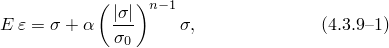其中是应力，是机械应变，*E*是杨氏模量（定义为应力-应变曲线在零应力处的斜率），是"屈服"偏移（从这个意义上说，当时，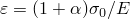），*n*是"塑性"（非线性）项的硬化指数：。

该模型描述的材料行为在所有应力水平下都是非线性的，但对于常用的硬化指数值（或更大），非线性仅在应力大小接近或超过时才变得显著。
### 多轴推广

第一个 term 的推广使用线性"弹性"关系；非线性项通过使用Mises应力势和相关流动法则推广到多轴应力状态，给出多轴模型

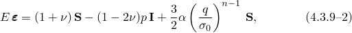其中

是应变张量，

是应力张量，

是等效静水应力，

是Mises等效应力，

是应力偏量，和

是泊松比。

行为的线性部分可能是可压缩或不可压缩的，取决于泊松比的值，但行为的非线性部分是不可压缩的（因为流动正交于Mises应力势）。由于该模型通常用于变形以塑性流动为主的情况，建议将此材料模型与选择性减缩积分单元或"杂交"（混合公式）单元一起使用（平面应力除外）。
### 应变能密度

该模型通常用于在需要*J*积分的断裂力学中获得完全塑性解。对于*J*积分评估，需要应变能密度。这是

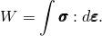从[公式4.3.9-2](04s03a111.md)这可以得为

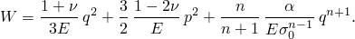
### 应力解

在每个积分点的分析过程中，运动学解的最新估计被提供给本构程序，后者必须提供针对所使用材料模型计算的相应应力张量。由于此材料模型是非线性的，我们使用下面描述的方法求解应力。

单轴情况（唯一的非零应力分量是一个直接应力）

在这种情况下

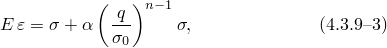其中现在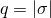。

我们使用Newton法求解[公式4.3.9-3](04s03a111.md)得到。将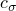写为的校正，[公式4.3.9-3](04s03a111.md)的Newton方程为

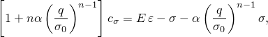

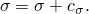作为初始猜测，如果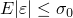我们使用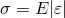，如果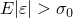则使用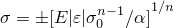（符号选择与相同）。

在这种情况下材料刚度矩阵为

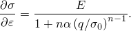所有由运动学定义应变分量的情况

当所有应变分量由运动学定义时（即除单轴和平面应力情况外的所有情况），将[公式4.3.9-2](04s03a111.md)投影到上给出

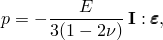体积行为的线性关系。定义偏应变为

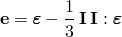并使用[公式4.3.9-2](04s03a111.md)，我们得到

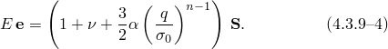定义等效偏应变为

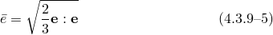并使用[公式4.3.9-4](04s03a111.md)，我们得到标量方程

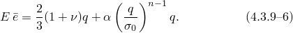该方程使用Newton法求解*q*：

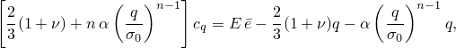

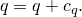对于单轴情况，我们将使用起始猜测：

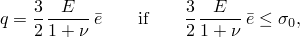和

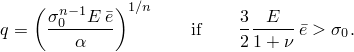[公式4.3.9-6](04s03a111.md)也可用于定义

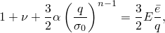以便[公式4.3.9-4](04s03a111.md)变为

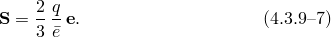因此，一旦知道*q*，就被定义；从而，已知为

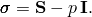材料刚度定义如下。从[公式4.3.9-7](04s03a111.md)我们有

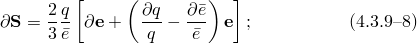且[公式4.3.9-6](04s03a111.md)给出

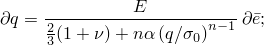且从[公式4.3.9-5](04s03a111.md),

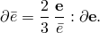使用这些结果，[公式4.3.9-8](04s03a111.md)变为

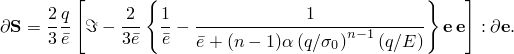现在

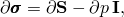

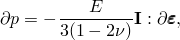和

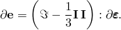结合这些结果，我们获得材料刚度为

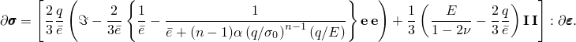平面应力

对于这种情况，我们假设材料完全不可压缩来求解。然后我们使用这个解作为Newton循环的起始猜测来找到可以像之前一样求解*q*。[公式4.3.9-7](04s03a111.md)然后定义，平面应力约束要求，所以

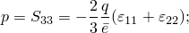从而，我们获得解的初始估计

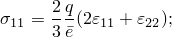

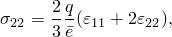和

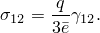实际应力的Newton解：

[公式4.3.9-2](04s03a111.md)定义应力，其中对于这种情况，

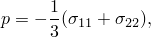

和

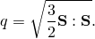因此，[公式4.3.9-2](04s03a111.md)变为

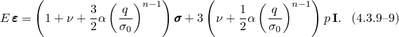这些方程使用Newton法求解：

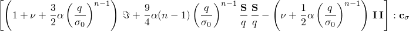

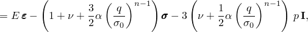

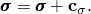材料刚度直接从[公式4.3.9-9](04s03a111.md)可得为

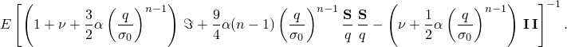
### 参考

### 参考

"Deformation plasticity,"  Section 23.2.13 of the Abaqus Analysis User's Guide
