# 4.3.10 塑性应变引起的热生成

### 4.3.10 塑性应变引起的热生成

**产品：** Abaqus/Standard  Abaqus/Explicit

Abaqus允许引入非弹性热分数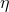，它定义了与塑性应变相关的机械耗散引起的热生成。这个项可以作为热-机械分析的耦合源引入。这种耦合在以下模拟中可能很重要：发生了广泛非弹性变形且材料机械性能依赖于温度的过程。如果过程非常缓慢，塑性变形产生的热量有时间消散；非耦合、等温分析足以模拟该过程。如果过程极其快速，热量没有时间扩散；非耦合、绝热分析（其中每个积分点被视为与相邻点热绝缘）是足够的。完全耦合的热-应力分析适用于远离两个极端的情况。本节定义了非弹性应变引起的热生成项，并描述了该项如何贡献于整体Newton求解方案。

模型假定塑性应变产生单位体积的热通量

其中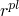是添加到热能平衡中的热通量；是非弹性热分数，假定为常数；是应力；且是塑性应变率。对于Abaqus中的所有塑性模型，塑性应变增量从流动势写为

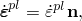其中是流动方向（我们假定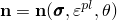，其中温度），且塑性应变的标量测度，用作某些塑性模型中屈服面和流动势定义中的硬化参数。在这种情况下，我们仅考虑各向同性硬化理论：Abaqus仅为此类模型提供热-机械耦合。

Abaqus通常使用后向Euler格式积分塑性应变，因此增量结束时的近似为

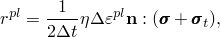其中所有量在增量结束时（在时间）评估，除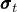外。本节余下部分采用此表示法。此项用作对热能平衡方程的贡献。

当使用Newton法求解非线性方程时，耦合项对Newton方法的Jacobian矩阵产生三项贡献：

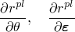来自热能平衡方程，和

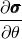来自机械平衡方程。这些项的一般形式现在推导。

机械本构模型具有以下一般形式。弹性通过以下定义应力

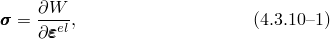其中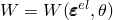是应变能密度势，是机械弹性应变。我们隐式假定弹性不是完全不可压缩的，尽管如果情况并非如此，推导没有显著差异，因为压力应力在完全不可压缩材料中不做功，因此不会对所讨论的项做出贡献。

我们假定存在加性应变率分解，可以积分给出

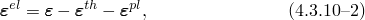其中总应变，热膨胀引起的应变。在Abaqus的本构模型中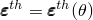 only。这种分解形式依赖于测量为变形率的积分以及弹性和热应变很小：，这对于程序中提供的标准塑性模型是成立的。

塑性流动定义通过后向Euler方法积分给出

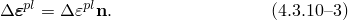

最后，假定有一个活跃屈服面或一个活跃流动面，率无关模型引入屈服面约束，而率相关模型提供积分流动率约束，两者都纳入一般形式

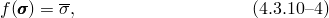其中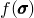标量应力函数（例如，简单金属塑性模型的Mises或Hill应力函数），且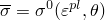率无关模型的屈服应力，而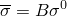于率相关模型，其中

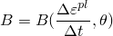从增量上的平均塑性应变率定义率效应。例如，默认情况下，率相关塑性模型定义

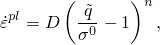其中Mises或Hill等效应力，且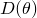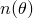材料参数。在此表达式中使用增量上的平均塑性应变率定义

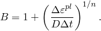

[公式4.3.10-1](04s03a112.md)到[公式4.3.10-4](04s03a112.md)是后向Euler方法积分的所有标准各向同性硬化塑性模型的一般定义。

我们现在取这些方程关于增量结束时所有量的变分：

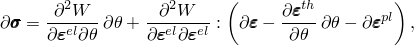

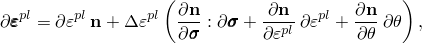和

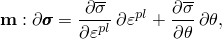其中

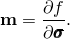

为符号简单起见，我们现在定义

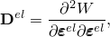

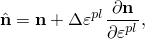

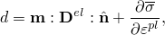

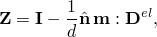

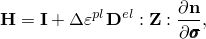

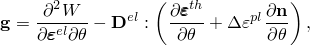

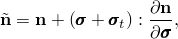

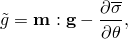

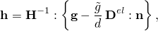和

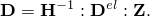

这些表达式允许我们写出

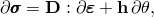和

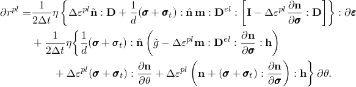
### 参考

### 参考

"Fully coupled thermal-stress analysis,"  Section 6.5.3 of the Abaqus Analysis User's Guide

"Fully coupled thermal-electrical-structural analysis,"  Section 6.7.4 of the Abaqus Analysis User's Guide

"Adiabatic analysis,"  Section 6.5.4 of the Abaqus Analysis User's Guide
