# 4.4.1 多孔弹性

### 4.4.1 多孔弹性

**产品：** Abaqus/Standard

Abaqus/Standard中的多孔弹性模型设计为与允许塑性体积变化的塑性模型结合使用，如"颗粒或聚合物行为模型，"第4.4.2节至"可压碎泡沫模型，"第4.4.6节所述。不建议在没有这些塑性选项之一的情况下使用多孔弹性模型。该模型基于实验观察：在多孔材料的弹性（可恢复）应变期间，孔隙比——*e*——的变化与等效压力应力——*p*——的对数变化——定义为

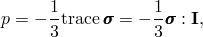——线性相关，因此在率形式中

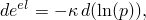其中是材料参数。在这种形式中，材料具有零抗拉强度。如果抗拉强度非零，则等价关系为

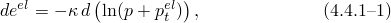这包括零抗拉强度的特殊情况（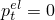）。可以证明，如果忽略固体材料的可压缩性，材料样品的体积变化为

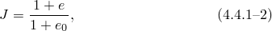其中是初始孔隙比。如果我们根据关系定义弹性孔隙比

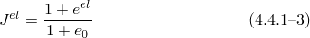然后积分线性关系，体积弹性关系为

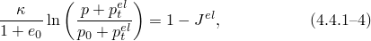其中是初始压力应力，由初始条件规定。注意，对于零抗拉强度材料，需要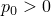。该方程可以反演得到

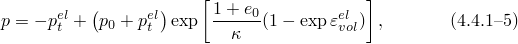如图[图4.4.1-1](04s04a113.md)所示。

图4.4.1-1 多孔弹性体积行为。

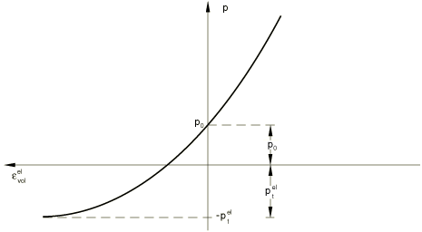

偏量弹性行为可以通过选择常剪切模量*G*来定义，使得偏量弹性刚度独立于等效压力应力，或者通过选择常泊松比来定义，使得偏量弹性刚度随等效压力应力的增加而增加。如果给定常剪切模量，偏量关系为

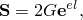而当给定泊松比时，关系具有率形式

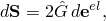其中

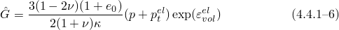对于具有非零抗拉强度的材料。在这些方程中，是偏应力：

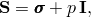且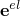是弹性应变的偏量部分：

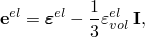其中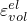是弹性应变的体积部分。
### 参考

### 参考

"Elastic behavior of porous materials,"  Section 22.3.1 of the Abaqus Analysis User's Guide
