# 4.4.2 颗粒或聚合物行为模型

### 4.4.2 颗粒或聚合物行为模型

**产品：** Abaqus/Standard  Abaqus/Explicit

颗粒材料和聚合物材料的行为很复杂。然而，在基本单调加载条件下，相当简单的本构模型可以提供有用的设计信息。这些本构模型本质上是压力相关塑性模型，在岩土工程领域有着悠久的历史。然而，最近它们也被发现对某些在拉伸和压缩中表现出显著不同屈服行为的聚合物和复合材料建模有用。

这里描述的模型是原始Drucker-Prager模型（[Drucker和Prager，1952](07s01a01-References.md)）的扩展。在岩土材料背景下，感兴趣的扩展包括在子午面上使用曲线屈服面、在偏应力平面上使用非圆形屈服面，以及使用非相关流动法则。在聚合物和复合材料背景下，感兴趣的扩展主要包括使用非相关流动法则和包含率相关效应。在这两种背景下，模型都已扩展为包含蠕变。
### 可用的屈服准则

这组模型提供了三种屈服准则。它们在子午面（*p*-*q*平面）上提供不同形状的屈服面：线性形式、双曲形式和一般指数形式（见[图4.4.2-1](04s04a114.md)）。

图4.4.2-1 子午面上的屈服准则。

公式中使用的应力不变量在Abaqus Analysis User's Guide的"约定，"第1.2.2节中定义。模型的选择主要取决于材料、可用于校准模型参数的实验数据以及可能遇到的压力应力值范围。

线性模型（在Abaqus/Standard和Abaus/Explicit中可用）在偏量（）平面上提供非圆形截面，在偏量平面上提供相关非弹性流动，并提供单独的膨胀角和摩擦角。偏量平面上使用的平滑表面与表现出顶点的真实Mohr-Coulomb表面不同。这有限制性含义，特别是对于颗粒材料的流动局部化研究，但在许多常规设计应用中可能不是主要问题。输入数据参数定义偏量平面上屈服面和流动面的形状以及摩擦角和膨胀角，从而提供一系列简单理论；例如，原始Drucker-Prager模型（[Drucker和Prager，1952](07s01a01-References.md)）在此模型中可用。

双曲和一般指数模型（仅在Abaqus/Standard中可用）在偏量应力平面上使用von Mises（圆形）截面，配合相关塑性流动。子午面上使用双曲流动势，这通常意味着非相关流动。
### 硬化、率依赖性和蠕变

这些模型提供完美塑性和各向同性硬化。各向同性硬化通常被认为是适用于塑性应变远超初始屈服状态（Bauschinger效应明显）的问题的合适模型（[Rice，1975](07s01a01-References.md)）。因此，这种硬化理论用于涉及大塑性应变且塑性应变率不会急剧反向的过程；即，这些模型适用于基本单调加载的问题，区别于循环加载。

各向同性硬化模型可用于率相关和率无关行为。率相关版本适用于相对较高的应变率应用。

各向同性硬化意味着屈服函数写为

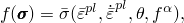其中*f*是对称二阶张量的各向同性函数，是等效屈服应力，给定为

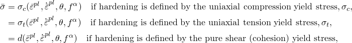其中是剪应力；*K*是材料参数；是等效塑性应变；是等效塑性应变率；是温度；且是其他预定义的场变量。

等效塑性应变率对于线性Drucker-Prager模型定义为

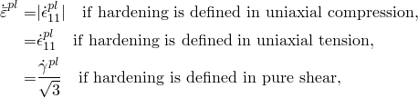其中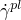是工程剪塑性应变率，对于双曲和指数Drucker-Prager模型由塑性功表达式定义为

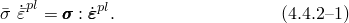

函数依赖性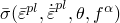可以包含硬化以及率相关效应。如果不同应变率下应力-应变曲线的形状不同，则测试数据以表格形式输入，作为不同等效塑性应变率下屈服应力值与等效塑性应变的表格：每个应变率一个表格。给定应变和应变率下的屈服应力直接从这些表格中插值。

或者，当可以假定不同应变率下硬化曲线的形状相似时，硬化和率依赖性分别指定。在这种情况下，我们假定率依赖性可以写为可分离形式：

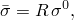其中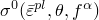是Drucker-Prager硬化模型的静态屈服应力，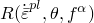将此值在非零应变率下缩放（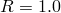时为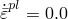）。率相关屈服比*R*以表格形式或使用标准幂律形式定义

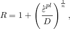其中和是材料参数。

蠕变模型最适用于在低变形率下表现出时间相关非弹性变形的应用。这种非弹性变形可以与率无关塑性变形共存，在本节后面描述。然而，Abaqus材料定义中存在蠕变意味着不能使用上述率依赖性。
### 应变率分解

假定加性应变率分解：

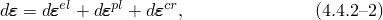其中是总应变率，是弹性应变率，是非弹性（塑性）应变率，且是非弹性蠕变应变率。如果应力点在屈服面内部，则省略；如果未定义蠕变或蠕变不活跃，则省略。
### 弹性行为

弹性行为可以建模为线性或使用多孔弹性模型，包括"多孔弹性，"第4.4.1节中描述的抗拉强度。如果定义了蠕变，弹性行为必须建模为线性。
### 线性Drucker-Prager模型

在此模型中，我们定义偏应力测度

其中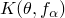是材料参数。为确保屈服面的凸性，。使用这种偏应力测度是因为它允许在偏量平面上匹配拉伸和压缩中不同的应力值，从而在材料在三轴拉伸和压缩试验中表现出不同屈服值时提供拟合实验结果的灵活性。此函数在[图4.4.2-2](04s04a114.md)中示意。

图4.4.2-2 线性模型在偏量平面上的典型屈服面。

它只提供对Mohr-Coulomb行为的粗略匹配（其中屈服与中间主应力无关）。由于在单轴拉伸时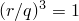，在这种情况下；由于在单轴压缩时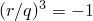，在那种情况下。当*K*=1时，对第三偏应力不变量的依赖被消除；在偏量平面上恢复Mises圆：。

利用这个偏应力测度表达式，屈服面定义为

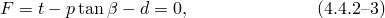其中

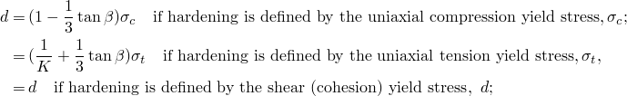且是子午应力平面中材料的摩擦角。

在以单轴压缩定义的硬化情况下，线性屈服准则排除摩擦角 71.5（3）。这不被视为限制，因为真实材料不太可能出现这种情况。

硬化参数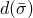测量材料的内聚力并代表各向同性硬化，如图[图4.4.2-3](04s04a114.md)所示。

图4.4.2-3 线性模型在*p*-*t*平面中硬化和流动的示意图。

公式将视为关于应力的常数，尽管可以直接扩展理论以提供对应力（如*p*）的函数依赖性。

在Abaqus Analysis User's Guide中描述了将Mohr-Coulomb数据（，Coulomb摩擦角，和*c*，内聚力）转换为适当的和*d*值的方法。
### 流动规则

线性模型中假定势流动，因此
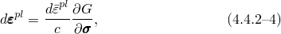
其中
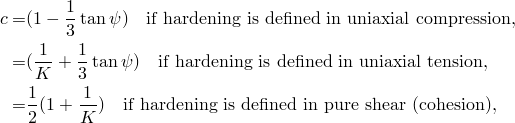
和
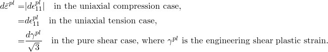
*G*是流动势，在此模型中选择为
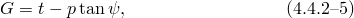
其中是*p*-*t*平面中的膨胀角。[图4.4.2-3](04s04a114.md)的*t*-*p*图中展示了的几何解释。在以单轴压缩定义的硬化情况下，此流动规则定义排除膨胀角 71.5（3）。这不被视为限制，因为真实材料不太可能出现这种情况。

比较[公式4.4.2-3](04s04a114.md)和[公式4.4.2-5](04s04a114.md)表明流动在偏量平面中是相关的，因为屈服面和流动势都对*t*有相同的函数依赖。然而，膨胀角和材料摩擦角可能不同，因此模型在*p*-*t*平面中可能不是相关的。对于，材料是非膨胀的；如果，则模型是完全相关的——该模型是[Drucker和Prager（1952）](07s01a01-References.md)首次引入的类型。对于和，恢复原始Drucker-Prager模型。
### 双曲和一般指数模型

双曲和一般指数模型仅在Abaqus/Standard中可用，用前两个应力不变量表示。双曲屈服准算是Rankine（拉伸截止）的最大拉伸应力条件与高约束应力下线性Drucker-Prager条件的连续组合。它写为
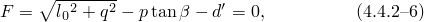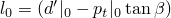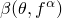
其中、是材料的初始静水拉伸强度，是的初始值，且是如图[图4.4.2-1](04s04a114.md)(b)所示在高约束压力下测得的摩擦角。是硬化参数，从测试数据中获得：
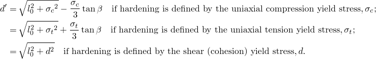
该模型中假定的各向同性硬化将视为关于应力的常数，并如图[图4.4.2-4](04s04a114.md)所示。该模型的校准在Abaqus Analysis User's Guide中描述。

图4.4.2-4 双曲模型在*p*-*q*平面中硬化的示意图。

一般指数形式提供了此类模型中最通用的屈服准则。屈服函数写为
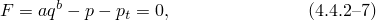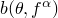
其中和是独立于塑性变形的材料参数，且是表示材料静水拉伸强度的硬化参数，如图[图4.4.2-1](04s04a114.md)(c)所示。与测试数据的关系为
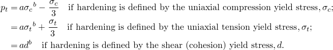
该模型中假定的各向同性硬化将*a*和*b*视为关于应力的常数，并如图[图4.4.2-5](04s04a114.md)所示。

图4.4.2-5 一般指数模型在*p*-*q*平面中硬化的示意图。

可以直接给出材料参数*a*、*b*和；或者，如果有多轴试验数据可用，Abaqus将从多轴试验数据确定材料参数。使用最小二乘拟合来最小化应力相对误差，以获得*a*、*b*和的"最佳拟合"值。
### 流动规则

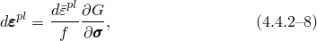双曲和一般指数模型中假定势流动，因此

其中*f*取决于硬化如何定义（通过单轴压缩、单轴拉伸或纯剪切数据），但通常可以写为

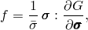和

*G*是流动势，在这些模型中选择为双曲函数：

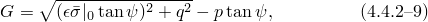其中是在高约束压力下在*p*-*q*平面中测得的膨胀角；是初始等效屈服应力；且是一个参数，称为偏心率，定义函数接近渐近线的速率（当偏心率趋于零时，流动势趋于直线）。此流动势是连续且平滑的，确保流动方向被唯一确定。该函数在高约束压力应力下渐近接近线性Drucker-Prager流动势，并以90度角与静水压力轴相交。子午应力平面中的一族双曲势如图[图4.4.2-6](04s04a114.md)所示。流动势是偏量应力平面（平面）中的von Mises圆。

图4.4.2-6 *p*-*q*平面中双曲流动势族。

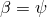

在这两个模型中，流动在偏量应力平面中都是相关的。在一般指数模型中，流动在子午*p*-*q*平面中始终是非相关的。在双曲模型中，比较[公式4.4.2-6](04s04a114.md)和[公式4.4.2-9](04s04a114.md)表明，当膨胀角和材料摩擦角不同时，流动在*p*-*q*平面中是非相关的。双曲模型仅在和时在*p*-*q*平面中提供相关流动。
### 蠕变模型

可以定义根据扩展Drucker-Prager模型表现出塑性行为的材料的经典"蠕变"行为。

此类材料中的蠕变行为与塑性行为密切相关（通过蠕变流动势和测试数据的定义），因此还需要定义Drucker-Prager塑性和硬化行为。行为的弹性部分必须是线性的。

塑性行为的率无关部分限于线性Drucker-Prager模型，该模型在偏量应力平面上具有von Mises（圆形）截面（*K*=1）。塑性势是结合双曲和一般指数模型描述的双曲流动势（[公式4.4.2-9](04s04a114.md)）。
### 蠕变行为

我们采用蠕变等值面（或等效蠕变面）的概念，即共享相同蠕变"强度"的应力点的等值面，用等效蠕变应力测量。当材料发生塑性变形时，等效蠕变面应与屈服面重合；因此，我们通过均匀缩小屈服面来定义等效蠕变面。在*p*-*q*平面上，这转化为与屈服面的平行线，如图[图4.4.2-7](04s04a114.md)所示。

图4.4.2-7 定义为剪应力的等效蠕变应力。
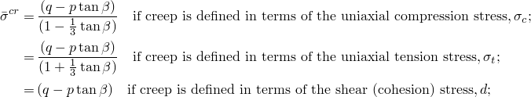
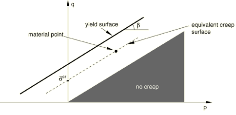Abaqus要求通过用于定义功硬化属性的相同类型的测试数据来定义蠕变属性。等效蠕变应力被确定为等效蠕变面与适当应力路径的交点。因此，
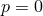
其中是材料摩擦角。

[图4.4.2-7](04s04a114.md)显示了当材料属性通过剪切试验定义时如何确定等效蠕变应力：绘制一条与屈服面平行的线，使其通过材料点；该线与试验应力路径（的交点产生。

这种方法的结果是蠕变应变率是*q*和*p*两者的函数，并且在由于高静水压力导致*q*非常高的情况下，可以确定真实的材料属性。如果我们认为该材料的屈服强度是内聚强度和摩擦强度的组合，该模型对应于由内聚力决定的蠕变。因此，在*p*-*q*空间中有一个锥形区域，其中没有蠕变。

可以使用内置Abaqus蠕变律或通过用户子程序CREEP定义的单轴律。蠕变应变率的积分首先尝试显式进行，如"率相关金属塑性（蠕变），"第4.3.4节所述。如果超过稳定性限制、进行几何非线性分析或塑性变得活跃，则使用后向Euler方法进行积分，如"率相关金属塑性（蠕变），"第4.3.4节所述。
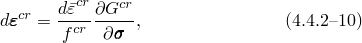### 蠕变流动规则

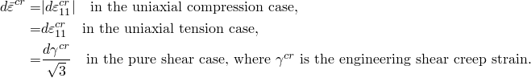蠕变流动规则从蠕变势中导出，使得

其中是等效蠕变应变率，必须与等效蠕变应力功共轭：

由于功共轭，定义为

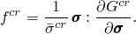等效蠕变应变率然后从"单轴"蠕变律确定：

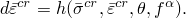

蠕变应变率假定遵循与塑性应变率相同的双曲势

其中是，在高约束压力下在*p*-*q*平面中测得的膨胀角；是初始屈服应力；且所示。蠕变势是偏量应力平面（平面）中的von Mises圆。

[公式4.4.2-10](04s04a114.md)和[公式4.4.2-11](04s04a114.md)产生完整的流动规则

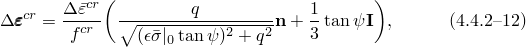其中

和

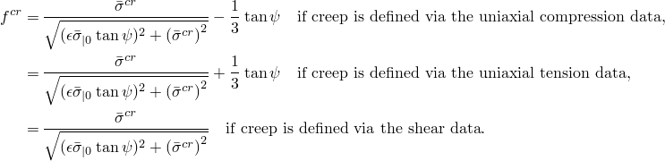的表达式表明，当通过单轴压缩数据定义蠕变属性时，如果

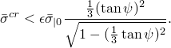则将变为负。

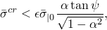因此，在这个应力水平以下（对于典型材料来说非常低），应力向量和蠕变势的法线方向相反：

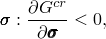这等价于

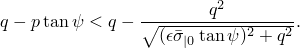因此，如果，在"无蠕变"锥之外有一个小区域会出现这种情况。因此，在此区域内获得的蠕变数据（如单轴压缩中获得的数据）应在非常低的应力水平下显示与施加应力方向相反的蠕变应变率，这通常不是情况。为克服此困难，Abaqus将修改输入的蠕变数据，使得。因此，不应期望计算蠕变应变与在以下区域定义的蠕变属性之间的对应关系

其中

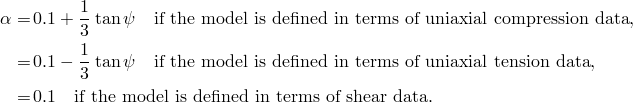该区域的确切大小取决于的值和输入的测试数据类型。这种修改通常不重要，因为典型蠕变分析的载荷施加迅速，然后是长期蠕变。因此，分析的大部分应力水平通常远高于修改区域。

"慢"加载的一个近似可见的示例 included in "Verification of creep integration,"  Section 3.2.6 of the Abaqus Benchmarks Guide. 从示例中可以清楚地看出，尽管载荷在步骤中斜坡上升，但近似的影响很小。

尽管蠕变流动在偏量应力平面中是相关的，但使用与等效蠕变面不同的蠕变势意味着蠕变流动是非相关的。
### 参考

### 参考

"Extended Drucker-Prager models,"  Section 23.3.1 of the Abaqus Analysis User's Guide
