# 4.4.3 临界状态模型

### 4.4.3 临界状态模型

**产品：** Abaqus/Standard  Abaqus/Explicit

Abaqus/Standard中为无内聚力材料建模提供的非弹性本构理论基于Roscoe及其在剑桥的同事开发的临界状态塑性理论（[Schofield等，1968](07s01a01-References.md)和[Parry，1972](07s01a01-References.md)）。实施的特定模型是"修正Cam-clay"理论的扩展。讨论完全基于有效应力：土壤可能被渗透液体饱和，该液体携带压力应力并假定根据Darcy定律流动。两相材料的连续体理论在"多孔介质中润湿液相的连续性声明，"第2.8.4节中描述。

修正Cam-clay理论是一个经典塑性模型。它使用应变率分解，其中土壤机械变形的速率分解为弹性和塑性部分；弹性理论；屈服面；流动规则；和硬化规则。理论的各个部分在本节中定义。该模型使用流动规则和硬化规则的后向Euler积分进行数值实现：Abaqus对塑性模型一直使用这种方法。

Cam-clay模型的基本概念在几何上如图[图4.4.3-1](04s04a115.md)到[图4.4.3-7](04s04a115.md)所示。该模型的主要特征是使用弹性模型（线性弹性或多孔弹性模型，随着材料被压缩体积弹性刚度增加）和变形的非弹性部分使用特定形式的屈服面、相关流动和允许屈服面生长或收缩的硬化规则。

该模型的一个关键特征是硬化/软化概念，围绕"临界状态"面的引入而发展：有效应力状态的轨迹，其中在恒定有效应力下发生土骨架的无限制、纯偏量塑性流动。临界状态面在主有效应力空间中是一个锥体（[图4.4.3-1](04s04a115.md)），其顶点是原点（零有效应力），其轴是等效压力应力*p*。

图4.4.3-1 主应力空间中的Cam-clay屈服和临界状态面。

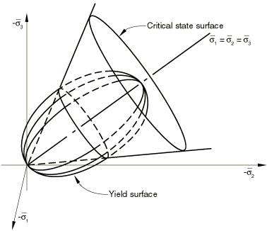在原始临界状态模型中，该表面在平面（主应力空间中垂直于等效压力应力轴的平面）上的截面是圆形的：在Abaqus中，这已扩展到[图4.4.3-5](04s04a115.md)中所示的更一般形状。在由等效压力应力——*p*——和等效偏应力测度——*t*（*t*的定义在本节后面给出）——定义的有效应力空间截面上，临界状态面呈现为一条直线，通过原点，斜率为*M*（见[图4.4.3-2](04s04a115.md)和[图4.4.3-3](04s04a115.md)）。修正Cam-clay屈服面在平面上与临界状态面具有相同的形状，但在*p*-*t*平面上假定由两个椭圆弧组成：一个弧通过原点，其切线垂直于压力应力轴，并在其切线平行于压力应力轴处与临界状态线相交；另一个弧是通过临界状态线的第一个弧的光滑延续，并在压力应力轴上某非零压力应力值处与其相交，同样其切线垂直于该轴（见[图4.4.3-4](04s04a115.md)）。假定塑性流动正交于该表面。

硬化/软化假设控制有效应力空间中屈服面的大小。硬化/软化假定仅依赖于体积塑性应变分量，并且当体积塑性应变是压缩的（即当土骨架被压实）时，屈服面尺寸增大，而土骨架体积的非弹性增加导致屈服面收缩。在（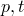)平面上选择屈服面的椭圆弧，结合相关流动假设，因此导致材料在屈服状态（在临界状态线左侧，[图4.4.3-2](04s04a115.md)中，"干燥"侧）软化，在屈服状态（在临界状态线右侧，[图4.4.3-3](04s04a115.md)中，"湿润"侧）硬化。

图4.4.3-2 临界状态"干燥"侧的剪切试验响应（）。

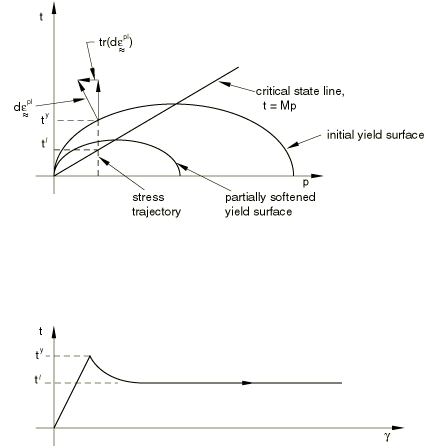在恒定有效压力应力但增加剪切（偏量）应变的状态下，产生的应力-应变行为如图[图4.4.3-2](04s04a115.md)和[图4.4.3-3](04s04a115.md)所示：初始屈服后（由最初假定的屈服面大小控制；即由初始超固结程度控制）发生应变软化或应变硬化，直到应力状态位于临界状态面上，此时发生无限制偏量塑性流动（完美塑性）。"湿润"和"干燥"术语来自用手加工土壤试样的概念。在临界状态的"湿润"侧，土骨架压实得过于松散以至于无法支撑压力应力——如果施加这种应力（如用手挤压土壤），会立即进入孔隙水，从而导致水从试样中流出并弄湿手。当土壤处于临界状态的"干燥"侧时，效果相反。

前述讨论描述了该理论的概念。这些现在被正式化，如同在Abaqus/Standard中实现的那样。
### 应变率分解

体积变化分解为

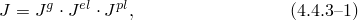其中*J*是当前体积与原始体积的比值，是当前与原始土颗粒体积的比值，是当前与原始土体积比的弹性（可恢复）部分，是当前与原始土体积比的塑性（不可恢复）部分。

图4.4.3-3 临界状态"湿润"侧的剪切试验响应（）。

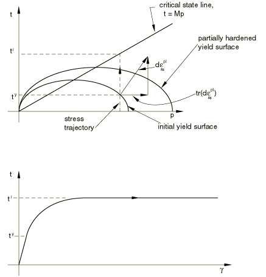

体积应变定义为

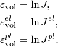

图4.4.3-4 *p*-*q*平面中的Cam-clay屈服面。

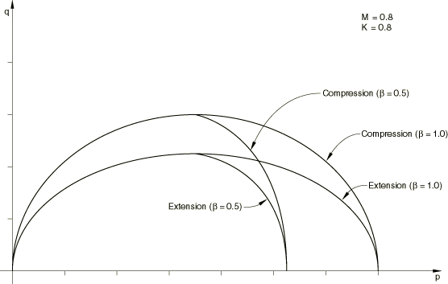

这些定义和[公式4.4.3-1](04s04a115.md)导致体积应变率的通常加性应变率分解：

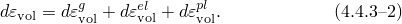

模型还假定偏量应变率以加性方式分解，因此总应变率分解为

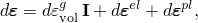其中是单位矩阵。
### 弹性行为

弹性行为可以建模为线性或使用多孔弹性模型，通常具有零抗拉强度，如"多孔弹性，"第4.4.1节所述。
### 塑性行为

修正Cam-clay屈服函数用等效有效压力应力*p*、Mises等效应力和第三应力不变量定义，定义为

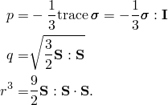

屈服面为

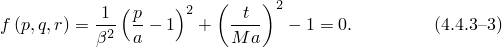

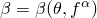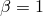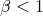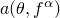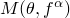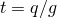在此方程中，是用户指定的常数，可以是温度和其他预定义场变量的函数。该常数用于修改临界状态"湿润"侧屈服面的形状，因此在临界状态"湿润"侧的椭圆弧与"干燥"侧使用的椭圆弧具有不同的曲率：在临界状态"干燥"侧，而在大多数情况下"湿润"侧，如图[图4.4.3-4](04s04a115.md)所示。定义了塑性模型的硬化，它是*p*轴上椭圆弧与临界状态线交会的点的位置，如图[图4.4.3-4](04s04a115.md)所示。是*p*-*t*平面中临界状态线的斜率（临界状态下*t*与*p*的比值）；且，其中*g*用于在平面上形成屈服面，定义为

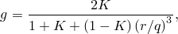其中是用户定义的常数。如果，屈服面不依赖于第三应力不变量，平面上屈服面截面是一个圆：这 choice gives the original form of the Cam-clay model. *K*的不同值对平面上屈服面形状的影响如图[图4.4.3-5](04s04a115.md)所示。为确保屈服面的凸性，。

图4.4.3-5 偏量平面中的Cam-clay面。

修正Cam-clay塑性模型使用相关流动。屈服面的大小由*a*定义；因此，这个变量的演化表征材料的硬化或软化。实验观察表明，在塑性变形期间，

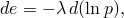其中是常数。积分这个方程，并利用[公式4.4.3-1](04s04a115.md)、[公式4.4.1-2](04s04a113.md)和[公式4.4.1-4](04s04a113.md)，我们得到

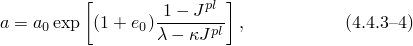其中定义了分析开始时*a*的位置——材料的初始超固结。的值可以直接由用户指定，也可以计算为

其中是等效压力应力的初始值，且所示。

图4.4.3-6 纯压缩中的假定土壤响应（指数硬化/软化情况）。

屈服面的演化也可以定义为分 piecewise linear function relating the yield stress in hydrostatic compression, , and the corresponding volumetric plastic strain （[图4.4.3-7](04s04a115.md)）：

 Then the evolution parameter, *a*, is given by

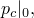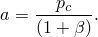Note that the volumetric plastic strain axis has an arbitrary origin: 是体积塑性应变轴上对应于材料初始状态的位置上的值，从而定义了初始静水压力，和因此初始屈服面大小，。

图4.4.3-7 分段线性硬化/软化曲线。

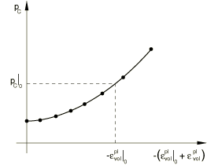

Abaqus检查初始有效应力状态是否在初始屈服面内部或之上。在任何违反屈服函数的材料点上，被调整使得[公式4.4.3-3](04s04a115.md)被精确满足（因此初始应力状态位于屈服面上）。
### 参考

### 参考

"Critical state (clay) plasticity model,"  Section 23.3.4 of the Abaqus Analysis User's Guide
