# 4.4.4 地质材料的Drucker-Prager/帽模型

### 4.4.4 地质材料的Drucker-Prager/帽模型

**产品：** Abaqus/Standard  Abaqus/Explicit

Abaqus中的修正Drucker-Prager/帽塑性模型适用于表现出压力相关屈服的地质材料。屈服面包括两个主要部分：剪切破坏面，提供主要剪切流动，和一个"帽"，与等效压力应力轴相交（[图4.4.4-1](04s04a116.md)）。

图4.4.4-1 修正Drucker-Prager/帽模型：*p*-*t*平面中的屈服面。

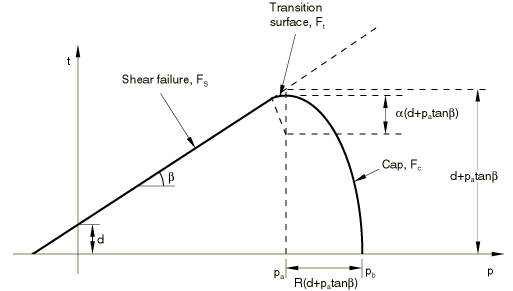这些部分之间有一个过渡区域，用于提供平滑表面。帽有两个主要目的：它在静水压缩中限制屈服面，从而提供表示塑性压实的非弹性硬化机制，并有助于控制材料在Drucker-Prager剪切破坏和过渡屈服面上屈服时由于非弹性体积增加导致的软化来控制体积膨胀。

该模型在帽区域使用相关流动，在剪切破坏和过渡区域使用非相关流动。该模型已扩展为包含蠕变，具有本节概述的某些限制。蠕变行为被设想为由两种可能的机制产生：一种以剪切行为为主，另一种以静水压缩为主。
### 应变率分解

假定线性应变率分解，因此

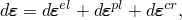其中总应变率，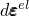弹性应变率，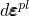非弹性（塑性）时间无关应变率，且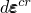非弹性（蠕变）时间相关应变率。
### 弹性行为

弹性行为可以建模为线性弹性或使用多孔弹性模型，包括抗拉强度，如"多孔弹性，"第4.4.1节所述。如果定义了蠕变，弹性行为必须建模为线性。
### 塑性行为

该模型使用的屈服/破坏面用三个应力不变量写为：等效压力应力

ises等效应力

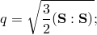偏应力第三不变量

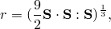中应力偏量，定义为

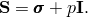

我们还定义偏应力测度

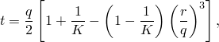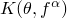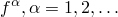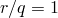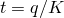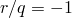中材料参数，可能依赖于温度，和其他预定义场使用这种偏应力测度是因为它允许在偏量平面上匹配拉伸和压缩中不同的应力值，从而提供拟合实验结果的灵活性，并对Mohr-Coulomb面进行平滑近似。由于在单轴拉伸时在这种情况下由于在单轴压缩时在那种情况下当，对第三偏应力不变量的依赖被消除；在偏量平面上恢复Mises圆：[图4.4.4-2](04s04a116.md)显示了*t*对*K*的依赖性。为确保屈服面的凸性，

图4.4.4-2 偏量平面中的典型屈服/流动面。

利用这个偏应力测度表达式，Drucker-Prager破坏面写为

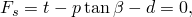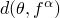中材料的摩擦角，内聚力（见[图4.4.4-1](04s04a116.md)）。

帽屈服面在子午面（*p*-*t*平面）（[图4.4.4-1](04s04a116.md)）上具有恒定偏心率的椭圆形状，并且在偏量平面上还包括对第三应力不变量的依赖性（[图4.4.4-2](04s04a116.md)）。帽面随着体积塑性应变硬化或软化：当在帽上屈服时体积塑性压实导致硬化，而当在剪切破坏面上屈服时体积塑性膨胀导致软化。帽屈服面写为

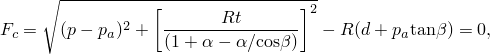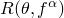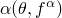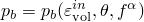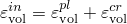中控制帽形状的材料参数，一个小数字，在下面定义，演化参数，表示体积塑性应变驱动的硬化/软化。硬化/软化律是用户定义的分段线性函数，关系静水压缩屈服应力，与相应的体积非弹性（塑性和/或蠕变）应变，[图4.4.4-3](04s04a116.md)），其中

图4.4.4-3 典型的帽硬化。

演化参数，定义为

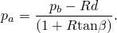

参数一个小数字（通常为0.01到0.05），用于在剪切破坏面和帽之间定义平滑过渡面：

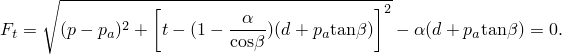
### 流动规则

塑性流动由流动势定义，在帽上是相关的，在破坏屈服面和过渡屈服面上是非相关的。这些表面的非相关性质源于子午面上流动势的形状。子午面上的流动势面如图[图4.4.4-4](04s04a116.md)所示。

图4.4.4-4 修正Drucker-Prager/帽模型：*p*-*t*平面中的流动势。

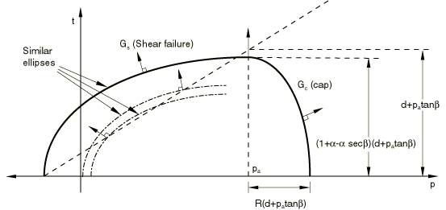它由与帽屈服面相同的帽区域中的椭圆部分组成：

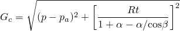破坏和过渡区域中提供非相关流动分量的另一个椭圆部分：

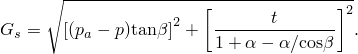个椭圆部分，形成一个连续且平滑的势面。

非相关流动意味着材料刚度矩阵不是对称的，因此用户应调用非对称求解器。然而，如果模型中发生非相关非弹性变形的区域是受限的，则材料刚度矩阵的对称近似可能会给出可接受的收敛率：在这种情况下，可能不需要非对称求解器。
### 蠕变模型

根据修正Drucker-Prager/帽模型也表现出塑性行为的材料可以定义经典"蠕变"行为。

此类材料中的蠕变行为与塑性行为密切相关（通过蠕变流动势和测试数据的定义），因此还需要定义修正Drucker-Prager/帽塑性和硬化行为。行为的弹性部分必须是线性的。

塑性行为的率无关部分受到以下限制：

—即，不允许过渡区域；

K=1——即，不考虑第三应力不变量效应。在这种情况下，偏应力测度*t*等于Mises等效应力*q*，屈服面在偏量应力平面上具有von Mises（圆形）截面。
### 蠕变行为

内置Abaqus蠕变律或通过用户子程序CREEP定义的单轴律可以使用。蠕变应变率的积分首先尝试显式进行，如"率相关金属塑性（蠕变），"第4.3.4节所述。如果超过稳定性限制、进行几何非线性分析或塑性变得活跃，则使用后向Euler方法进行积分（如"率相关金属塑性（蠕变），"第4.3.4节中所述）。

在此模型中，我们假定存在两个独立且独立的蠕变机制。一种是内聚机制，其作用类似于"颗粒或聚合物行为模型，"第4.4.2节中描述的Drucker-Prager蠕变模型。另一种是固结机制，其作用类似于帽区塑性。然后我们有
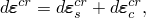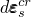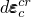
中内聚机制引起的蠕变应变率，固结机制引起的蠕变应变率。
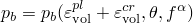
如上所述，帽面随着体积塑性应变和体积蠕变应变硬化或软化：体积非弹性压实（当在帽上屈服或通过固结机制蠕变时）导致硬化，而体积塑性膨胀（当在剪切破坏面上屈服或通过内聚机制蠕变时）导致软化。两个屈服面之间的分离和两个蠕变机制的主要区域由演化参数定义，它与用户定义的静水压缩屈服应力，（[图4.4.4-3](04s04a116.md)）相关。

内聚机制对所有具有正等效蠕变应力的应力状态都活跃，如下面所解释。固结机制对所有压力大于应力状态都活跃。[图4.4.4-5](04s04a116.md)说明了这个公式中的活跃区域。

图4.4.4-5 内聚和固结蠕变机制的活跃区域。

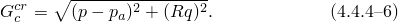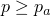

我们采用蠕变等值面（或等效蠕变面）的概念，即共享相同蠕变"强度"的应力点的等值面，以等效蠕变应力测量。首先考虑内聚蠕变机制。当材料发生塑性变形时，等效蠕变面应与屈服面重合；因此，我们通过均匀缩小屈服面来定义等效蠕变面。在*p*-*q*平面上，这转化为与屈服面的平行线，如图[图4.4.4-6](04s04a116.md)所示。Abaqus要求通过单轴压缩试验测量内聚蠕变属性。

图4.4.4-6 内聚蠕变的等效蠕变应力。
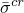
等效蠕变应力，被确定为等效蠕变面与单轴压缩曲线的交点。因此，
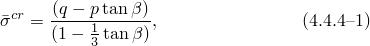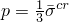
中材料摩擦角。[图4.4.4-6](04s04a116.md)显示了如何确定等效蠕变应力。在单轴压缩中因此，单轴压缩试验线的斜率为1/3。这种方法有几个后果。一个是内聚蠕变应变率是*q*和*p*两者的函数。这允许在由于高静水压力导致*q*非常高的情况下确定真实的材料属性。如果我们认为该材料的屈服强度是内聚强度和摩擦强度的组合，该模型对应于由内聚力决定的蠕变。因此，在*p*-*q*空间中存在一个锥体，其中没有内聚蠕变。
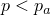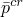
接下来考虑固结蠕变机制。在这种情况下，我们希望使蠕变依赖于高于阈值静水压力，并平滑过渡到机制不活跃的区域（因此，我们定义等效蠕变面为恒定压力面。在*p*-*q*平面上，这转化为垂直线。Abaqus要求通过静水压缩试验测量固结蠕变属性。有效蠕变压力，然后是*p*轴上相对压力为
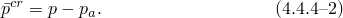
值用于单轴蠕变律。这种律产生的等效体积蠕变应变率对于正等效压力定义为正。Abaqus中的内部张量计算将考虑正压力产生负（即压缩）体积蠕变分量这一事实。
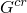### 蠕变流动规则

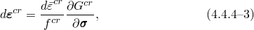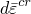蠕变流动规则从蠕变势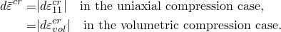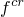中等效蠕变应变率，必须与等效蠕变应力功共轭：

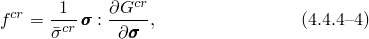于然与共轭，由

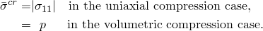义的比例因子，其中

### 内聚蠕变
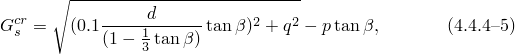
对于内聚机制，蠕变势假定遵循与Drucker-Prager蠕变模型（"颗粒或聚合物行为模型，"第4.4.2节）中蠕变应变率相同的势；即双曲函数。这个蠕变流动势是连续且平滑的，确保流动方向始终被唯一确定。该函数在高约束压力应力下渐近接近与剪切-破坏屈服面平行的线，并以直角与静水压力轴相交。子午应力平面中的一族双曲势如图[图4.4.4-7](04s04a116.md)所示：

中*d*是材料内聚力。

图4.4.4-7 蠕变势：内聚机制。

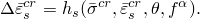
等效内聚蠕变应变率然后从单轴律确定：
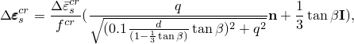
[公式4.4.4-1](04s04a116.md)、[公式4.4.4-3](04s04a116.md)和[公式4.4.4-5](04s04a116.md)产生这个机制的流动规则
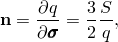
中
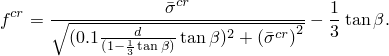

例因子，
将变为负。

事实证明，在低于这个应力水平的典型材料中，应力向量和蠕变势的法线指向相反的方向：

等价于

此，在"无蠕变"锥之外有一个小区域情况如此。因此，在此区域内获得的蠕变数据（如单轴压缩中获得的数据）应在非常低的应力水平下显示与施加应力方向相反的蠕变应变率，这通常不是情况。为克服此困难，Abaqus将修改输入的蠕变数据，使得因此，不应期望计算蠕变应变与在以下区域定义的蠕变属性之间的对应关系

种修改通常不重要，因为典型蠕变分析的载荷施加迅速，然后是长期蠕变。因此，分析的大部分应力水平通常远高于修改区域。

"慢"加载的一个近似可见的示例 included in "Verification of creep integration,"  Section 3.2.6 of the Abaqus Benchmarks Guide. 从示例中可以清楚地看出，尽管载荷在步骤中斜坡上升，但近似的影响很小。

等效内聚蠕变应变率通过*q*和*p*两者的函数。蠕变势是偏量应力平面（面）中的von Mises圆。虽然蠕变流动在偏量应力平面中是相关的，但使用与等效蠕变面不同的蠕变势意味着蠕变流动是非相关的。
### 固结蠕变

对于固结机制，蠕变势从帽区域的塑性势导出（[图4.4.4-8](04s04a116.md)）：

想一下，此机制仅在活跃。

图4.4.4-8 蠕变势：固结机制。

等效固结蠕变应变率然后从单轴律确定

[公式4.4.4-3](04s04a116.md)和[公式4.4.4-4](04s04a116.md)产生且[公式4.4.4-2](04s04a116.md)、[公式4.4.4-3](04s04a116.md)和[公式4.4.4-6](04s04a116.md)产生这个机制的流动规则：

意，存在一个等效压力应力，它是等效固结蠕变应变的功共轭，与有效蠕变压力同。这样的等效压力应力由

出，其特征是还原为静水压缩试验中的压力。

蠕变势是偏量应力平面（面）中的von Mises圆。在这个机制中，蠕变流动是非相关的。

这个公式非常简单，忽略了*q*对蠕变函数影响。两种蠕变机制相互独立运作。这意味着依赖于且依赖于两种机制之间唯一的交叉效应是通过它们任何一个的体积蠕变的依赖性获得的。
### 参考

### 参考

"Modified Drucker-Prager/Cap model,"  Section 23.3.2 of the Abaqus Analysis User's Guide
