# 4.5.1 混凝土的非弹性本构模型

### 4.5.1 混凝土的非弹性本构模型

**产品：** Abaqus/Standard

本节描述Abaqus/Standard中为素混凝土提供的 smeared crack 模型。Abaqus的材料库还包括基于标量塑性损伤理论的本构模型，用于混凝土，如"混凝土和其他准脆性材料的损伤塑性模型，"第4.5.2节所述，该模型在Abaqus/Standard和Abaqus/Explicit中都可用。在Abaqus/Explicit中，素混凝土也可以用"混凝土和其他脆性材料的裂缝模型，"第4.5.3节中描述的裂缝模型进行分析。钢筋混凝土建模旨在通过结合使用此素混凝土模型的标准单元与"钢筋单元"——钢筋，以单独定义或嵌入定向表面，使用一维应变理论，可用于模拟钢筋本身。这些单元叠加在素混凝土单元的网格上，与描述钢筋材料行为的标准金属塑性模型一起使用。这种建模方法允许混凝土行为独立于钢筋来考虑，因此本节仅讨论素混凝土模型。钢筋/混凝土界面相关的影响，如粘结滑移和销钉作用，在此方法中不能考虑，除非修改素混凝土行为的某些方面来模拟它们，例如使用"拉伸刚化"来模拟通过钢筋的裂缝间载荷传递。

本节描述的理论旨在用于相对单调加载下的混凝土行为建模，在相当低的约束压力下（小于混凝土在单轴压缩中可承受的最大压缩应力的四到五倍）。假定裂缝是行为中最重要的方面，并主导建模。假定当应力达到破坏面时发生裂缝，我们称之为"裂缝检测面"。该破坏面取为用第一和第二应力不变量*p*和*q*写的简单Coulomb线，定义如下。裂缝引入的各向异性假定在模型适用的模拟中很重要，因此模型包括对该各向异性的考虑。该模型是一个 smeared crack 模型，从这个意义上说，它不追踪单个"宏"裂缝：相反，本构计算在有限元模型的每个积分点独立进行，裂缝的存在通过裂缝影响与该积分点相关的应力和材料刚度的方式进入这些计算。人们对这种 smeared crack 模型提出了各种反对意见。主要关注点是这种建模方法固有地在解中引入网格敏感性，从有限元结果不会收敛到唯一结果的意义上来说。例如，由于裂缝与应变软化相关，网格细化将导致更窄的裂缝带。[Crisfield（1986）](07s01a01-References.md)详细讨论了这个关注点，并得出结论：基于脆性断裂概念的[Hillerborg（1976）](07s01a01-References.md)方法对于实际目的是足够的。该模型的这个方面在下面的裂缝部分讨论。为简化讨论，下文中使用术语"裂缝"表示在所考虑的单一本构计算点检测到裂缝的方向：最接近的物理概念是在该点存在连续体微裂缝，方向由模型确定。

当主应力分量主要是压缩时，混凝土的响应由弹塑性理论建模，使用以第一和第二应力不变量写的简单形式屈服面。使用相关流动和各向同性硬化。该模型显著简化了实际行为：相关流动假设通常高估非弹性体积应变；使用的简单屈服面不能非常准确地匹配所有数据（需要第三应力不变量来改善模型的这个方面）；而且，特别是当混凝土应变超过极限应力点时，恒定弹性刚度的假设不能再现观察到的卸载响应显著弱化（材料的弹性响应似乎已受损）。此外，当混凝土承受非常高的压力应力时，它表现出非弹性响应：尚未尝试将此行为构建到模型中。尽管有这些限制，该模型为涉及混凝土非弹性加载的各种问题提供了有用的预测。引入这些限制是为了计算效率。特别是，假定相关流动导致本构模型（"材料刚度矩阵"）Jacobian矩阵有足够的对称性，使得整体平衡方程求解通常不需要因此进行非对称方程求解。所有这些限制都可以在计算成本上有一定牺牲的情况下被移除。

模型中包含的混凝土裂缝和压缩响应如图[图4.5.1-1](04s05a119.md)所示的单轴试样响应所示。

图4.5.1-1 素混凝土的单轴行为。

当混凝土在压缩中加载时，它最初表现出弹性响应。随着应力增加，发生一些不可恢复（非弹性）应变，材料响应软化。达到极限应力，之后材料软化直至不能再承受任何应力。如果在发生非弹性应变后的某个点移除载荷，卸载响应比初始弹性响应更软：该效应在模型中被忽略。当单轴试样在拉伸中加载时，它表现出弹性响应，直到应力通常为极限压缩应力的7%到10%时，裂缝形成得非常快，以至于即使使用最刚性的试验机也难以观察实际行为。为开发模型的目的，我们假定材料通过软化机制失去强度，而这主要是一种损伤效应，在这个意义上开裂的裂缝可以表示为弹性刚度的损失（与经典塑性效应相关的不可恢复应变不同，如我们用于压缩行为模型）。模型忽略与裂缝相关的任何永久应变；即，我们假定当跨裂缝的应力变为压缩时，裂缝可以完全闭合。

在多轴应力状态下，这些观察可以通过失效面和极限强度面的概念在应力空间中推广。这些面在下面定义并与实验数据拟合。典型面如图[图4.5.1-2](04s05a119.md)和[图4.5.1-3](04s05a119.md)所示。

图4.5.1-2 平面应力中的混凝土破坏面。

图4.5.1-3 （*p*-*q*）平面中的混凝土破坏面。

该模型不尝试包括循环响应的预测或非弹性应变引起的弹性刚度降低，因为该模型适用于相对单调加载情况。然而，即使在此类情况下，应力轨迹可能不会完全是径向的，模型必须以合理的方式预测这种情况下的响应。各向同性硬化的"压缩"屈服/流动面形成了当主应力主要是压缩时非弹性响应建模的基础。在拉伸中，一旦裂缝被定义为由模型的"裂缝检测面"发生，裂缝的方向被存储和定向，然后使用定向损伤弹性来模拟现有裂缝。与开裂裂缝相关的应力分量不包括在用于检测同一点额外裂缝的裂缝检测面定义中，我们只允许裂缝在正交方向上形成。

由于Abaqus/Standard是一个隐式、刚度方法代码，用于定义混凝土行为的材料计算在该部分由混凝土组成的模型的每个积分点独立进行，因此在时间增量开始时解是已知的。本构计算必须基于当前对增量期间空间积分点运动学解的当前估计提供增量结束时的应力和材料刚度（对数应变）

一旦裂缝存在于某点，所有向量和张量值量的分量形式被旋转，使其位于由裂缝方向向量（裂缝面法线）定义的局部坐标系中。模型确保这些裂缝面法线向量将是正交的，因此该局部坐标系是矩形笛卡尔坐标系。使用局部坐标系简化了用于与现有裂缝相关的分量的损伤弹性计算。

因此，该模型由一个"压缩"屈服/流动面组成，用于在主要是压应力的应力状态下建模混凝土响应，配合损伤弹性来表示在材料计算点发生的裂缝，裂缝的发生由被认为是弹性一部分的"裂缝检测"破坏面定义。该模型的详细信息现在给出。
### 混凝土的弹塑性模型

该模型使用塑性理论的传统概念：应变率分解为弹性和非弹性应变率、弹性、屈服、流动和硬化。
### 应变率分解

我们从应变率分解开始：

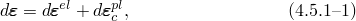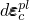中总机械应变率，弹性应变率（包括裂缝检测应变——当我们描述弹性时，这个弹性应变将进一步分解），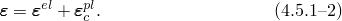
### 压缩屈服

"压缩"面为

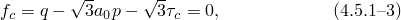中*p*是有效压力应力，定义为

*q*是Mises等效偏应力：

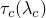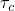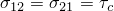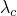中偏应力分量；一个常数，从双轴压缩中达到的极限应力与单轴压缩中达到的极限应力的比值选择；且一个硬化参数（屈服面在*p*轴上的大小，因此纯剪切应力状态下当除了所有量都为零时的屈服应力）。硬化由值测量：系由用户指定。

这个简单面在（*p*-*q*）空间中是一条直线，在相当宽的压力应力值范围内（高达混凝土在单轴压缩中可承受的最大压缩应力的四到五倍）与实验数据非常匹配。这个面的形式意味着，当硬化（化时，（*p*-*q*）空间中的面是相似的，因此，例如，双轴加载与单轴加载中流动应力的比值在所有流动应力水平下是相同的。这似乎没有被任何实验数据反驳，而且这意味着只需要一个常数（来定义面的形状。

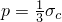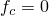值从用户的数据建立如下。在单轴压缩中其中应力大小。因此，在，

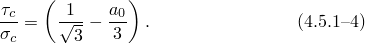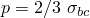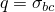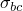双轴压缩中其中每个非零主应力的大小。因此，在，

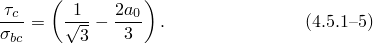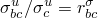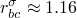户指定为破坏面数据一部分的值通常为。以从[公式4.5.1-4](04s05a119.md)和[公式4.5.1-5](04s05a119.md)计算为

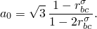

"压缩"面如图[图4.5.1-2](04s05a119.md)和[图4.5.1-3](04s05a119.md)所示。
### 硬化

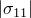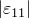用户通过指定单轴压缩试验中应力大小为非弹性应变大小函数来定义硬化。这些数据用于定义系，如下所示。

在单轴压缩中其中应力大小。在活跃塑性加载期间因此通过使用定义（[公式4.5.1-4](04s05a119.md)），我们立即得到

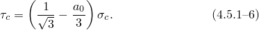
### 流动

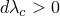模型使用相关流动，因此如果

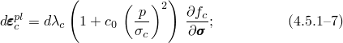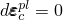则，

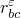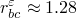在定义中，一个常数，选择它使得单调加载双轴压缩试验中的单调加载单轴压缩试验中的比值为该值由用户作为破坏面数据的一部分指定（通常为。接下来推导从压缩面中的其他常数定义方程。

压缩面的流动势梯度为

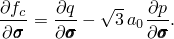于

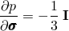

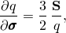

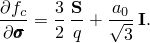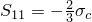单轴压缩中因此[公式4.5.1-7](04s05a119.md)定义

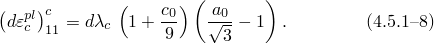个方程可以立即积分得到

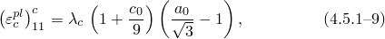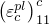此以从常数知。因此，[公式4.5.1-6](04s05a119.md)和[公式4.5.1-9](04s05a119.md)一旦知，就从混凝土模型输入数据定义系。

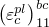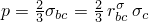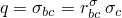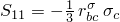常数用户定义的比值）计算，这是单调加载双轴和单轴压缩试验中会发生的总塑性应变分量。在双轴压缩中，当两个非零主应力的大小为，因此流动规则给出

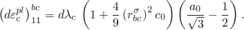用这个方程和[公式4.5.1-8](04s05a119.md)然后从其他常数定义

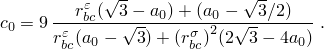
### 裂缝检测和损伤弹性

当应力状态主要是拉伸时，裂缝主导材料行为。该模型使用应力空间中的"裂缝检测"塑性面来确定裂缝发生的时间和裂缝的方向。然后使用损伤弹性来描述混凝土与开裂裂缝的后破坏行为。

在数值上，我们在裂缝发生的增量期间使用"裂缝检测"塑性模型，然后在裂缝的存在和方向被检测到后使用损伤弹性。因此，至少有一个增量我们计算裂缝检测"塑性"应变。由于这些实际上只是处理裂缝的数值手段的结果，它们被重新表述为裂缝方向的弹性应变和其他方向的塑性应变。（这意味着我们保留为平衡目的计算的应力，以及[公式4.5.1-1](04s05a119.md)的应变分解。）

后裂行为的基础是[Hilleborg（1976）](07s01a01-References.md)的脆性断裂概念。我们假定形成单位面积裂缝表面所需的断裂能一个材料特性。这个值可以从测量裂缝张开位移作为应力的函数计算（[图4.5.1-4](04s05a119.md)），为

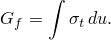

图4.5.1-4 基于断裂能的裂缝行为。

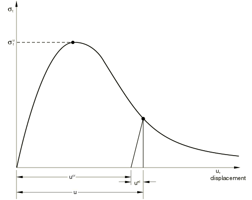

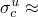典型值对于典型建筑混凝土（约20 MPa抗压强度）从40 N/m（0.22 lb/in）到高强度混凝土（约40 MPa抗压强度）的120 N/m（0.67 lb/in）。

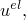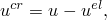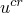假定一个材料特性的含义是，当位移的弹性部分消除后，应力和位移剩余部分间的关系是固定的，与试样尺寸无关。例如，考虑一个试样在施加拉伸位移时在其横截面上形成一个裂缝：跨裂缝的位移，通过在试验中使用更长或更短的试样不会改变（只要试样明显长于裂缝带宽度，这通常与骨料大小相当）。因此，裂缝混凝土拉伸行为的一个重要部分以应力/位移关系定义。在该模型的有限元实现中，我们必须因此计算积分点的相对位移以提供我们在Abaqus中通过将应变乘以与积分点相关的特征长度来实现。特征裂缝长度基于单元几何和公式：对于一阶单元，它是跨越单元的线的典型长度；对于二阶单元，它是相同典型长度的一半。对于梁和桁架，它是沿单元轴的特征长度。对于膜和壳，它参考面的特征长度。对于轴对称单元，它只是*r*-*z*平面中的特征长度。对于内聚单元，它等于本构厚度。使用这个特征长度定义是因为我们不一定知道混凝土将在哪个方向开裂，因此无法先验地选择任何特定方向的长度测度。因此，如果模型中的单元具有大的纵横比，当以不同方向加载并在此类单元中发生裂缝时，模型可能会提供不同的结果。用户应在定义材料属性值时考虑这个效应。

在钢筋混凝土中，-系还必须代表混凝土和钢筋之间粘结的作用，因为混凝土开裂。我们假定这是通过基于与钢筋材料实验的比较增加值来容纳的。

我们首先描述裂缝检测塑性模型，然后讨论损伤弹性。
### 应变率分解

我们将[公式4.5.1-1](04s05a119.md)的弹性应变率分解为

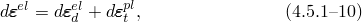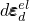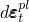中裂缝检测问题的总机械应变率，弹性应变率，与裂缝检测面相关的塑性应变率。
### 屈服

裂缝检测面是Coulomb线

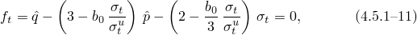中单轴拉伸中的破坏应力，一个常数，从双轴应力状态下另一个非零主应力处于单轴压缩极限应力值的拉伸破坏应力义。一个硬化参数（等效单轴拉伸应力）。硬化由量，系从用户指定的拉伸刚化数据定义（见[图4.5.1-5](04s05a119.md)）。

图4.5.1-5 "拉伸刚化"模型。

应力测度与*p*和*q*相同的方式定义，只是所有与开裂裂缝相关的应力分量（即，如果一个裂缝方向，其中直接应变不包括在这些测度中：它们是应力空间子空间中的不变量。

该面具有简单的数学形式，但与平面应力数据非常匹配。硬化以[公式4.5.1-11](04s05a119.md)中所示的特定形式引入，使得当，面变为这在（*p*-*q*）空间中是包含应力主轴的锥体。这意味着，当平面应力试验中的拉伸刚化耗尽时，应力点将回到最近的主应力轴上。

值获得如下。破坏面数据包括*f*的定义，一个比率，表示在平面应力试验中当一个主应力具有值单轴压缩中极限应力的大小）而另一个非零主应力具有值会发生裂缝。作为破坏面数据一部分提供的另一个值是它定义

此，裂缝将发生在主应力为*0*的点。因此对于这些值

此，当

以

裂缝检测面如图[图4.5.1-2](04s05a119.md)和[图4.5.1-3](04s05a119.md)所示。
### 流动

裂缝检测模型使用相关流动假设，因此如果

则，
### 硬化

用户通过指定单轴拉伸试验中应力大小为非弹性应变函数来定义拉伸刚化行为。（当使用断裂能概念来定义后破坏行为时，"应变"现在定义为其中*c*是与积分点相关的特征长度。）系定义如下。

使用[公式4.5.1-11](04s05a119.md)中定义，我们在上述流动规则中写为

单轴拉伸中因此，在单轴拉伸中，

此

分后，[公式4.5.1-13](04s05a119.md)给出系从拉伸刚化输入数据获得。
### 损伤弹性

裂缝检测后，我们使用损伤弹性来建模失效材料。弹性写为

中混凝土的弹性刚度矩阵。

设示裂缝方向，相应的直接应力直接弹性应变在这些表达式和本节余下部分中，带杠的重复索引不暗示求和。如果使用断裂能概念，应变通过拉伸刚化行为的用户指定应力/位移定义与关，其中*c*是与积分点相关的特征长度。

然后，在，如果混凝土通常的弹性。如果

中对应于应力（如拉伸刚化数据中定义的），且

果

从拉伸刚化数据得出。

我们还假定开裂裂缝没有泊松效应：对于于

与现有裂缝方向相关的弹性中的剪切项为

中些表达式中，*G*是弹性剪切模量，一个由用户作为剪切保留数据一部分定义的常数（见[图4.5.1-6](04s05a119.md)），

图4.5.1-6 剪切保留。

且线性函数，也在剪切保留数据中由用户定义。这里其中Macauley括号，定义

于任何函数*f*。
### 裂缝

一旦裂缝检测面（被激活，我们假定裂缝已经发生。裂缝方向取为与裂缝检测面共轭的最大主塑性应变增量部分的方向，它与同一点任何现有裂缝的方向正交。该裂缝方向被存储以供后续计算使用，这些计算方便地在局部坐标系中进行，该坐标系定向使得其中一个坐标方向是裂缝方向裂缝是不可恢复的，因为一旦某点发生裂缝，它在计算的剩余过程中保持存在。裂缝检测后，裂缝通过如上定义的损伤弹性影响计算。此外，如果跨裂缝的弹性应变是拉伸的，裂缝检测面中使用的不变量是在所有与开裂裂缝方向相关的应力分量都被忽略的应力子空间中定义的，如上屈服部分所述。这意味着任何点最多可以发生三个裂缝（平面应力情况下两个，单轴应力情况下一个）。
### 模型积分

该模型使用Abaqus中通常与塑性模型一起使用的后向Euler方法积分。使用与该积分算子一致的材料Jacobian进行平衡迭代。
### 参考

### 参考

"Concrete smeared cracking,"  Section 23.6.1 of the Abaqus Analysis User's Guide
