# 4.5.2 混凝土和其他准脆性材料的损伤塑性模型

### 4.5.2 混凝土和其他准脆性材料的损伤塑性模型

**产品：** Abaqus/Standard  Abaqus/Explicit

本节描述Abaqus中提供的混凝土损伤塑性模型，用于混凝土和其他准脆性材料的分析。Abaqus的材料库还包括用于混凝土的其他本构模型，基于 smeared crack 方法。这些是Abaqus/Standard中的 smeared crack 模型，如"混凝土的非弹性本构模型，"第4.5.1节所述，以及Abaqus/Explicit中的脆性裂缝模型，如"混凝土和其他脆性材料的裂缝模型，"第4.5.3节所述。

混凝土损伤塑性模型主要用于混凝土结构在循环和/或动态加载下的分析。该模型也适用于其他准脆性材料（如岩石、砂浆和陶瓷）的分析；但在本节余下部分，使用混凝土的行为来说明本构理论的不同方面。在低约束压力下，混凝土表现为脆性方式；主要破坏机制是拉伸中的裂缝和压缩中的压碎。当约束压力足够大以防止裂缝扩展时，混凝土的脆性行为消失。在这些情况下，破坏是由混凝土微孔微观结构的固结和坍塌驱动的，导致类似于具有加工硬化的延性材料的宏观响应。

在塑性-损伤模型考虑范围内，建模大静水压力下的混凝土行为超出了范围。本节的本构理论旨在捕捉在相当低的约束压力下（小于单轴压缩加载中极限压缩应力的四或五倍），与混凝土和其他准脆性材料中发生的破坏机制相关的不可逆损伤的影响。这些影响表现为以下宏观性质：

拉伸和压缩中不同的屈服强度，压缩中的初始屈服应力比拉伸中的初始屈服应力高10倍或更多；

与压缩中的初始硬化然后软化相反的拉伸中的软化行为；

拉伸和压缩中弹性刚度的不同程度退化；

循环加载期间的刚度恢复效应；和

率敏感性，特别是峰值强度随应变率的增加。

Abaqus中的塑性-损伤模型基于Lubliner等（[1989](07s01a01-References.md)）和Lee与Fenves（[1998](07s01a01-References.md)）提出的模型。本节余下部分描述该模型。首先给出模型主要成分的概述，然后对本构模型的不同方面进行更详细的讨论。
### 概述

无粘性混凝土损伤塑性模型的主要成分总结如下。
### 应变率分解

对于率无关模型假定加性应变率分解：

中总应变率，应变率的弹性部分，应变率的塑性部分。
### 应力-应变关系

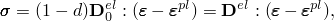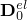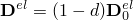应力-应变关系由标量损伤弹性控制：

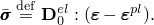中材料的初始（未损伤）弹性刚度；退化弹性刚度；*d*是标量刚度退化变量，可以取从零（未损伤材料）到一（完全损伤材料）的值。与混凝土破坏机制（裂缝和压碎）相关的损伤导致弹性刚度降低。在标量损伤理论范围内，刚度退化是各向同性的，由单个退化变量*d*表征。遵循连续体损伤力学的通常概念，有效应力定义为

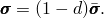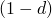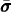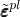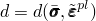auchy应力通过标量退化关系与有效应力相关：

于材料的任何给定横截面，系数示有效承载面积（即，整体面积减去损伤面积）与整体横截面积之比。在没有损伤的情况下，有效应力价于Cauchy应力然而，当损伤发生时，有效应力比Cauchy应力更具代表性，因为是有效应力面积在抵抗外部载荷。因此，方便的是将塑性问题以有效应力表示。如后面讨论的，退化变量的演化由一组硬化变量有效应力控制；即，
### 硬化变量
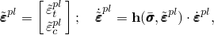
拉伸和压缩中的损伤状态分别由两个硬化变量立表征，它们分别被称为拉伸和压缩中的等效塑性应变。硬化变量的演化由以下形式的关系给出

本节后面所述。
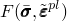
混凝土中的微裂缝和压碎由硬化变量的增加值表示。这些变量控制屈服面的演化和弹性刚度的退化。它们还与产生微裂缝所需的消散断裂能密切相关。
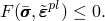### 屈服函数

屈服函数示有效应力空间中的一个面，它决定失效或损伤状态。对于无粘性塑性-损伤模型

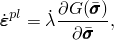服函数的具体形式在本节后面描述。
### 流动规则

塑性流动由流动势*G*根据流动规则控制：
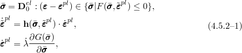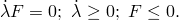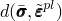
中非负塑性乘子。塑性势在有效应力空间中定义。混凝土损伤塑性模型流动势的具体形式在本节后面讨论。该模型使用非相关塑性，因此需要求解非对称方程。
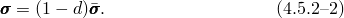### 总结

总之，混凝土损伤塑性模型的弹塑性响应以有效应力和硬化变量描述：

中*F*服从Kuhn-Tucker条件：auchy应力根据刚度退化变量有效应力计算为
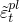

弹塑性响应的本构关系（[公式4.5.2-1](04s05a120.md)）从刚度退化响应（[公式4.5.2-2](04s05a120.md)）解耦，这使得模型对有效数值实现具有吸引力。这里总结的无粘性模型可以通过使用粘塑性正则化来允许应力位于屈服面之外，从而容易地扩展以考虑粘塑性效应。
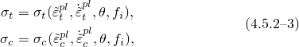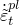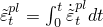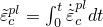### 损伤和刚度退化

硬化变量演化方程通过首先考虑单轴加载条件然后扩展到多轴条件来方便地制定。
### 单轴条件
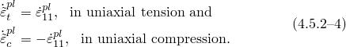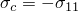
假定单轴应力-应变曲线可以转换为如下形式的应力与塑性应变曲线

中下标*t*和*c*分别指拉伸和压缩；等效塑性应变率，等效塑性应变，温度，其他预定义场变量。
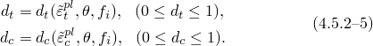
在单轴加载条件下，有效塑性应变率给出为

本节余下部分，我们采用约定，一个正值，表示单轴压缩应力的大小；即，

如图[图4.5.2-1](04s05a120.md)所示，当混凝土试样从应力-应变曲线应变软化分支上的任何点卸载时，卸载响应被观察到弱化：材料的弹性刚度似乎受损（或退化）。弹性刚度的退化在拉伸和压缩试验之间显著不同；在任一情况下，随着塑性应变的增加，效应更明显。混凝土的退化响应由两个独立的单轴损伤变量征，它们假定为塑性应变、温度和场变量的函数：

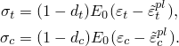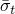
图4.5.2-1 混凝土对单轴加载在拉伸（a）和压缩（b）中的响应。
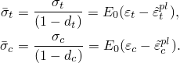
单轴退化变量是等效塑性应变的递增函数。它们可以取从零（对于未损伤材料）到一（对于完全损伤材料）的值。

如果材料的初始（未损伤）弹性刚度，则单轴拉伸和压缩加载下的应力-应变关系分别为：

单轴加载条件下，裂缝沿垂直于应力方向扩展。因此，裂缝的形核和扩展导致可用承载面积的减少，这又导致有效应力的增加。在压缩加载下效应不太明显，因为裂缝平行于加载方向扩展；然而，在大量压碎之后，有效承载面积也显著减少。有效单轴内聚应力出为
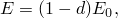
效单轴内聚应力决定屈服（或破坏）面的大小。
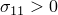### 单轴循环条件

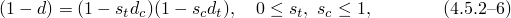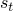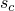在单轴循环加载条件下，退化机制相当复杂，涉及先前形成的微裂缝的张开和闭合，以及它们的相互作用。实验上，观察到在单轴循环试验中当载荷改变符号时弹性刚度有一些恢复。刚度恢复效应，也称为"单侧效应"，是混凝土在循环加载下行为的一个重要方面。效应通常在载荷从拉伸变为压缩时更明显，导致拉伸裂缝闭合，从而恢复压缩刚度。

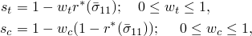混凝土损伤塑性模型假定弹性模量的降低以标量退化变量*d*给出，如

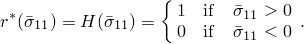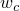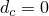中材料的初始（未损伤）模量。

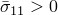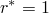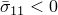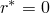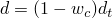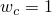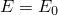该表达式在循环的拉伸侧（函数。对于单轴循环条件，Abaqus假定

中引入的表示与应力反向相关刚度恢复效应的应力状态函数。它们根据以下定义

中

重因子假定为材料属性，控制拉伸和压缩刚度在载荷反向时的恢复。为了说明这一点，考虑[图4.5.2-2](04s05a120.md)中的示例，其中载荷从拉伸变为压缩。假定材料先前没有压缩损伤（压碎）；即，那么

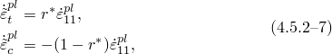拉伸中（因此， as expected. 在压缩中（且如果则因此，材料完全恢复压缩刚度（在本例中是初始未损伤刚度，另一方面，如果则没有刚度恢复。中间值导致刚度部分恢复。

图4.5.2-2 压缩刚度恢复参数应的说明。

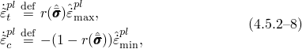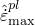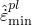

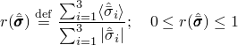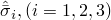等效塑性应变率的演化方程也推广到单轴循环条件为

在循环的拉伸和压缩阶段简化为[公式4.5.2-4](04s05a120.md)。
### 多轴条件

硬化变量的演化方程必须推广到一般多轴条件。基于Lee和Fenves（[1998](07s01a01-References.md)），我们假定等效塑性应变率根据以下表达式评估

中别是塑性应变率张量最大和最小特征值，且

一个应力权重因子，如果所有主应力义为在单轴加载条件下，[公式4.5.2-8](04s05a120.md)简化为单轴定义[公式4.5.2-4](04s05a120.md)和[公式4.5.2-7](04s05a120.md)，因为在拉伸中在压缩中

如果塑性应变率张量的特征值（则一般多轴应力条件下演化方程可以表达为以下矩阵形式：

中

### 弹性刚度退化

塑性-损伤混凝土模型假定弹性刚度退化是各向同性的，由单个标量变量*d*表征：

量退化变量*d*的定义必须与单轴单调响应（一致，而且还应捕捉循环加载下退化机制的复杂性。对于一般多轴应力条件，Abaqus假定

似于单轴循环情况，只是在根据函数

可以容易地验证[公式4.5.2-10](04s05a120.md)中标量退化变量的定义与单轴响应一致。

大多数准脆性材料（包括混凝土）的实验观察是，当载荷从拉伸变为压缩时，压缩刚度在裂缝闭合时恢复。另一方面，一旦形成压碎微裂缝，拉伸刚度在载荷从压缩变为拉伸时不会恢复。这种行为对应于是Abaqus使用的默认值。[图4.5.2-3](04s05a120.md)展示了一个单轴载荷循环，假定刚度恢复因子使用默认值：

图4.5.2-3 单轴载荷循环（拉-压-拉），假定刚度恢复因子使用默认值。

### 屈服条件

塑性-损伤混凝土模型使用基于Lubliner等（[1989](07s01a01-References.md)）提出的屈服函数屈服条件，并结合Lee和Fenves（[1998](07s01a01-References.md)）提出的修改以考虑拉伸和压缩下强度的不同演化。以有效应力表示，屈服函数取形式

中无量纲材料常数；

有效静水压力；

Mises等效有效应力；

有效应力张量偏量部分；且代数最大特征值。函数出为

中别是有效拉伸和压缩内聚应力。

在双轴压缩中，当[公式4.5.2-11](04s05a120.md)简化为著名的Drucker-Prager屈服条件。系数以从初始等双轴和单轴压缩屈服应力定为

凝土的典型实验值。比值在1.10到1.16之间，产生0.08到0.12之间的值（[Lubliner等，1989](07s01a01-References.md)）。

系数在三轴压缩应力状态下进入屈服函数，当。该系数可以通过比较拉伸和压缩子午线上的屈服条件来确定。*拉伸子午线*（TM）定义为满足条件应力状态轨迹，*压缩子午线*（CM）是满足条件应力状态轨迹，其中有效应力张量的特征值。可以容易地表明，沿拉伸和压缩子午线分别有当，相应的屈服条件为

对于任何给定的静水压力值则

常数这一事实似乎没有被实验证据反驳（[Lubliner等，1989](07s01a01-References.md)）。因此，系数算为

为对混凝土典型）给出

如果则沿拉伸和压缩子午线的屈服条件简化为

对于任何给定的静水压力值则

典型屈服面在偏量平面中如图[图4.5.2-4](04s05a120.md)所示，平面应力条件下如图[图4.5.2-5](04s05a120.md)所示。

图4.5.2-4 偏量平面中的屈服面，对应于不同值。

图4.5.2-5 平面应力中的屈服面。

### 流动规则

塑性-损伤模型假定非相关势流动，

该模型选择的流动势*G*是Drucker-Prager双曲函数：

中失效时的单轴拉伸应力；且一个参数，称为偏心率，定义函数接近渐近线的速率（当偏心率趋于零时，流动势趋于直线）。此流动势是连续且平滑的，确保流动方向被唯一确定。该函数在高约束压力应力下渐近接近线性Drucker-Prager流动势，并以90度角与静水压力轴相交。见"颗粒或聚合物行为模型，"第4.4.2节对该势的进一步讨论。

因为塑性流动是非相关的，使用塑性-损伤混凝土模型需要求解非对称方程。
### 粘塑性正则化

表现出软化行为和刚度退化的材料模型通常在隐式分析程序中导致严重的收敛困难。可以通过使用本构方程的粘塑性正则化来克服一些这些收敛困难。混凝土损伤塑性模型可以使用粘塑性进行正则化，因此允许应力位于屈服面之外。我们使用Duvaut-Lions正则化的推广，其中粘塑性应变率张量里表示粘塑性系统松弛时间的粘度参数，义为

中*d*是在无粘性主干模型中评估的退化变量。粘塑性模型的应力-应变关系给出为

粘塑性系统的解在其中*t*表示时间）时松弛到无粘性情况。当粘度参数取值较小（与特征时间增量相比）时，使用粘塑性正则化通常有助于提高模型在软化状态下的收敛率，而不会影响结果。
### 模型积分

该模型使用Abaqus中通常与塑性模型一起使用的后向Euler方法积分。使用与该积分算子一致的材料Jacobian进行平衡迭代。
### 参考

### 参考

"Concrete damaged plasticity,"  Section 23.6.3 of the Abaqus Analysis User's Guide
