# 4.5.3 混凝土和其他脆性材料的裂缝模型

### 4.5.3 混凝土和其他脆性材料的裂缝模型

**产品：** Abaqus/Explicit

本节描述Abaqus/Explicit中为混凝土和其他脆性材料提供的裂缝本构模型。Abaqus的材料库还包括用于混凝土的本构模型，基于标量塑性损伤理论，如"混凝土和其他准脆性材料的损伤塑性模型，"第4.5.2节所述，该模型在Abaqus/Standard和Abaqus/Explicit中都可用。在Abaqus/Standard中，素混凝土也可以用"混凝土的非弹性本构模型，"第4.5.1节中描述的 smeared crack 混凝土模型进行分析。虽然这个脆性裂缝模型对其他材料（如陶瓷和脆性岩石）也可能有用，但它主要用于建模素混凝土。因此，在本节余下部分，使用混凝土的物理行为来说明本构模型的不同方面。

Abaqus中的钢筋混凝土建模通过结合使用此素混凝土裂缝模型的标准单元与"钢筋单元"——钢筋，单独定义或嵌入定向表面，使用一维应变理论，可用于模拟钢筋本身。钢筋单元叠加在素混凝土单元的网格上，与描述钢筋材料行为的标准金属塑性模型一起使用。这种建模方法允许混凝土行为独立于钢筋考虑，因此本节仅讨论素混凝土裂缝模型。钢筋/混凝土界面相关的影响，如粘结滑移和销钉作用，在此方法中不能考虑，除非修改素混凝土行为的某些方面来模拟它们（如使用"拉伸刚化"来模拟通过钢筋的裂缝间载荷传递）。

普遍认为混凝土表现出两种主要行为模式：一种是脆性模式，其中微裂缝聚合形成代表高度局部化变形区域的离散宏裂缝；另一种是延性模式，其中微裂缝或多或少均匀地遍布材料发展，导致非局部化变形。脆性行为与在拉伸和拉-压应力状态下观察到的解理、剪切和混合模式断裂机制相关。它几乎总是涉及材料的软化。延性行为与主要在压缩应力状态下观察到的分布式微裂缝机制相关。它几乎总是涉及材料的硬化，尽管在低约束压力下后续可能软化。这里描述的裂缝模型仅建模混凝土行为的脆性方面。虽然这是一个重大简化，但有许多应用中只有混凝土的脆性行为是重要的；因此，在这些情况下，假定材料在压缩中是线弹性是合理的。
### Smeared裂缝假设

选择 smeared 模型来表示不连续的宏裂缝脆性行为。在这种方法是，我们不追踪单个"宏"裂缝：相反，裂缝的存在通过裂缝影响与每个材料计算点相关的应力和材料刚度的方式进入计算。

为简化起见，这里使用术语"裂缝"表示在所考虑的材料计算点检测到裂缝的方向。最接近的物理概念是在该点存在连续体微裂缝，方向由模型确定。裂缝引入的各向异性包括在模型中，因为假定它在模型适用的模拟中是重要的。

人们对 smeared crack 模型提出了一些反对意见。主要关注点是这种建模方法固有地在解中引入网格敏感性，从有限元结果不会收敛到唯一结果的意义上来说。例如，由于裂缝与应变软化相关，网格细化将导致更窄的裂缝带。许多研究人员已经解决了这个关注点，普遍共识是[Hillerborg（1976）](07s01a01-References.md)的方法——基于脆性断裂概念——对于实际目的是足够的。引入了一个长度尺度，通常以"特征"长度的形式，来"调节" smeared 连续体模型并衰减结果对网格密度的敏感性。该模型的这个方面在下面详细讨论。
### 裂缝方向假设

 various researchers已经提出了三种基本的裂缝方向模型（[Rots和Blaauwendraad，1989](07s01a01-References.md)）：固定正交裂缝；旋转裂缝模型；和固定多方向（非正交）裂缝。在固定正交裂缝模型中，第一个裂缝的法线方向与裂缝萌发时最大拉伸主应力的方向对齐。该模型记住这个裂缝方向，后续在所考虑的点形成的裂缝只能在与第一个裂缝正交的方向上形成。在旋转裂缝概念中，任何点只能形成一个裂缝（与最大拉伸主应力方向对齐）。因此，单个裂缝方向随主应力轴的方向旋转。该模型没有裂缝方向记忆。最后，多方向裂缝模型允许在主应力轴方向随加载变化时在一点形成任意数量的裂缝。在实践中，对允许在一点形成的裂缝数量有一些限制。该模型记住所有裂缝方向。

多方向裂缝模型最不受欢迎，主要是因为用于决定后续裂缝何时形成的标准（限制一点裂缝数量）是有些任意的：引入了"阈值角"的概念以防止新裂缝以小于此阈值角的角度向现有裂缝形成。固定正交和旋转裂缝模型都被广泛使用，尽管可以对两者提出反对意见。在旋转裂缝模型中，裂缝闭合和重新打开的概念没有很好地定义，因为裂缝的方向可以连续变化。固定正交裂缝模型主要受到批评，因为模型中使用的传统"剪切保留"处理往往使模型响应过于刚性。可以通过以一种确保随着裂缝界面上的变形发生剪应力趋于零的方式来制定剪切保留来解决这个 问题（Abaqus模型中这样做，如后面所述）。最后，虽然固定正交裂缝模型有正交性限制，但在多裂缝效应重要的情况下（旋转裂缝模型限制在任何点只有一个裂缝），它被认为优于旋转裂缝模型。

Abaqus使用固定正交裂缝模型，因此材料点最大裂缝数量受该有限元模型材料点存在的直接应力分量数量的限制（例如，三维、轴对称和平面应变问题中最多三个裂缝，平面应力问题中最多两个裂缝）。一旦裂缝存在于某点，所有向量和张量值量的分量形式被旋转，使其位于由裂缝方向向量（裂缝面法线）定义的局部坐标系中。模型确保这些裂缝面法线向量是正交的，因此该局部坐标系是矩形笛卡尔坐标系。裂缝闭合和重新打开可以沿着裂缝面法线的方向进行。模型忽略与裂缝相关的任何永久应变；即，我们假定当跨裂缝的应力变为压缩时，裂缝可以完全闭合。
### 混凝土的弹性-裂缝模型

该模型的主要成分是应变率分解为弹性（混凝土）和裂缝应变率、弹性、一组裂缝条件和一个裂缝关系（裂缝行为的演化律）。应变分解的主要优点是它允许以一致的方式最终添加其他效应，如塑性和蠕变。弹性-裂缝应变分解还允许表示裂缝状态的裂缝应变被单独识别；这与经典 smeared crack 模型形成对比，后者使用单个应变数量以均质化形式表示裂缝固体状态，导致修改的（损伤）弹性公式。
### 应变率分解

我们从应变率分解开始：

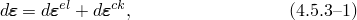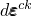其中是总机械应变率，是表示未裂混凝土（裂缝之间的连续体）的弹性应变率，是与任何现有裂缝相关的裂缝应变率。
### 裂缝方向变换

[公式4.5.3-1](04s05a121.md)中的应变参照全局笛卡尔坐标系，可以写成向量形式（在三维设置中）

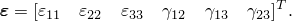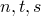对于合并裂缝关系，定义一个局部笛卡尔坐标系很方便，它与裂缝方向对齐。在[图4.5.3-1](04s05a121.md)中所示的局部坐标系中，应变为

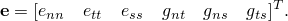

图4.5.3-1 全局和局部裂缝坐标系。

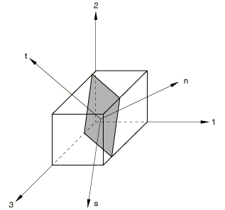全局和局部应变之间的变换以矩阵形式写为

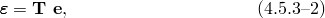其中是由局部裂缝坐标系的方向余弦构造的变换矩阵。在我们的固定裂缝模型中是常数。

共轭应力数量可以写成全局坐标系中的

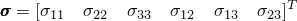在局部裂缝系统中为

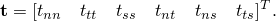局部和全局应力之间的变换为

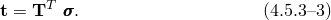
### 弹性

裂缝之间完整的连续体用各向同性线性弹性建模。裂缝材料的正交各向异性性质在模型的裂缝分量中引入。如前所述，将应变分解为弹性、完整混凝土应变和裂缝应变的方法具有的优点是，这个 smeared 模型可以推广以包括其他效应，如塑性和蠕变（尽管此类推广尚未在Abaqus/Explicit中包含）。
### 裂缝检测

使用简单的Rankine准则来检测裂缝萌发。它指出当最大主拉应力超过脆性材料的抗拉强度时形成裂缝。Rankine裂缝检测面在偏量平面中如图[图4.5.3-2](04s05a121.md)所示，在子午面中如图[图4.5.3-3](04s05a121.md)所示，在平面应力中如图[图4.5.3-4](04s05a121.md)所示。虽然裂缝检测纯粹基于I型断裂考虑，但随后裂缝行为包括I型（拉伸软化）和II型（剪切软化/保留）行为，如后面所述。

图4.5.3-2 偏量平面中的Rankine准则。

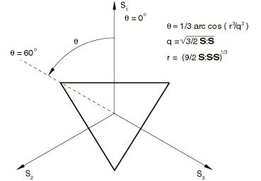

图4.5.3-3 子午面中的Rankine准则。

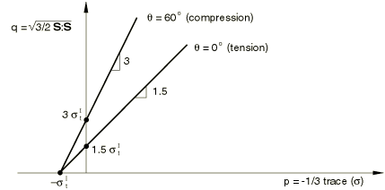

图4.5.3-4 平面应力中的Rankine准则。

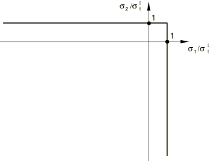

一旦满足裂缝形成的Rankine准则，我们假定第一个裂缝已经形成。裂缝面被取为与最大拉伸主应力方向垂直。后续裂缝可以形成，其裂缝面法线方向为与同一点任何现有裂缝面法线正交的最大拉伸主应力方向。

裂缝方向被存储以供后续计算使用，这些计算方便地在裂缝方向定向的局部坐标系中进行。裂缝是不可恢复的，因为一旦某点发生裂缝，它在计算的剩余过程中保持存在。然而，裂缝随后可以闭合和重新打开。
### 裂缝条件

我们引入裂缝一致性条件（类似于经典塑性中的屈服条件），以裂缝方向坐标系以张量形式写出

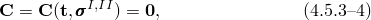其中

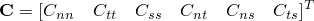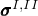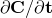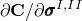且在直接应力分量情况下表示拉伸软化模型（I型断裂），在剪切应力分量情况下表示剪切软化/保留模型（II型断裂）。矩阵和假定为对角的，意味着通常的假设：裂缝条件之间没有耦合。

每个裂缝条件比经典屈服条件更复杂，因为存在两种可能的裂缝状态（活跃张开裂缝状态和闭合/重新打开裂缝状态），与经典塑性中的单个塑性状态对比。这可以通过显式写出特定裂缝法线方向*n*的裂缝条件来说明：

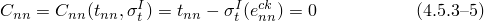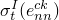对于活跃张开裂缝，其中是用户定义的拉伸软化演化，和

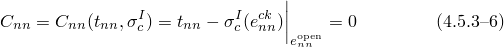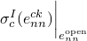对于闭合/重新打开裂缝，其中是依赖于最大裂缝张开应变定义的裂缝闭合/重新打开演化

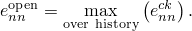这些条件如图[图4.5.3-5](04s05a121.md)所示，代表了裂缝面法线方向裂缝行为的拉伸软化模型。可以为其他两个可能的裂缝法线方向*s*和*t*写出类似的条件。必须强调的是，虽然[公式4.5.3-4](04s05a121.md)的裂缝条件已经为所有可能存在的裂缝的最一般情况写出，但在这个模型的计算中只考虑指现有裂缝的部分。

图4.5.3-5 I型裂缝的裂缝条件。

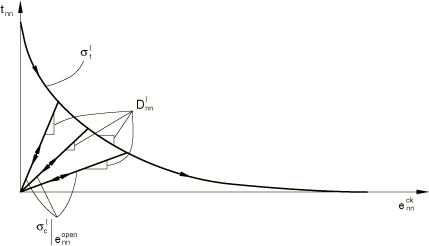

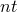裂缝坐标系中剪切分量的裂缝条件在与相关法线方向开裂时被激活。我们现在通过显式写出剪切分量的条件来呈现剪切裂缝条件。

依赖于裂缝张开的剪切模型（剪切保留模型）写为

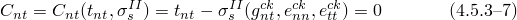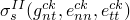对于裂缝的剪切加载或卸载，其中是依赖于剪切应变且也依赖于裂缝张开应变的剪切演化（由用户定义）。[图4.5.3-6](04s05a121.md)说明了这个模型。虽然这个模型灵感来自传统剪切保留模型，但在一个重要方面与那些模型不同：随着裂缝的发展，剪应力趋于零。这将在后面更详细地讨论。

图4.5.3-6 II型裂缝的裂缝条件（依赖于裂缝张开的模型）。

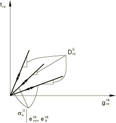
### 裂缝关系

局部应力和裂缝界面处裂缝应变之间的关系以率形式写为

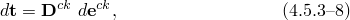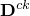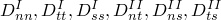其中是一个对角裂缝矩阵，依赖于现有裂缝的状态。这些对角分量（的定义在[图4.5.3-5](04s05a121.md)和[图4.5.3-6](04s05a121.md)中给出）。
### 率本构方程

使用应变率分解（[公式4.5.3-3](04s05a121.md)）和弹性关系，我们可以将应力率写为

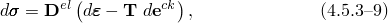其中是各向同性线性弹性矩阵。

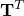将[公式4.5.3-9](04s05a121.md)左乘并将[公式4.5.3-5](04s05a121.md)和[公式4.5.3-8](04s05a121.md)代入得到的左手边得到

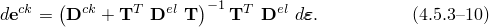

最后，将[公式4.5.3-10](04s05a121.md)代入[公式4.5.3-9](04s05a121.md)得到应力-应变率方程：

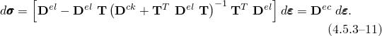
### 拉伸软化模型

[Hilleborg（1976）](07s01a01-References.md)的脆性断裂概念构成了裂缝面法线方向（通常称为拉伸软化）后裂行为的基础。我们假定形成I型中单位面积裂缝表面所需的断裂能是一个材料特性。这个值可以从测量裂缝张开位移作为应力的函数计算（[图4.5.3-7](04s05a121.md)），为

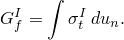

图4.5.3-7 基于I型断裂能的裂缝行为。

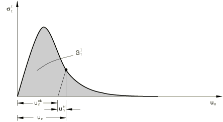

的典型值对于典型建筑混凝土（约20 MPa抗压强度）从40 N/m（0.22 lb/in）到高强度混凝土（约40 MPa抗压强度）的120 N/m（0.67 lb/in）。

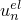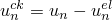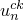假定是一个材料特性的含义是，当位移的弹性部分被消除后，应力和位移剩余部分之间的关系是固定的，与试样尺寸无关。例如，考虑一个试样在施加拉伸位移时在其横截面上形成一个裂缝：是跨裂缝的位移，通过在试验中使用更长或更短的试样不会改变（只要试样明显长于裂缝带宽度，这通常与骨料大小相当）。因此，裂缝混凝土拉伸行为的一个重要部分以应力/位移关系定义。

在这个模型的有限元实现中，我们必须因此计算材料点的相对位移以提供。我们在Abaqus中通过将应变乘以与材料点相关的特征长度来实现（使用局部裂缝方向*n*中的裂缝应变作为示例）：

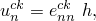其中*h*是特征长度。这个特征裂缝长度基于单元几何和公式：对于一阶单元，它是跨越单元的线的典型长度；对于二阶单元，它是相同典型长度的一半。对于梁和桁架，它是沿单元轴的特征长度。对于膜和壳，它参考面的特征长度。对于轴对称单元，它只是*r*-*z*平面中的特征长度。对于内聚单元，它等于本构厚度。使用这个特征长度定义是因为我们不一定知道混凝土将在哪个方向开裂；因此，我们无法先验地选择任何特定方向的长度测度*a priori*。这些特征长度估计仅适用于形状良好的单元（具有大纵横比的单元），用户应在定义材料属性值时考虑这一点。或者，可以通过在用户子程序VUCHARLENGTH中直接指定作为单元拓扑和材料方向函数的特征长度来减少这种网格依赖性，如"Abaqus User Subroutines Reference Guide"的"VUCHARLENGTH，"第1.2.11节所述。

对于钢筋混凝土，由于Abaqus没有直接建模钢筋和混凝土之间的粘结，混凝土裂缝上这种粘结的影响必须被纳入模型的素混凝土部分。这种效应通常通过基于与钢筋材料实验的比较增加的值来实现。这种增加的延展性通常被称为"拉伸刚化"效应。

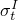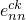在钢筋混凝土应用中，混凝土的软化行为由于钢筋的稳定存在往往对结构整体响应影响较小。因此，通常直接定义拉伸刚化为-关系是合适的。Abaqus也提供这个选项。
### 裂缝剪切模型

裂缝模型的一个重要特征是，虽然裂缝萌发仅基于I型断裂，但后裂行为包括II型以及I型。接下来描述II型剪切行为。

II型模型基于共同的观察：剪切行为依赖于裂缝张开的程度。因此，Abaqus提供了一个剪切保留模型，其中后裂剪切刚度依赖于裂缝张开。这个模型将总剪应力定义为总剪切应变（剪切方向作为示例）的函数：

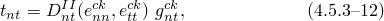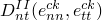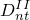其中是一个依赖于裂缝张开的刚度。可以表示为

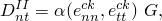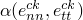其中*G*是未裂混凝土的剪切模量，是[图4.5.3-8](04s05a121.md)中所示形式用户定义的依赖关系。

图4.5.3-8 剪切保留因子对裂缝张开的依赖性。

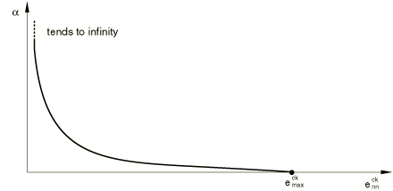

当只有一个裂缝时，对于只有一个与方向*n*相关联的裂缝，这个依赖性的常用数学形式是[Rots和Blaauwendraad（1989）](07s01a01-References.md)提出的幂律：

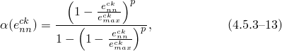其中*p*和是材料参数。这个形式满足要求：当（对应裂缝萌发前的状态）时，当（对应骨料联锁完全丧失）时。注意，在模型中的界限，使用弹性-裂缝应变分解，是和零。这与一些传统剪切保留模型形成对比，在那些模型中完整混凝土和裂缝应变没有分开；那些模型中的剪切保留使用剪切保留因子定义，其值可以在一和零之间。这两个剪切保留参数之间的关系为

[公式4.5.3-13](04s05a121.md)中给出的剪切保留幂律形式可以然后以写出为

由于用户更习惯于以传统方式（值在一和零之间）指定剪切保留因子，Abaqus输入请求-数据。使用[公式4.5.3-14](04s05a121.md)，然后将这些数据转换为计算用的-数据。

当所考虑的剪切分量仅与一个开裂方向（*n*或*t*）相关时，裂缝张开依赖性直接从[图4.5.3-8](04s05a121.md)获得。然而，当剪切方向与两个开裂方向（*n*和*t*）相关时，则

其中

因此

这个总应力-应变剪切保留模型与传统剪切保留模型不同，传统模型中应力-应变关系以增量形式写出（再次以剪切方向作为示例）：

其中是一个依赖于裂缝张开的增量刚度。Abaqus使用的总模型（[公式4.5.3-12](04s05a121.md)）与传统增量模型（[公式4.5.3-15](04s05a121.md)）之间的差异最好通过考虑在裂缝同时张开和剪切时两个模型的剪切响应来说明。这在总模型的[图4.5.3-9](04s05a121.md)和增量模型的[图4.5.3-10](04s05a121.md)中显示。显然，在总模型中，剪应力随裂缝张开和剪切趋于零；而在增量模型中，剪应力趋于有限值。这可以解释为什么传统剪切保留模型通常获得过于刚性的响应。

图4.5.3-9 Abaqus依赖于裂缝张开的剪切保留（总）模型。

图4.5.3-10 传统的依赖于裂缝张开的剪切保留（增量）模型。

### 参考

### 参考

"Cracking model for concrete,"  Section 23.6.2 of the Abaqus Analysis User's Guide
