# 4.5.4 节理材料本构模型

### 4.5.4 节理材料本构模型

**产品：** Abaqus/Standard

节理材料模型旨在为含有高密度不同方向平行节理面的材料提供一个简单的连续体模型。特定方向的节理间距假定与模型域中的特征尺寸相比足够小，以至于节理可以 smear 到滑移系统连续体中。一个明显的应用是建模岩土工程问题，其中感兴趣介质由显著断层的岩石组成。在这种情况下，类似于接下来描述的模型过去已被提出；例如，见[Zienkiewicz和Pande（1977）](07s01a01-References.md)制定的模型。

Abaqus/Standard中实施的模型为这些系统中的每一个（在本上下文中，"系统"是材料计算点上特定方向的节理方向）提供节理张开或节理摩擦滑动。此外，模型包括一种体材料破坏机制。这基于Drucker-Prager破坏准则。
### 节理系统定义

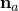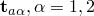我们考虑由节理面法线定向的特定节理*a*。我们定义为节理面上的两个单位正交向量。局部应力分量是跨节理的压力应力

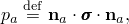和跨节理的剪切应力

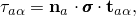其中是应力张量。我们定义剪切应力大小为

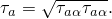局部应变分量是跨节理的法向应变

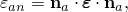和节理面上方向中的工程剪切应变

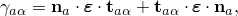其中是应变张量。
### 应变率分解

假定线性应变率分解，因此

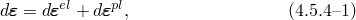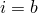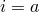其中是总应变率，是弹性应变率，是非弹性（塑性）应变率。假设几个系统是活跃的（我们用*i*表示活跃系统，其中表示体材料系统，是节理系统*a*），我们写为

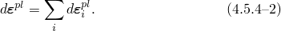
### 弹性和节理张开/闭合

当一点的所有节理都闭合时，材料的弹性行为假定为各向同性且线性。材料不能弹性不可压缩（泊松比必须小于0.5）。

我们使用基于应力的节理张开准则，而节理闭合基于应变监测。当跨节理的估计压力应力（垂直于节理面）不再为正时，节理系统*a*张开：

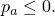在这种情况下，材料假定对跨节理直接应变没有弹性刚度。因此，开裂节理在一点产生各向异性弹性响应。节理系统只要

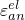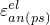就保持张开，其中是跨节理直接弹性应变分量，是在平面应力中计算的跨节理直接弹性应变分量，计算为

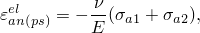其中*E*是材料的杨氏模量，是泊松比，且

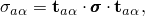是节理平面中的直接应力。

开裂节理的剪切响应由剪切保留参数控制，它表示当节理张开时保留的弹性剪切模量的分数（=0意味着与开裂节理相关的没有剪切刚度，而=1对应于开裂节理中的弹性剪切刚度；可以使用这两个极端之间的任何值）。
### 节理系统的塑性行为

节理系统*a*上滑动的破坏面定义为

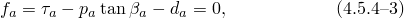其中是系统*a*的摩擦角，是系统*a*的内聚力（见[图4.5.4-1](04s05a122.md)）。

图4.5.4-1 节理系统材料模型。

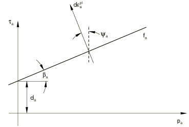只要，节理系统*a*不滑动。当节理系统*a*滑动。然后系统的非弹性（"塑性"）应变由

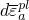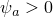给出，其中是节理面上方向中非弹性剪切应变率，是非弹性应变率大小，是此节理系统的膨胀角（选择提供节理上的纯剪切流动，而导致节理滑动时膨胀），且是正交于节理面的非弹性应变。为了添加来自不同系统的塑性流动贡献，我们将节理*a*的张量塑性应变率写为

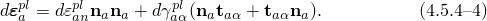

一点上不同节理系统的滑动是独立的，因为一个系统上的滑动不会改变同一点任何其他节理系统的破坏准则或膨胀角。该模型在一点最多提供三个节理系统。
### 体材料的塑性行为

除了节理系统，模型还包括体材料破坏机制。这基于Drucker-Prager破坏准则，

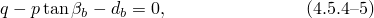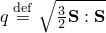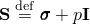其中是Mises等效偏应力（这里是偏应力），是等效压力应力，是体材料的摩擦角，是体材料的内聚力（见[图4.5.4-2](04s05a122.md)）。

图4.5.4-2 体材料模型。

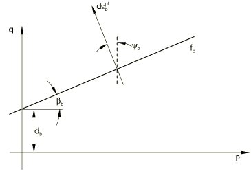如果达到此破坏准则，体非弹性流动由

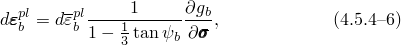定义，其中

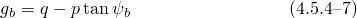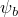是流动势。这里，是非弹性流动率大小（选择使得在1方向单轴压缩中）且是体材料的膨胀角。这个体破坏模型是"颗粒或聚合物行为模型，"第4.4.2节中描述的扩展Drucker-Prager模型的简化版本。与节理系统一样，这个体破坏系统独立于节理系统，因为体非弹性流动不会改变任何节理系统的行为。

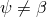如果任何系统中的，则该系统中的流动是"非相关的"。这意味着材料刚度矩阵不是对称的，因此用户应调用非对称矩阵求解方案。如果和之间的差异不大，则矩阵的对称近似可以提供可接受的平衡方程收敛率，从而降低整体求解成本。因此，对于此材料行为，Abaqus不会自动调用非对称求解器。但是，建议在任何节理系统上和差异很大的所有情况下使用。
### 模型积分

上述本构方程使用Abaqus中通常与塑性模型一起使用的后向Euler方法积分。使用与此积分算子一致的材料Jacobian进行整体平衡迭代。
### 参考

### 参考

"Jointed material model,"  Section 23.5.1 of the Abaqus Analysis User's Guide
